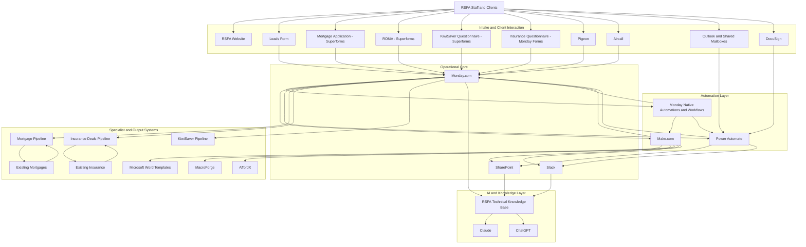
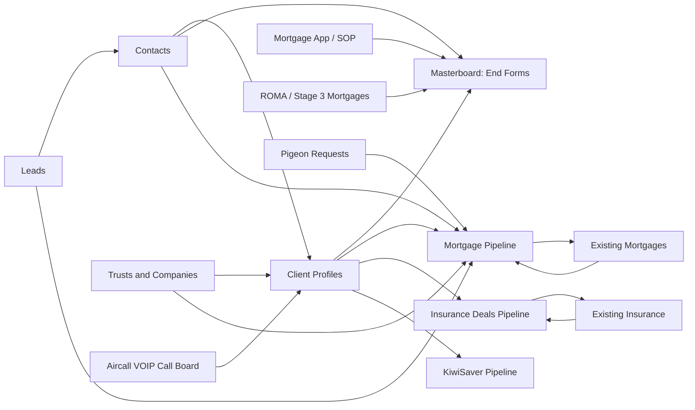
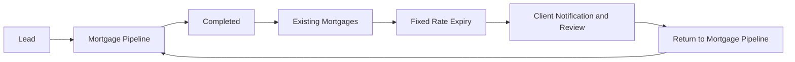
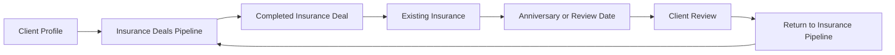
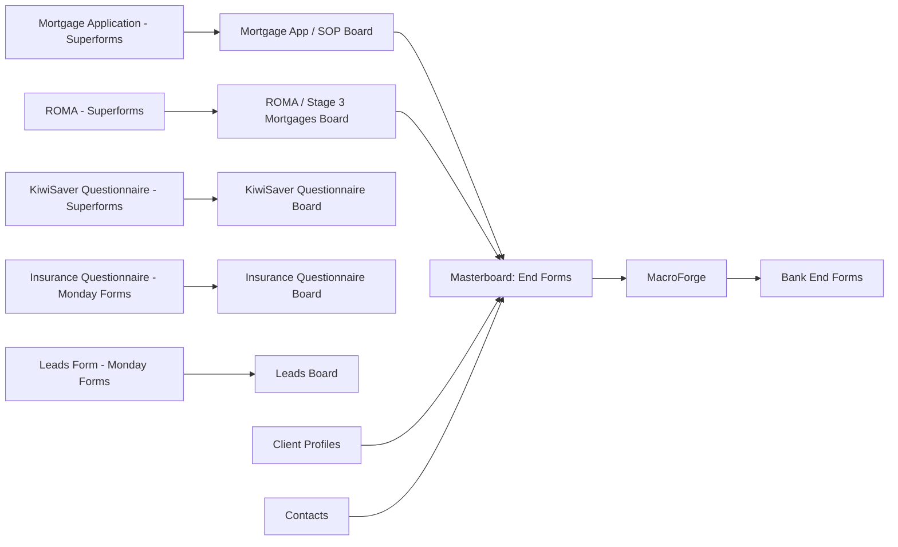
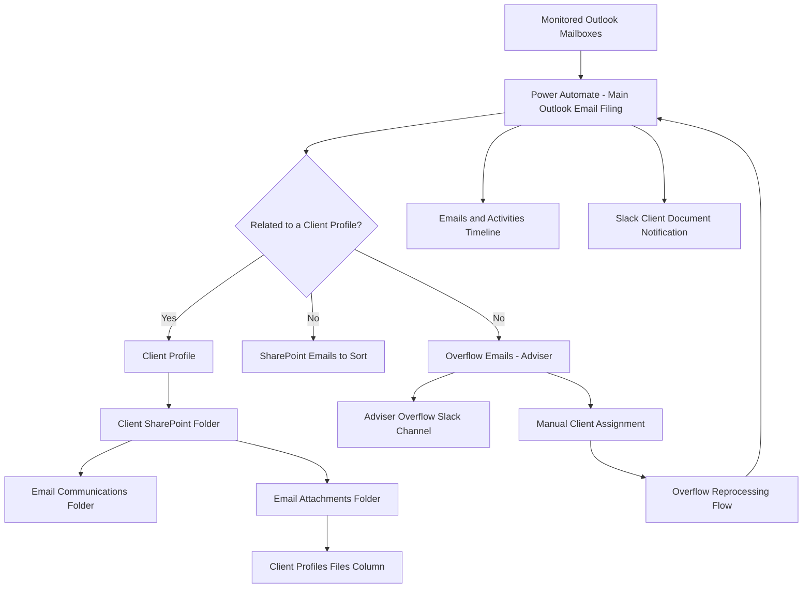
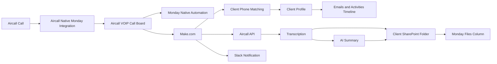
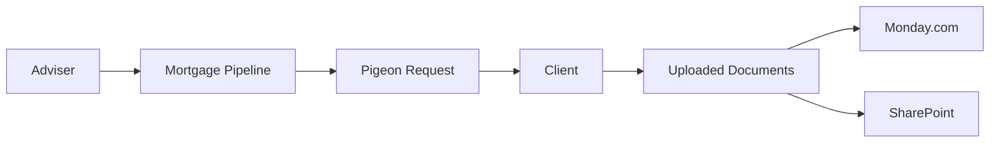
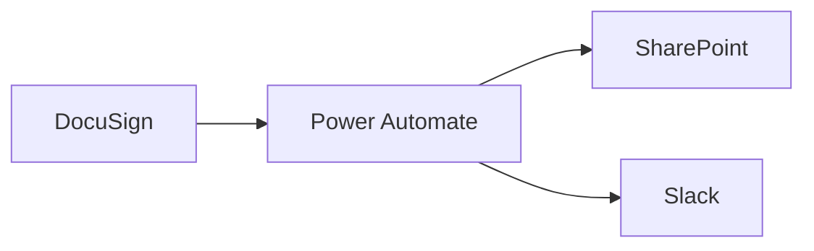

# RSFA System Map

## 1. Purpose

This document provides a high-level map of RSFA's technical ecosystem.

Its purpose is to help authorised developers and technical consultants understand:

- Which systems RSFA uses.
- What role each system plays.
- How data moves between systems.
- Which platforms act as sources of truth.
- Where automations are executed.
- Which systems are current, transitional or planned for retirement.
- Which operational processes depend on each platform.

This document is intentionally high level.

Detailed board schemas, automation logic, mappings, credentials, implementation
notes and incident history belong in their dedicated files.

---

## 2. Executive summary

Monday.com is the operational centre of RSFA.

It stores and connects the majority of RSFA's operational records, including:

- Leads.
- Client Profiles.
- Contacts.
- Mortgage applications.
- Mortgage pipeline records.
- Existing mortgages.
- Insurance pipeline records.
- Existing insurance.
- KiwiSaver records.
- Trusts and companies.
- Security addresses.
- Pigeon requests.
- Aircall call records.
- Overflow emails.
- Automation logs.
- Technical tasks.
- Documentation and manuals.
- Email campaign templates.
- Automation registries and references.

SharePoint is the primary document-storage layer.

Each Client Profile has its own SharePoint folder. Client Profile IDs are
included in folder names to make client-folder matching more reliable.

Make.com is the primary automation and integration platform for most non-Microsoft
workflows.

Power Automate is still used mainly for Microsoft-centric processes, especially:

- Outlook email filing.
- Overflow email reprocessing.
- SharePoint operations.
- DocuSign filing.
- Selected operational backup flows.

Slack is RSFA's main communication and notification platform.

Technical requests, tickets, automation notifications and operational updates are
primarily communicated through Slack.

Superforms and Monday Forms are the main form-entry layer.

Superforms is the preferred direction because it connects directly to Monday boards
and exposes Monday columns as form fields.

Aircall provides call data through its native Monday integration.

Pigeon provides document-upload requests for clients.

MacroForge uses consolidated client data from Monday to populate bank end forms.

AffordX supports bank-statement analysis, application tracking and newer meeting
summary and transcription workflows.

Claude and ChatGPT are gradually being introduced as an AI support layer for
research, technical consultation, documentation and future agent-based workflows.

---

## 3. High-level architecture



---

## 4. System layers

### 4.1 Operational core

#### Monday.com

Monday.com is RSFA's main operational system.

It is the central structured-record and workflow layer for:

- Leads.
- Contacts.
- Client Profiles.
- Mortgage applications.
- Mortgage pipelines.
- Existing mortgages.
- Insurance pipelines.
- Existing insurance.
- KiwiSaver.
- Trusts and companies.
- Security addresses.
- Aircall call records.
- Pigeon document requests.
- Overflow emails.
- Automation tracking.
- IT tasks.
- Documentation.
- Email campaign templates.

Monday also hosts:

- Native automations.
- Native workflows.
- Forms.
- Board relationships.
- Mirror columns.
- Activity timelines.
- Documentation references.
- Operational views.

Monday is the primary source of truth for operational status and structured records.

It is not the primary source of truth for stored client documents.

#### SharePoint

SharePoint is RSFA's primary document-storage system.

It stores:

- Client folders.
- Email copies.
- Email attachments.
- Generated Word documents.
- Signed documents.
- Technical documentation.
- Operational manuals.
- Templates.
- Overflow or unclassified files.

Each Client Profile has a dedicated SharePoint folder.

The Monday Client Profile ID is included in the folder name to support reliable
matching between Monday and SharePoint.

A Client Profile may represent one or more Contacts.

General folders also exist for files that:

- Cannot yet be assigned to a client.
- Do not belong to a client.
- Require manual review.

OneDrive is not a major operational storage layer.

It is used mainly where local synchronisation is required, such as MacroForge
desktop workflows synchronised with SharePoint.

#### Slack

Slack is RSFA's primary communication and notification platform.

It is used for:

- Technical tickets.
- Operational requests.
- Automation notifications.
- Overflow email alerts.
- Document-arrival alerts.
- Incident communication.
- Task discussion.
- Clarifications and implementation decisions.

Slack currently acts mainly as a communication and notification layer.

It does not currently serve as the main automation trigger layer.

ClaudeTag or similar AI-assisted Slack tooling may be evaluated in the future.

---

### 4.2 Automation layer

#### Make.com

Make.com is RSFA's main automation platform for most cross-platform workflows.

It is used primarily for:

- Monday.com integrations.
- Superforms processing.
- Aircall processing.
- Pigeon workflows.
- MacroForge preparation.
- Document generation.
- API integrations.
- Data transformations.
- Complex mappings.
- Slack notifications.
- AI-assisted summaries and document workflows.

Make.com is preferred for new non-Microsoft workflows because it is generally
easier to maintain and offers broader connector coverage.

#### Power Automate

Power Automate is used mainly for Microsoft-centric workflows.

Its most important current responsibilities include:

- Main Outlook Email Filing.
- Overflow email reprocessing.
- SharePoint file operations.
- DocuSign filing.
- Selected backup and operational flows.

Power Automate is used less frequently for new automation work unless the process
is strongly connected to Outlook, SharePoint or Microsoft 365.

#### Monday native automations and workflows

Monday native automations and workflows are part of RSFA's automation layer.

They are used for:

- Status-based routing.
- Item movement.
- Item creation.
- Board-to-board transitions.
- Triggering external automations.
- Notifications.
- Assignment.
- Workflow progression.

These automations must be documented alongside Make.com and Power Automate
dependencies because they may trigger or affect external workflows.

---

### 4.3 Forms and intake layer

#### Superforms

Superforms is a SpotNik form product connected directly to Monday.com boards.

It is the preferred form platform for RSFA.

Superforms builds forms from Monday board columns and writes submissions directly
into the connected board.

Current or planned major Superforms include:

- Mortgage Application.
- KiwiSaver Questionnaire.
- ROMA.

#### Monday Forms

Monday Forms is still used for some forms.

Current examples include:

- Insurance Questionnaire.
- Leads Form.

RSFA intends to gradually replace Monday Forms with Superforms where practical.

#### Jotform

Jotform is no longer part of RSFA's current form architecture.

Any remaining Jotform references should be treated as historical unless verified.

---

### 4.4 Specialist platforms

#### MacroForge

MacroForge is a desktop tool used to populate bank end forms automatically.

Its main data source is `Masterboard: End Forms` in Monday.com.

The Masterboard consolidates information from:

- Mortgage Application.
- Client Profile.
- Contacts.
- ROMA.
- Manual adviser entry.

The purpose of this consolidation is to provide a complete and structured dataset
for MacroForge.

The Masterboard includes bank-specific views such as:

- ANZ.
- ASB.
- BNZ.
- Other lender-specific views.

These views help advisers review large amounts of end-form information in a
simplified way.

#### Pigeon

Pigeon is used for online client document-upload requests.

Pigeon requests can be linked to mortgage pipeline items.

Relevant records may include:

- Pigeon Request.
- Pigeon Request ID.
- Related Client Profile.
- Related mortgage application or pipeline record.

#### AffordX

AffordX supports:

- Bank-statement analysis.
- Application tracking.
- Meeting summaries.
- Meeting transcriptions.

AffordX is a current or growing specialist system within RSFA.

Its exact integration map should be documented separately.

#### GetGuru

GetGuru is a legacy system.

RSFA intends to retire it.

Information still stored in GetGuru must be identified and migrated before
decommissioning.

#### Planolitix

Planolitix is a legacy system.

RSFA intends to retire it.

Remaining information must be identified and migrated before decommissioning.

#### DocuSign

DocuSign is currently used for electronic signatures.

A Power Automate flow:

- Detects relevant signed documents.
- Saves them to SharePoint.
- Sends Slack notifications.

#### DocuSeal

DocuSeal is being considered as a possible future replacement for DocuSign.

No production workflow is currently implemented.

Only a test board exists at this stage.

#### Microsoft Word templates

Microsoft Word templates are used for generated documents, including:

- Aircall transcriptions.
- Aircall AI summaries.
- Branded Mortgage SOPs.
- Other automated document outputs.

Templates are generally stored in SharePoint and populated through Make.com or
Microsoft tooling.

---

### 4.5 AI and knowledge layer

#### Claude

Claude is used or planned for:

- Technical consultation.
- Documentation maintenance.
- Repository analysis.
- Agent workflows.
- Skills.
- Subagents.
- Tool-assisted investigation.
- Future Slack-based workflows.

#### ChatGPT

ChatGPT is used or planned for:

- Technical consultation.
- Company Knowledge.
- Monday queries.
- Slack and SharePoint research.
- Ticket analysis.
- Drafting.
- Cross-system investigation.
- Future custom agents.

#### RSFA technical knowledge base

The technical knowledge base is intended to consolidate:

- System documentation.
- Automation documentation.
- Board schemas.
- Incident history.
- Playbooks.
- Technical decisions.
- Source references.

The knowledge base should complement live-system access rather than replace it.

---

## 5. Core Monday data model



### Client Profiles and Contacts

A Client Profile may contain one or more Contacts.

The Client Profile is the main client-level record.

Contacts represent individual people.

Client folders in SharePoint are associated with Client Profiles, not individual
Contacts.

### Emails and Activities

`Emails & Activities` is not a standalone board.

It is a Monday extension tab that shows a timeline of:

- Emails.
- Updates.
- Related activity.

The timeline is viewed from a Client Profile and may aggregate activity linked to
one or more email addresses.

`Client Timeline` and `Emails & Activities` refer to the same or equivalent
client-activity timeline concept.

### Masterboard: End Forms

`Masterboard: End Forms` is a consolidated data board designed primarily for
MacroForge.

It combines information collected from:

- Mortgage Application.
- Client Profile.
- Contacts.
- ROMA.
- Manual entry.

Its main purpose is to support automated completion of bank end forms.

Bank-specific views help advisers review the consolidated information.

---

## 6. Mortgage lifecycle



### Mortgage Pipeline

A Lead interested in mortgage services is moved into the Mortgage Pipeline.

The Mortgage Pipeline tracks the application through operational stages such as:

- New Leads.
- Old lead / on hold.
- Await docs.
- Await client response.
- In review.
- Processing application.
- Await credit decision.
- Conditional approval.
- Unconditional approval.
- Handover in progress.
- Loan documentation.
- Loan settled.
- Awaiting commission.
- Concluded.
- Archive.
- Paused.
- Paid.
- Completed.

The exact adviser operating procedure is not yet fully documented.

### Move to Existing Mortgages

When a mortgage reaches completion, it is transferred to `Existing Mortgages`.

The Mortgage Pipeline includes a `Move to Existing` action and stores relationships
to:

- Leads.
- Client Profiles.
- Contacts.
- Borrowers.
- Trusts and Companies.
- Pigeon Requests.
- Client SharePoint folder.
- Files.

The pipeline also tracks:

- Lender.
- Stage.
- Application type.
- Loan values.
- Interest details.
- Fixed rate expiry.
- Settlement.
- Approval expiry.
- Commission status.
- Pipeline outcome.

### Existing Mortgages

Existing Mortgages stores active or completed lending records.

It tracks:

- Client Profile.
- Contacts.
- Borrowers.
- Lender.
- Stage.
- Loan type.
- Original loan.
- Current loan.
- Interest rate.
- Repayment.
- Fixed term.
- Fixed rate expiry.
- Reminder date.
- Settlement date.
- Renewal notification status.
- Archive reason.

Existing Mortgages drives follow-up processes such as Fixed Rate Expiry
notifications.

A mortgage may later return to the Mortgage Pipeline for restructuring, review,
refinancing or another lending process.

The exact operational loop requires further adviser-process documentation.

---

## 7. Insurance lifecycle



The insurance process follows a pattern similar to mortgages:

- Active opportunities are managed in Insurance Deals Pipeline.
- Completed business moves to Existing Insurance.
- Existing Insurance contains anniversary or review dates.
- Date-based notifications support future client review.
- A client may return to the Insurance Deals Pipeline for new or updated cover.

The exact adviser workflow requires further documentation.

---

## 8. KiwiSaver lifecycle

KiwiSaver currently has its own pipeline.


The KiwiSaver process is less integrated with renewal-style loops than mortgages
or insurance.

Additional operational detail should be documented when confirmed.

---

## 9. Form and end-form data flow



### Mortgage Application

The Mortgage Application uses Superforms and writes directly to the related Monday
board.

The application provides a major part of the data later consolidated into
`Masterboard: End Forms`.

### ROMA

ROMA is connected to `ROMA / Stage 3: Mortgages`.

Its main purpose is to collect information that was not fully captured in the
Mortgage Application.

### Insurance Questionnaire

The Insurance Questionnaire currently uses Monday Forms.

It is expected to migrate to Superforms in the future.

### KiwiSaver Questionnaire

The KiwiSaver Questionnaire uses Superforms.

### Leads Form

The Leads Form currently uses Monday Forms and writes to the Leads board.

---

## 10. Email filing and overflow flow



### Monitored mailboxes

The Main Outlook Email Filing flow currently monitors sent and received emails for:

- Rod.
- Kathleen.
- Seth.
- Jet.
- Support.

Planned additions include:

- `it-support@rsfa.co.nz`.
- `leo@rsfa.co.nz`.

Jet-related handling is expected to be removed when Jet leaves RSFA.

### Client-specific email path

When an email is matched to a client:

1. The Client Profile is identified.
2. The SharePoint client folder is located.
3. The `.eml` file is saved in `Email Communications`.
4. Attachments are saved in `Email Attachments`.
5. Copies of attachments are added to a Files column in Client Profiles.
6. The email is added to the Client Profile activity timeline.
7. If attachments exist, Slack receives a document-arrival notification with a
   link to the Client Profile.

### Overflow path

When an email cannot be matched to a client:

1. The `.eml` file is saved in `Emails to Sort` in SharePoint.
2. An item is created in the relevant adviser Overflow Emails board.
3. The email is sent to the relevant adviser overflow Slack channel.
4. A user may manually associate the overflow item with a client.
5. That assignment triggers reprocessing through the Email Filing flow.

Current overflow boards include:

- Rod and Kathleen.
- Seth.
- Jet.

The Jet overflow board is expected to be removed when Jet leaves RSFA.

### Observability improvement

RSFA intends to create a dedicated board for logging all client-specific processed
emails because Power Automate run history is not sufficient for long-term tracking.

---

## 11. Aircall flow



The Aircall native Monday integration creates call records in the Aircall board.

Monday native automations and Make.com then process the records.

Current automation responsibilities include:

- Match the call telephone number to a client.
- Link the call to a Client Profile.
- Add the call to the client activity timeline.
- Retrieve transcription data.
- Generate a transcription Word document.
- Generate an AI summary Word document.
- Save generated documents to the client SharePoint folder.
- Add generated files to Monday.
- Mark whether a transcription is available.

Slack notification functionality is currently being developed.

Short calls may not produce a transcription.

This is treated as an expected case rather than an unexpected failure.

---

## 12. Pigeon document-request flow



Pigeon enables clients to upload documents online.

Mortgage Pipeline records may store:

- A relationship to the Pigeon Request.
- The Pigeon Request ID.
- Related client and borrower information.

The exact document-storage and status-update flow should be documented separately.

---

## 13. DocuSign flow



DocuSign is currently active.

Power Automate is used to:

- Detect completed signed documents.
- File them in SharePoint.
- Notify the relevant Slack channel.

DocuSeal is not yet part of the production architecture.

---

## 14. Documentation and automation knowledge

RSFA currently stores significant automation information in Monday.com.

Important documentation locations include:

### Automations board

The Automations board contains:

- Power Automate flows.
- Make.com scenarios.
- Status.
- Links.
- Affected people.
- Creation dates.
- Notes and references.

Some entries may be outdated.

### Manuals / Documentation board

The Manuals / Documentation board contains:

- Active manuals.
- Operational guides.
- Automation documentation.
- References to automation records.
- Review statuses.
- Files.
- External links.

Examples include:

- MacroForge Guide.
- Automations documentation.
- Leads to Contacts / Client Profiles Automation.
- Overflow Emails AI Matching.
- New Form Submission documentation.
- Aircall Transcriptions to SharePoint.
- Claude Token Efficiency Guide.

The repository should gradually become the canonical technical layer while
Monday continues to provide operational access and links.

---

## 15. Identity and ownership

### `rod@rsfa.co.nz`

Rod's account is commonly the primary administrator or owner of RSFA tools.

It may be required for:

- Workspace ownership.
- Primary-owner actions.
- Tool installation.
- Administrative approval.

### `tech@rsfa.co.nz`

The main technical and automation account.

It is used as an Automation Hub for:

- Make.com.
- Power Automate.
- Microsoft 365 connections.
- Technical integrations.
- Automation ownership.

### `it-support@rsfa.co.nz`

Used for technical communication and support.

It may also become part of monitored email workflows.

### `leo@rsfa.co.nz`

Personal authorised technical account for development and delegated access.

It may also become part of monitored email workflows.

### Adviser accounts

Adviser accounts include:

- Kathleen.
- Seth.
- Jet.
- Other current or future advisers.

Kathleen has broader business and operational privileges than standard adviser
accounts.

Jet-related access and workflows are expected to be retired when Jet leaves RSFA.

---

## 16. Website and planned systems

### RSFA website

RSFA's website is:

```text
rsfa.co.nz
```

The website is part of the client-facing layer.

Its current integration points should be documented when confirmed.

### Microsoft Bookings

Microsoft Bookings is being considered.

It is not currently part of the confirmed production architecture.

### Microsoft Teams

Microsoft Teams may be used within Microsoft 365 but is not currently a major
part of RSFA's automation architecture.

### Rod's knowledge base

Rod is developing or evaluating a personalised knowledge base.

Its relationship to this technical knowledge repository is not yet defined.

---

## 17. Current source-of-truth responsibilities

| Information type | Primary source of truth |
|---|---|
| Operational record and workflow status | Monday.com |
| Client document storage | SharePoint |
| Technical communication and tickets | Slack |
| Outlook email source | Microsoft 365 / Outlook |
| Non-Microsoft automation configuration | Make.com |
| Microsoft-centric automation configuration | Power Automate |
| Form submission structure | Superforms or Monday Forms and connected Monday board |
| Aircall call source | Aircall |
| Signed document source | DocuSign |
| Bank end-form dataset | Masterboard: End Forms |
| Bank end-form completion | MacroForge |
| Bank-statement analysis and meeting summaries | AffordX |
| Canonical technical documentation | RSFA Technical Knowledge Repository |

---

## 18. System status summary

| System | Role | Status |
|---|---|---|
| Monday.com | Operational centre | Active and core |
| SharePoint | Document storage | Active and core |
| Slack | Communication and notifications | Active and core |
| Make.com | Primary automation platform | Active and core |
| Power Automate | Microsoft-centric automation | Active |
| Superforms | Preferred forms platform | Active and expanding |
| Monday Forms | Existing forms platform | Active but intended to reduce |
| Jotform | Previous forms platform | Retired |
| Aircall | Calls and call metadata | Active |
| Pigeon | Client document uploads | Active |
| MacroForge | Bank end-form completion | Active |
| AffordX | Analysis, tracking and meeting summaries | Active or expanding |
| DocuSign | Electronic signatures | Active |
| DocuSeal | Potential future replacement | Experimental only |
| GetGuru | Legacy knowledge or process system | Planned retirement |
| Planolitix | Legacy system | Planned retirement |
| Claude | AI support and future agents | Active and expanding |
| ChatGPT | AI consultation and Company Knowledge | Active and expanding |
| Microsoft Bookings | Potential scheduling platform | Under consideration |

---

## 19. Known gaps and required follow-up

The following areas require further documentation:

- Complete adviser workflow for Mortgage Pipeline.
- Exact conditions for moving records between Mortgage Pipeline and Existing Mortgages.
- Exact fixed-rate-expiry follow-up process.
- Complete adviser workflow for Insurance Deals Pipeline.
- Exact anniversary and renewal process for Existing Insurance.
- Detailed KiwiSaver process.
- Complete AffordX integration map.
- Complete Pigeon document-storage flow.
- Complete MacroForge local and SharePoint synchronisation process.
- Complete Monday native automation inventory.
- Current Make.com scenario inventory.
- Current Power Automate flow inventory.
- Complete Slack channel map.
- Exact website integrations.
- Information remaining in GetGuru.
- Information remaining in Planolitix.
- Migration plan for legacy systems.
- Long-term email execution logging architecture.
- Future AI agent permissions and tool access.

---

## 20. Related documentation

This map should be used together with:

- `02_SYSTEMS_REGISTRY.md`
- `03_AUTOMATION_REGISTRY.md`
- `04_MONDAY_BOARDS_REGISTRY.md`
- System-specific documents under `knowledge/systems/`
- Automation-specific documents under `knowledge/automations/`
- Board schemas under `knowledge/schemas/monday-boards/`
- Playbooks under `knowledge/playbooks/`
- Technical decisions under `knowledge/decisions/`

---

## 21. Maintenance rule

Update this document when:

- A major system is introduced.
- A major system is retired.
- A source-of-truth responsibility changes.
- A core data flow changes.
- A new pipeline becomes operational.
- A legacy platform is migrated.
- The primary automation platform changes.
- AI agents gain new operational responsibilities.
- A major integration is added or removed.

Do not update this map for minor column-level changes unless they alter the system
relationship or operational flow.
