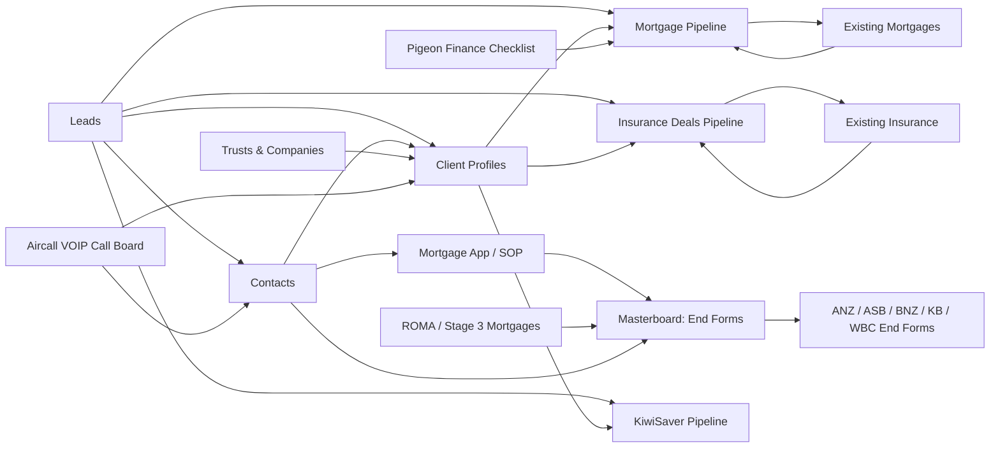

# RSFA Monday Boards Registry

## 1. Purpose

This document is the master registry of boards in the RSFA Monday.com workspace.

It provides:

- The exact Monday board ID and URL.
- Workspace and folder location.
- Current board state and access type.
- Functional classification.
- Business and technical criticality.
- A concise description of each board's role.
- Important columns and board relationships.
- The expected location of the full technical schema.

This registry is an index. Complete column IDs, status labels, mirror mappings and board-relation configuration belong in individual schema files under `knowledge/schemas/monday/`.

---

## 2. Source and scope

The source export contained:

- **100 boards**.
- **100 boards marked active by Monday**.
- **33 boards without a workspace folder**, mostly automatically generated subitem boards.
- **32 explicit subitem boards**.
- Workspace: `Real Savvy_CRM` (`2308685`).

A Monday board marked `active` may still be historical, experimental, unused or planned for retirement. Functional status in this registry therefore considers both Monday state and known RSFA context.

---

## 3. Functional classification

| Category | Board count | Meaning |
|---|---:|---|
| Backup / Audit | 1 | Retention, audit and historical-activity records. |
| Communications | 7 | Calls, overflow emails, campaigns and communication records. |
| Compliance Register | 12 | Governance, compliance, risk and regulatory registers. |
| Core Entity | 4 | Core records such as Leads, Contacts, Client Profiles and entities. |
| Document Generation | 6 | Masterboard and lender-specific end-form structures. |
| Documentation | 1 | Manual and technical-document indexes. |
| Existing Business | 2 | In-force or completed business requiring ongoing servicing. |
| Experimental | 1 | Testing, proof-of-concept or work-in-progress boards. |
| Form Intake | 4 | Boards receiving data from Superforms or Monday Forms. |
| Historical / Legacy | 11 | Boards retained for historical reference or migration. |
| Integration / Automation | 5 | Boards or workflows supporting system integrations. |
| Operations | 5 | General operational process boards. |
| Pipeline | 3 | Active advice or implementation work progressing through stages. |
| Project / Task | 6 | Project and technical task tracking. |
| Subitem Board | 32 | Monday-generated or dedicated subitem storage boards. |

---

## 4. Criticality conventions

| Criticality | Meaning |
|---|---|
| `Critical` | Core client, pipeline or document-completion data; failure may materially disrupt advice operations. |
| `High` | Important operational, communication, intake or audit board with significant downstream effects. |
| `Medium` | Supporting process, register, project or integration board. |
| `Low` | Experimental or limited-use board. |
| `Inherited` | Subitem board whose criticality follows its parent board. |
| `Historical` | Retained for reference, migration or audit rather than current processing. |

---

## 5. Master board registry

| Board ID | Board | Folder | State | Access | Category | Criticality | Columns | Main role | Full schema |
|---:|---|---|---|---|---|---|---:|---|---|
| `2074688492` | [Activities](https://rsfa-squad.monday.com/boards/2074688492) | Clients/Entities | Active | public | Operations | Medium | 7 | Operational Monday board; detailed business purpose requires verification. | `knowledge/schemas/monday/2074688492-activities.md` |
| `5024661649` | [Client Profiles](https://rsfa-squad.monday.com/boards/5024661649) | Clients/Entities | Active | private | Core Entity | Critical | 30 | Primary client-level record representing one or more Contacts and linking operational activity to SharePoint. | `knowledge/schemas/monday/5024661649-client-profiles.md` |
| `2074688484` | [Contacts](https://rsfa-squad.monday.com/boards/2074688484) | Clients/Entities | Active | public | Core Entity | Critical | 44 | Individual people linked to Client Profiles, communications, calls and applications. | `knowledge/schemas/monday/2074688484-contacts.md` |
| `2074688480` | [Leads](https://rsfa-squad.monday.com/boards/2074688480) | Clients/Entities | Active | public | Core Entity | Critical | 48 | Initial prospect and service-interest records; source for pipeline creation. | `knowledge/schemas/monday/2074688480-leads.md` |
| `2074688487` | [Trusts & Companies](https://rsfa-squad.monday.com/boards/2074688487) | Clients/Entities | Active | public | Core Entity | Critical | 9 | Entity records connected to Contacts, Client Profiles and mortgage or insurance processes. | `knowledge/schemas/monday/2074688487-trusts-companies.md` |
| `5028745187` | [Update Loan Details](https://rsfa-squad.monday.com/boards/5028745187) | Email Campaigns (All) | Active | public | Communications | Medium | 2 | Communication, campaign or notification-related operational board. | `knowledge/schemas/monday/5028745187-update-loan-details.md` |
| `5027616908` | [✉️ Client Renewal/Reviews](https://rsfa-squad.monday.com/boards/5027616908) | Email Campaigns (All) | Active | public | Communications | High | 9 | Stores email campaign templates for mortgage, insurance and KiwiSaver renewal or review communications. | `knowledge/schemas/monday/5027616908-client-renewal-reviews.md` |
| `5026106123` | [DocuSign (WIP)](https://rsfa-squad.monday.com/boards/5026106123) | Historical Boards | Retained - Historical | private | Historical / Legacy | Historical | 26 | Historical board retained for reference, migration or audit purposes. | `knowledge/schemas/monday/5026106123-docusign-wip.md` |
| `5026308468` | [Getting Started](https://rsfa-squad.monday.com/boards/5026308468) | Historical Boards | Retained - Historical | public | Historical / Legacy | Historical | 2 | Historical board retained for reference, migration or audit purposes. | `knowledge/schemas/monday/5026308468-getting-started.md` |
| `5029192628` | [MCP getting started](https://rsfa-squad.monday.com/boards/5029192628) | Historical Boards | Retained - Historical | public | Historical / Legacy | Historical | 2 | Historical board retained for reference, migration or audit purposes. | `knowledge/schemas/monday/5029192628-mcp-getting-started.md` |
| `5026727861` | [✍🏻 GetSign: E-Signature Board](https://rsfa-squad.monday.com/boards/5026727861) | Historical Boards | Retained - Historical | public | Historical / Legacy | Historical | 23 | Historical board retained for reference, migration or audit purposes. | `knowledge/schemas/monday/5026727861-getsign-e-signature-board.md` |
| `1962041209` | [🎓Academy - monday CRM](https://rsfa-squad.monday.com/boards/1962041209) | Historical Boards | Retained - Historical | public | Historical / Legacy | Historical | 5 | Historical board retained for reference, migration or audit purposes. | `knowledge/schemas/monday/1962041209-academy-monday-crm.md` |
| `5029033494` | [💾 Monday E&A Backup Log](https://rsfa-squad.monday.com/boards/5029033494) | Historical Boards | Retained - Historical | public | Historical / Legacy | High | 9 | Backup register for Emails & Activities timeline records and related .eml files. | `knowledge/schemas/monday/5029033494-monday-e-a-backup-log.md` |
| `5025622850` | [ANZ: End Forms](https://rsfa-squad.monday.com/boards/5025622850) | Macroforge Boards | Active | public | Document Generation | Medium | 94 | Bank-specific end-form view and mirror layer sourced from Masterboard: End Forms. | `knowledge/schemas/monday/5025622850-anz-end-forms.md` |
| `5026525627` | [ASB: End Forms](https://rsfa-squad.monday.com/boards/5026525627) | Macroforge Boards | Active | public | Document Generation | Medium | 142 | Bank-specific end-form view and mirror layer sourced from Masterboard: End Forms. | `knowledge/schemas/monday/5026525627-asb-end-forms.md` |
| `5026525749` | [BNZ: End Forms](https://rsfa-squad.monday.com/boards/5026525749) | Macroforge Boards | Active | public | Document Generation | Medium | 104 | Bank-specific end-form view and mirror layer sourced from Masterboard: End Forms. | `knowledge/schemas/monday/5026525749-bnz-end-forms.md` |
| `5026525794` | [KB: End Forms](https://rsfa-squad.monday.com/boards/5026525794) | Macroforge Boards | Active | public | Document Generation | Medium | 91 | Kiwibank-specific end-form view and mirror layer sourced from Masterboard: End Forms. | `knowledge/schemas/monday/5026525794-kb-end-forms.md` |
| `5026186805` | [Masterboard: End Forms](https://rsfa-squad.monday.com/boards/5026186805) | Macroforge Boards | Active | public | Document Generation | Critical | 400 | Consolidates mortgage, client, contact, ROMA and manual information for MacroForge bank end-form completion. | `knowledge/schemas/monday/5026186805-masterboard-end-forms.md` |
| `5026525927` | [WBC: End Forms](https://rsfa-squad.monday.com/boards/5026525927) | Macroforge Boards | Active | public | Document Generation | Medium | 123 | Westpac-specific end-form view and mirror layer sourced from Masterboard: End Forms. | `knowledge/schemas/monday/5026525927-wbc-end-forms.md` |
| `2074688483` | [Quotes & Invoices](https://rsfa-squad.monday.com/boards/2074688483) | No folder | Active | public | Operations | Medium | 8 | Operational Monday board; detailed business purpose requires verification. | `knowledge/schemas/monday/2074688483-quotes-invoices.md` |
| `1982102193` | [Subitems of Automations](https://rsfa-squad.monday.com/boards/1982102193) | No folder | Active | public | Subitem Board | Inherited | 4 | Subitem storage associated with `Automations`. | `knowledge/schemas/monday/1982102193-subitems-of-automations.md` |
| `5024661650` | [Subitems of Client Profiles](https://rsfa-squad.monday.com/boards/5024661650) | No folder | Active | private | Subitem Board | Inherited | 5 | Subitem storage associated with `Client Profiles`. | `knowledge/schemas/monday/5024661650-subitems-of-client-profiles.md` |
| `2074688520` | [Subitems of Contacts](https://rsfa-squad.monday.com/boards/2074688520) | No folder | Active | public | Subitem Board | Inherited | 4 | Subitem storage associated with `Contacts`. | `knowledge/schemas/monday/2074688520-subitems-of-contacts.md` |
| `2069848379` | [Subitems of General to do](https://rsfa-squad.monday.com/boards/2069848379) | No folder | Active | public | Subitem Board | Inherited | 4 | Subitem storage associated with `General to do`. | `knowledge/schemas/monday/2069848379-subitems-of-general-to-do.md` |
| `5027911373` | [Subitems of Insurance Referrals Tracking](https://rsfa-squad.monday.com/boards/5027911373) | No folder | Active | public | Subitem Board | Inherited | 4 | Subitem storage associated with `Insurance Referrals Tracking`. | `knowledge/schemas/monday/5027911373-subitems-of-insurance-referrals-tracking.md` |
| `5025485896` | [Subitems of Leads](https://rsfa-squad.monday.com/boards/5025485896) | No folder | Active | public | Subitem Board | Inherited | 4 | Subitem storage associated with `Leads`. | `knowledge/schemas/monday/5025485896-subitems-of-leads.md` |
| `5025844638` | [Subitems of Masterboard Tasks](https://rsfa-squad.monday.com/boards/5025844638) | No folder | Active | share | Subitem Board | Inherited | 4 | Subitem storage associated with `Masterboard Tasks`. | `knowledge/schemas/monday/5025844638-subitems-of-masterboard-tasks.md` |
| `5026463208` | [Subitems of Masterboard: End Forms](https://rsfa-squad.monday.com/boards/5026463208) | No folder | Active | public | Subitem Board | Inherited | 17 | Subitem storage associated with `Masterboard: End Forms`. | `knowledge/schemas/monday/5026463208-subitems-of-masterboard-end-forms.md` |
| `5028618939` | [Subitems of Material Issues/Breaches](https://rsfa-squad.monday.com/boards/5028618939) | No folder | Active | public | Subitem Board | Inherited | 4 | Subitem storage associated with `Material Issues/Breaches`. | `knowledge/schemas/monday/5028618939-subitems-of-material-issues-breaches.md` |
| `2075730954` | [Subitems of RBR 2025 (to improve)](https://rsfa-squad.monday.com/boards/2075730954) | No folder | Active | public | Subitem Board | Inherited | 4 | Subitem storage associated with `RBR 2025 (to improve)`. | `knowledge/schemas/monday/2075730954-subitems-of-rbr-2025-to-improve.md` |
| `1911911339` | [Subitems of Replacement Business 2024_To Repair](https://rsfa-squad.monday.com/boards/1911911339) | No folder | Active | public | Subitem Board | Inherited | 4 | Subitem storage associated with `Replacement Business 2024_To Repair`. | `knowledge/schemas/monday/1911911339-subitems-of-replacement-business-2024-to-repair.md` |
| `5023820356` | [Subitems of Trusts & Companies](https://rsfa-squad.monday.com/boards/5023820356) | No folder | Active | public | Subitem Board | Inherited | 4 | Subitem storage associated with `Trusts & Companies`. | `knowledge/schemas/monday/5023820356-subitems-of-trusts-companies.md` |
| `5028745188` | [Subitems of Update Loan Details](https://rsfa-squad.monday.com/boards/5028745188) | No folder | Active | public | Subitem Board | Inherited | 4 | Subitem storage associated with `Update Loan Details`. | `knowledge/schemas/monday/5028745188-subitems-of-update-loan-details.md` |
| `5024672366` | [Subitems of ✅️ Existing Mortgages](https://rsfa-squad.monday.com/boards/5024672366) | No folder | Active | private | Subitem Board | Inherited | 1 | Subitem storage associated with `✅️ Existing Mortgages`. | `knowledge/schemas/monday/5024672366-subitems-of-existing-mortgages.md` |
| `5025483253` | [Subitems of ✍ Mortgage App/SOP](https://rsfa-squad.monday.com/boards/5025483253) | No folder | Active | share | Subitem Board | Inherited | 4 | Subitem storage associated with `✍ Mortgage App/SOP`. | `knowledge/schemas/monday/5025483253-subitems-of-mortgage-app-sop.md` |
| `5027076803` | [Subitems of ✍️ ROMA/Stage3: Mortgages](https://rsfa-squad.monday.com/boards/5027076803) | No folder | Active | public | Subitem Board | Inherited | 12 | Subitem storage associated with `✍️ ROMA/Stage3: Mortgages`. | `knowledge/schemas/monday/5027076803-subitems-of-roma-stage3-mortgages.md` |
| `5024672438` | [Subitems of ✔️ Existing Insurance](https://rsfa-squad.monday.com/boards/5024672438) | No folder | Active | private | Subitem Board | Inherited | 9 | Subitem storage associated with `✔️ Existing Insurance`. | `knowledge/schemas/monday/5024672438-subitems-of-existing-insurance.md` |
| `5025365502` | [Subitems of ❓️Insurance Questionnaire](https://rsfa-squad.monday.com/boards/5025365502) | No folder | Active | public | Subitem Board | Inherited | 4 | Subitem storage associated with `❓️Insurance Questionnaire`. | `knowledge/schemas/monday/5025365502-subitems-of-insurance-questionnaire.md` |
| `5025201921` | [Subitems of ➕Insurance Deals Pipeline](https://rsfa-squad.monday.com/boards/5025201921) | No folder | Active | public | Subitem Board | Inherited | 4 | Subitem storage associated with `➕Insurance Deals Pipeline`. | `knowledge/schemas/monday/5025201921-subitems-of-insurance-deals-pipeline.md` |
| `5028320858` | [Subitems of 🏠 Ppty/Security Addresses](https://rsfa-squad.monday.com/boards/5028320858) | No folder | Active | private | Subitem Board | Inherited | 4 | Subitem storage associated with `🏠 Ppty/Security Addresses`. | `knowledge/schemas/monday/5028320858-subitems-of-ppty-security-addresses.md` |
| `5025365498` | [Subitems of 🏧 AffordX: Bank Statements](https://rsfa-squad.monday.com/boards/5025365498) | No folder | Active | public | Subitem Board | Inherited | 15 | Subitem storage associated with `🏧 AffordX: Bank Statements`. | `knowledge/schemas/monday/5025365498-subitems-of-affordx-bank-statements.md` |
| `5027911374` | [Subitems of 👩‍💼F&G Insurance Tracking](https://rsfa-squad.monday.com/boards/5027911374) | No folder | Active | public | Subitem Board | Inherited | 4 | Subitem storage associated with `👩‍💼F&G Insurance Tracking`. | `knowledge/schemas/monday/5027911374-subitems-of-f-g-insurance-tracking.md` |
| `5025201890` | [Subitems of 💲Mortgage Pipeline](https://rsfa-squad.monday.com/boards/5025201890) | No folder | Active | public | Subitem Board | Inherited | 9 | Subitem storage associated with `💲Mortgage Pipeline`. | `knowledge/schemas/monday/5025201890-subitems-of-mortgage-pipeline.md` |
| `5025201955` | [Subitems of 📈 KiwiSaver Pipeline](https://rsfa-squad.monday.com/boards/5025201955) | No folder | Active | public | Subitem Board | Inherited | 4 | Subitem storage associated with `📈 KiwiSaver Pipeline`. | `knowledge/schemas/monday/5025201955-subitems-of-kiwisaver-pipeline.md` |
| `5025365500` | [Subitems of 📋 Pigeon: Finance Checklist](https://rsfa-squad.monday.com/boards/5025365500) | No folder | Active | public | Subitem Board | Inherited | 8 | Subitem storage associated with `📋 Pigeon: Finance Checklist`. | `knowledge/schemas/monday/5025365500-subitems-of-pigeon-finance-checklist.md` |
| `5028745447` | [Subitems of 📒 Manuals/Documentation](https://rsfa-squad.monday.com/boards/5028745447) | No folder | Active | public | Subitem Board | Inherited | 4 | Subitem storage associated with `📒 Manuals/Documentation`. | `knowledge/schemas/monday/5028745447-subitems-of-manuals-documentation.md` |
| `5025365488` | [Subitems of 📬 Overflow Emails (OLD)](https://rsfa-squad.monday.com/boards/5025365488) | No folder | Active | public | Subitem Board | Inherited | 4 | Subitem storage associated with `📬 Overflow Emails (OLD)`. | `knowledge/schemas/monday/5025365488-subitems-of-overflow-emails-old.md` |
| `5029313275` | [Subitems of 📬 Overflow Emails - Jet](https://rsfa-squad.monday.com/boards/5029313275) | No folder | Active | public | Subitem Board | Inherited | 4 | Subitem storage associated with `📬 Overflow Emails - Jet`. | `knowledge/schemas/monday/5029313275-subitems-of-overflow-emails-jet.md` |
| `5029313287` | [Subitems of 📬 Overflow Emails - Rod/Kathleen](https://rsfa-squad.monday.com/boards/5029313287) | No folder | Active | public | Subitem Board | Inherited | 4 | Subitem storage associated with `📬 Overflow Emails - Rod/Kathleen`. | `knowledge/schemas/monday/5029313287-subitems-of-overflow-emails-rod-kathleen.md` |
| `5029313273` | [Subitems of 📬 Overflow Emails - Seth](https://rsfa-squad.monday.com/boards/5029313273) | No folder | Active | public | Subitem Board | Inherited | 4 | Subitem storage associated with `📬 Overflow Emails - Seth`. | `knowledge/schemas/monday/5029313273-subitems-of-overflow-emails-seth.md` |
| `5029053391` | [Subitems of 🗄️ Monday Activity Log Archive](https://rsfa-squad.monday.com/boards/5029053391) | No folder | Active | public | Subitem Board | Inherited | 4 | Subitem storage associated with `🗄️ Monday Activity Log Archive`. | `knowledge/schemas/monday/5029053391-subitems-of-monday-activity-log-archive.md` |
| `5021300252` | [Subitems of 🦁 Leo IT Tasks](https://rsfa-squad.monday.com/boards/5021300252) | No folder | Active | public | Subitem Board | Inherited | 7 | Subitem storage associated with `🦁 Leo IT Tasks`. | `knowledge/schemas/monday/5021300252-subitems-of-leo-it-tasks.md` |
| `5025365493` | [Aircall Board JV](https://rsfa-squad.monday.com/boards/5025365493) | Old boards to retain | Retained - Historical | public | Historical / Legacy | Historical | 16 | Historical board retained for reference, migration or audit purposes. | `knowledge/schemas/monday/5025365493-aircall-board-jv.md` |
| `1896430413` | [Complaints 2024](https://rsfa-squad.monday.com/boards/1896430413) | Old boards to retain | Retained - Historical | public | Historical / Legacy | Historical | 14 | Historical board retained for reference, migration or audit purposes. | `knowledge/schemas/monday/1896430413-complaints-2024.md` |
| `2075767590` | [Complaints 2025](https://rsfa-squad.monday.com/boards/2075767590) | Old boards to retain | Retained - Historical | public | Historical / Legacy | Historical | 13 | Historical board retained for reference, migration or audit purposes. | `knowledge/schemas/monday/2075767590-complaints-2025.md` |
| `5024672484` | [Existing KiwiSaver](https://rsfa-squad.monday.com/boards/5024672484) | Old boards to retain | Retained - Historical | private | Historical / Legacy | Historical | 14 | Historical board retained for reference, migration or audit purposes. | `knowledge/schemas/monday/5024672484-existing-kiwisaver.md` |
| `1896430546` | [Replacement Business 2024_To Repair](https://rsfa-squad.monday.com/boards/1896430546) | Old boards to retain | Retained - Historical | public | Historical / Legacy | Historical | 11 | Historical board retained for reference, migration or audit purposes. | `knowledge/schemas/monday/1896430546-replacement-business-2024-to-repair.md` |
| `5028745446` | [📒 Manuals/Documentation](https://rsfa-squad.monday.com/boards/5028745446) | Operations Boards | Active | public | Documentation | High | 10 | Operational documentation and manual index with review status, files and links. | `knowledge/schemas/monday/5028745446-manuals-documentation.md` |
| `5026308494` | [📞 Aircall: VOIP Call Board](https://rsfa-squad.monday.com/boards/5026308494) | Operations Boards | Active | private | Communications | High | 23 | Receives call records from the Aircall native integration for client matching, transcription and timeline processing. | `knowledge/schemas/monday/5026308494-aircall-voip-call-board.md` |
| `5025365487` | [📬 Overflow Emails (OLD)](https://rsfa-squad.monday.com/boards/5025365487) | Operations Boards | Active | public | Communications | Medium | 17 | Communication, campaign or notification-related operational board. | `knowledge/schemas/monday/5025365487-overflow-emails-old.md` |
| `5029313274` | [📬 Overflow Emails - Jet](https://rsfa-squad.monday.com/boards/5029313274) | Operations Boards | Active - Planned Retirement | public | Communications | High | 17 | Stores unmatched Jet emails; expected to be retired when Jet-related workflows are removed. | `knowledge/schemas/monday/5029313274-overflow-emails-jet.md` |
| `5029313286` | [📬 Overflow Emails - Rod/Kathleen](https://rsfa-squad.monday.com/boards/5029313286) | Operations Boards | Active | public | Communications | High | 17 | Stores unmatched emails for Rod and Kathleen pending classification or Client Profile assignment. | `knowledge/schemas/monday/5029313286-overflow-emails-rod-kathleen.md` |
| `5029313272` | [📬 Overflow Emails - Seth](https://rsfa-squad.monday.com/boards/5029313272) | Operations Boards | Active | public | Communications | High | 17 | Stores unmatched emails for Seth pending classification or Client Profile assignment. | `knowledge/schemas/monday/5029313272-overflow-emails-seth.md` |
| `5029053386` | [🗄️ Monday Activity Log Archive](https://rsfa-squad.monday.com/boards/5029053386) | Operations Boards | Active | public | Backup / Audit | High | 16 | Long-term archive of important Monday activity-log events and raw audit data. | `knowledge/schemas/monday/5029053386-monday-activity-log-archive.md` |
| `5024672364` | [✅️ Existing Mortgages](https://rsfa-squad.monday.com/boards/5024672364) | Pipelines/Existing Business | Active | private | Existing Business | Critical | 34 | Stores active or completed lending records, fixed-rate expiries, reminders and renewal lifecycle information. | `knowledge/schemas/monday/5024672364-existing-mortgages.md` |
| `5025483251` | [✍ Mortgage App/SOP](https://rsfa-squad.monday.com/boards/5025483251) | Pipelines/Existing Business | Active | share | Form Intake | Critical | 492 | Stores Mortgage Application submissions from Superforms and supports SOP and Masterboard processing. | `knowledge/schemas/monday/5025483251-mortgage-app-sop.md` |
| `5026093057` | [✍️ ROMA/Stage3: Mortgages](https://rsfa-squad.monday.com/boards/5026093057) | Pipelines/Existing Business | Active | public | Form Intake | High | 33 | Collects missing or later-stage mortgage information not captured in the initial Mortgage Application. | `knowledge/schemas/monday/5026093057-roma-stage3-mortgages.md` |
| `5024672437` | [✔️ Existing Insurance](https://rsfa-squad.monday.com/boards/5024672437) | Pipelines/Existing Business | Active | private | Existing Business | Critical | 25 | Stores in-force insurance records, anniversary dates, renewal status and policy ownership. | `knowledge/schemas/monday/5024672437-existing-insurance.md` |
| `5025365501` | [❓️Insurance Questionnaire](https://rsfa-squad.monday.com/boards/5025365501) | Pipelines/Existing Business | Active | public | Form Intake | High | 76 | Form-submission board connected to a client or advice process. | `knowledge/schemas/monday/5025365501-insurance-questionnaire.md` |
| `5025201920` | [➕Insurance Deals Pipeline](https://rsfa-squad.monday.com/boards/5025201920) | Pipelines/Existing Business | Active | public | Pipeline | Critical | 24 | Tracks active insurance opportunities through proposal, placement and movement to Existing Insurance. | `knowledge/schemas/monday/5025201920-insurance-deals-pipeline.md` |
| `1817664233` | [🇸🇽 𝐆𝐑𝐎𝐔𝐏 SCHEME \| Agvance](https://rsfa-squad.monday.com/boards/1817664233) | Pipelines/Existing Business | Active | private | Operations | Medium | 16 | Operational Monday board; detailed business purpose requires verification. | `knowledge/schemas/monday/1817664233-scheme-agvance.md` |
| `5028320840` | [🏠 Ppty/Security Addresses](https://rsfa-squad.monday.com/boards/5028320840) | Pipelines/Existing Business | Active | private | Operations | Medium | 7 | Operational Monday board; detailed business purpose requires verification. | `knowledge/schemas/monday/5028320840-ppty-security-addresses.md` |
| `5025365497` | [🏧 AffordX: Bank Statements](https://rsfa-squad.monday.com/boards/5025365497) | Pipelines/Existing Business | Active | public | Integration / Automation | High | 12 | Tracks AffordX bank-statement submissions and related mortgage-processing information. | `knowledge/schemas/monday/5025365497-affordx-bank-statements.md` |
| `5026459551` | [🐖 KiwiSaver Questionnaire](https://rsfa-squad.monday.com/boards/5026459551) | Pipelines/Existing Business | Active | public | Form Intake | High | 54 | Form-submission board connected to a client or advice process. | `knowledge/schemas/monday/5026459551-kiwisaver-questionnaire.md` |
| `5027911372` | [👩‍💼F&G Insurance Tracking](https://rsfa-squad.monday.com/boards/5027911372) | Pipelines/Existing Business | Active | public | Operations | Medium | 9 | Operational Monday board; detailed business purpose requires verification. | `knowledge/schemas/monday/5027911372-f-g-insurance-tracking.md` |
| `5025201889` | [💲Mortgage Pipeline](https://rsfa-squad.monday.com/boards/5025201889) | Pipelines/Existing Business | Active | public | Pipeline | Critical | 50 | Tracks active mortgage opportunities from lead through settlement, completion and movement to Existing Mortgages. | `knowledge/schemas/monday/5025201889-mortgage-pipeline.md` |
| `5025201954` | [📈 KiwiSaver Pipeline](https://rsfa-squad.monday.com/boards/5025201954) | Pipelines/Existing Business | Active | public | Pipeline | Critical | 23 | Tracks active KiwiSaver advice and implementation work. | `knowledge/schemas/monday/5025201954-kiwisaver-pipeline.md` |
| `5025365499` | [📋 Pigeon: Finance Checklist](https://rsfa-squad.monday.com/boards/5025365499) | Pipelines/Existing Business | Active | public | Integration / Automation | High | 8 | Tracks Pigeon document requests and their relationship to Client Profiles and Mortgage Pipeline records. | `knowledge/schemas/monday/5025365499-pigeon-finance-checklist.md` |
| `5030207070` | [Complaints Register](https://rsfa-squad.monday.com/boards/5030207070) | Registers | Active | public | Compliance Register | Medium | 21 | Compliance or governance register used to record, review and evidence regulated business information. | `knowledge/schemas/monday/5030207070-complaints-register.md` |
| `5030207106` | [Conflicts, Gifts & Benefits Register](https://rsfa-squad.monday.com/boards/5030207106) | Registers | Active | public | Compliance Register | Medium | 18 | Compliance or governance register used to record, review and evidence regulated business information. | `knowledge/schemas/monday/5030207106-conflicts-gifts-benefits-register.md` |
| `5030207122` | [CPD & Competence Register](https://rsfa-squad.monday.com/boards/5030207122) | Registers | Active | public | Compliance Register | Medium | 18 | Compliance or governance register used to record, review and evidence regulated business information. | `knowledge/schemas/monday/5030207122-cpd-competence-register.md` |
| `1881042165` | [Gift Registry RSFA](https://rsfa-squad.monday.com/boards/1881042165) | Registers | Active | public | Compliance Register | Medium | 10 | Compliance or governance register used to record, review and evidence regulated business information. | `knowledge/schemas/monday/1881042165-gift-registry-rsfa.md` |
| `5030207120` | [Incidents, Breaches & Privacy Register](https://rsfa-squad.monday.com/boards/5030207120) | Registers | Active | public | Compliance Register | Medium | 21 | Primary register for incidents, privacy events, remediation and reporting assessments. | `knowledge/schemas/monday/5030207120-incidents-breaches-privacy-register.md` |
| `5028606541` | [Material Issues/Breaches](https://rsfa-squad.monday.com/boards/5028606541) | Registers | Active | public | Compliance Register | Medium | 24 | Compliance or governance register used to record, review and evidence regulated business information. | `knowledge/schemas/monday/5028606541-material-issues-breaches.md` |
| `5030207129` | [Outsourcing & Data Flow Register](https://rsfa-squad.monday.com/boards/5030207129) | Registers | Active | public | Compliance Register | Medium | 18 | Tracks third-party systems, data categories, hosting, criticality and review responsibilities. | `knowledge/schemas/monday/5030207129-outsourcing-data-flow-register.md` |
| `2075730831` | [RBR 2025 (to improve)](https://rsfa-squad.monday.com/boards/2075730831) | Registers | Active | public | Compliance Register | Medium | 11 | Compliance or governance register used to record, review and evidence regulated business information. | `knowledge/schemas/monday/2075730831-rbr-2025-to-improve.md` |
| `5028597173` | [Real Savvy CPD Board](https://rsfa-squad.monday.com/boards/5028597173) | Registers | Active | public | Compliance Register | Medium | 9 | Compliance or governance register used to record, review and evidence regulated business information. | `knowledge/schemas/monday/5028597173-real-savvy-cpd-board.md` |
| `5030207082` | [Replacement Business Register](https://rsfa-squad.monday.com/boards/5030207082) | Registers | Active | public | Compliance Register | Medium | 22 | Compliance or governance register used to record, review and evidence regulated business information. | `knowledge/schemas/monday/5030207082-replacement-business-register.md` |
| `5030207135` | [System Health Monitor](https://rsfa-squad.monday.com/boards/5030207135) | Registers | Active | public | Compliance Register | Medium | 12 | Tracks recurring checks for automations, credentials, data quality, backups and access. | `knowledge/schemas/monday/5030207135-system-health-monitor.md` |
| `5030207117` | [Vulnerable Clients Register](https://rsfa-squad.monday.com/boards/5030207117) | Registers | Active | public | Compliance Register | Medium | 15 | Compliance or governance register used to record, review and evidence regulated business information. | `knowledge/schemas/monday/5030207117-vulnerable-clients-register.md` |
| `2069848377` | [General to do](https://rsfa-squad.monday.com/boards/2069848377) | Rod_Projects & Tasks | Active | public | Project / Task | Medium | 11 | Project, implementation or recurring-task tracking board. | `knowledge/schemas/monday/2069848377-general-to-do.md` |
| `5029828152` | [Lightning Developments: AI Strategy](https://rsfa-squad.monday.com/boards/5029828152) | Rod_Projects & Tasks | Active | private | Project / Task | Medium | 6 | Project, implementation or recurring-task tracking board. | `knowledge/schemas/monday/5029828152-lightning-developments-ai-strategy.md` |
| `5025844027` | [Masterboard Tasks](https://rsfa-squad.monday.com/boards/5025844027) | Rod_Projects & Tasks | Active | share | Project / Task | Medium | 11 | Project, implementation or recurring-task tracking board. | `knowledge/schemas/monday/5025844027-masterboard-tasks.md` |
| `5030209264` | [Mortgage Migration Reconciliation](https://rsfa-squad.monday.com/boards/5030209264) | Rod_Projects & Tasks | Active | public | Project / Task | Medium | 20 | Project, implementation or recurring-task tracking board. | `knowledge/schemas/monday/5030209264-mortgage-migration-reconciliation.md` |
| `5029392473` | [Ōngoing Tasks](https://rsfa-squad.monday.com/boards/5029392473) | Rod_Projects & Tasks | Active | public | Project / Task | Medium | 13 | Project, implementation or recurring-task tracking board. | `knowledge/schemas/monday/5029392473-ngoing-tasks.md` |
| `5029524384` | [🖊️ DocuSeal Submissions (WIP)](https://rsfa-squad.monday.com/boards/5029524384) | Rod_Projects & Tasks | Experimental | public | Experimental | Low | 11 | Experimental board for a potential DocuSeal implementation. | `knowledge/schemas/monday/5029524384-docuseal-submissions-wip.md` |
| `5005075773` | [🦁 Leo IT Tasks](https://rsfa-squad.monday.com/boards/5005075773) | Rod_Projects & Tasks | Active | public | Project / Task | Medium | 14 | Project, implementation or recurring-task tracking board. | `knowledge/schemas/monday/5005075773-leo-it-tasks.md` |
| `1956265298` | [Automations](https://rsfa-squad.monday.com/boards/1956265298) | Workflows | Active | public | Integration / Automation | High | 8 | Operational catalogue of Power Automate flows, Make scenarios and related status or reference links. | `knowledge/schemas/monday/1956265298-automations.md` |
| `5025430003` | [Leads App 2 Creation + CP Name](https://rsfa-squad.monday.com/boards/5025430003) | Workflows | Active | public | Integration / Automation | High | 4 | Monday Workflow that creates a second Lead for two-applicant forms and supports Client Profile naming. | `knowledge/schemas/monday/5025430003-leads-app-2-creation-cp-name.md` |
| `5025429617` | [Move to Pipeline Workflow (New)](https://rsfa-squad.monday.com/boards/5025429617) | Workflows | Active | public | Integration / Automation | High | 4 | Monday Workflow that creates Mortgage, Insurance or KiwiSaver pipeline records from the Leads Pipeline Status. | `knowledge/schemas/monday/5025429617-move-to-pipeline-workflow-new.md` |

---

## 6. Core board relationships

---

## 7. Detailed core board summaries

### `2074688480` — Leads

- **URL:** https://rsfa-squad.monday.com/boards/2074688480
- **Folder:** Clients/Entities
- **Monday state:** active
- **Registry status:** Active
- **Access type:** public
- **Category:** Core Entity
- **Criticality:** Critical
- **Column count:** 48
- **Purpose:** Initial prospect and service-interest records; source for pipeline creation.
- **Key columns:** `Pipeline Status`, `Status`, `Owner`, `Assigned to`, `JVP`, `KiwiSaver Previous`, `KiwiSaver Intending`, `Has Company?`
- **Related boards detected in schema:** `Leads`, `Contacts`, `Trusts & Companies`, `Subitems of Leads`
- **Full schema:** `knowledge/schemas/monday/2074688480-leads.md`
- **Operational notes:**
  - Pipeline Status is used by `Move to Pipeline Workflow (New)`.
  - The board supports mortgage, insurance and KiwiSaver service interest.
  - Two-applicant submissions may trigger `Leads App 2 Creation + CP Name`.

### `2074688484` — Contacts

- **URL:** https://rsfa-squad.monday.com/boards/2074688484
- **Folder:** Clients/Entities
- **Monday state:** active
- **Registry status:** Active
- **Access type:** public
- **Category:** Core Entity
- **Criticality:** Critical
- **Column count:** 44
- **Purpose:** Individual people linked to Client Profiles, communications, calls and applications.
- **Key columns:** `Adviser`, `Client Folder SP`, `Associated Client Profile`, `Type of Professional`, `Notification Status`, `link to 📞 Aircall: VOIP Call Board`, `Date of Birth`, `Trusts / Companies`
- **Related boards detected in schema:** `🇸🇽 𝐆𝐑𝐎𝐔𝐏 SCHEME | Agvance`, `Leads`, `Contacts`, `Trusts & Companies`, `Subitems of Contacts`, `Client Profiles`, `✔️ Existing Insurance`, `➕Insurance Deals Pipeline`, `📈 KiwiSaver Pipeline`, `🏧 AffordX: Bank Statements`, `❓️Insurance Questionnaire`, `✍ Mortgage App/SOP`, `📞 Aircall: VOIP Call Board`
- **Full schema:** `knowledge/schemas/monday/2074688484-contacts.md`
- **Operational notes:**
  - Each item represents an individual person.
  - Contacts may be connected to a shared Client Profile.
  - Contact email addresses and phone numbers support Email Filing and Aircall matching.

### `5024661649` — Client Profiles

- **URL:** https://rsfa-squad.monday.com/boards/5024661649
- **Folder:** Clients/Entities
- **Monday state:** active
- **Registry status:** Active
- **Access type:** private
- **Category:** Core Entity
- **Criticality:** Critical
- **Column count:** 30
- **Purpose:** Primary client-level record representing one or more Contacts and linking operational activity to SharePoint.
- **Key columns:** `Contacts`, `Adviser(s)`, `SP folder`, `Files`, `Pigeon Requests`, `SP access group`, `SP Trail Archive`, `Referred By`
- **Related boards detected in schema:** `Leads`, `Contacts`, `Subitems of Client Profiles`, `✅️ Existing Mortgages`, `✔️ Existing Insurance`, `Existing KiwiSaver`, `💲Mortgage Pipeline`, `➕Insurance Deals Pipeline`, `📈 KiwiSaver Pipeline`, `📋 Pigeon: Finance Checklist`
- **Full schema:** `knowledge/schemas/monday/5024661649-client-profiles.md`
- **Operational notes:**
  - A Client Profile may represent one or more Contacts.
  - The Client Profile is the primary client-level record used to link advisers, SharePoint folders, files, pipelines, Pigeon requests and existing business.
  - Client SharePoint folder names include the Monday Client Profile ID.

### `2074688487` — Trusts & Companies

- **URL:** https://rsfa-squad.monday.com/boards/2074688487
- **Folder:** Clients/Entities
- **Monday state:** active
- **Registry status:** Active
- **Access type:** public
- **Category:** Core Entity
- **Criticality:** Critical
- **Column count:** 9
- **Purpose:** Entity records connected to Contacts, Client Profiles and mortgage or insurance processes.
- **Key columns:** `Adviser`, `Entity`, `Company Type`, `Main Contacts`, `Company profile`
- **Related boards detected in schema:** `Contacts`, `Subitems of Trusts & Companies`
- **Full schema:** `knowledge/schemas/monday/2074688487-trusts-companies.md`

### `5025201889` — 💲Mortgage Pipeline

- **URL:** https://rsfa-squad.monday.com/boards/5025201889
- **Folder:** Pipelines/Existing Business
- **Monday state:** active
- **Registry status:** Active
- **Access type:** public
- **Category:** Pipeline
- **Criticality:** Critical
- **Column count:** 50
- **Purpose:** Tracks active mortgage opportunities from lead through settlement, completion and movement to Existing Mortgages.
- **Key columns:** `Stage`, `Client Profiles`, `Contacts`, `Adviser`, `Client Folder SP`, `Files`, `Move to Existing`, `Fixed Rate Expiry Date`
- **Related boards detected in schema:** `Leads`, `Contacts`, `Trusts & Companies`, `Client Profiles`, `Subitems of 💲Mortgage Pipeline`, `📋 Pigeon: Finance Checklist`
- **Full schema:** `knowledge/schemas/monday/5025201889-mortgage-pipeline.md`
- **Operational notes:**
  - Tracks mortgage work from lead through application, documentation, settlement, commission and completion.
  - Completed records move to Existing Mortgages.
  - Records may later return from Existing Mortgages for renewal, restructure or refinance activity.

### `5024672364` — ✅️ Existing Mortgages

- **URL:** https://rsfa-squad.monday.com/boards/5024672364
- **Folder:** Pipelines/Existing Business
- **Monday state:** active
- **Registry status:** Active
- **Access type:** private
- **Category:** Existing Business
- **Criticality:** Critical
- **Column count:** 34
- **Purpose:** Stores active or completed lending records, fixed-rate expiries, reminders and renewal lifecycle information.
- **Key columns:** `Stage`, `Client Profiles`, `Contacts`, `Client Folder SP`, `FR Exp`, `Access group`, `Automation`, `Borrowers`
- **Related boards detected in schema:** `Contacts`, `Trusts & Companies`, `Client Profiles`, `Subitems of ✅️ Existing Mortgages`
- **Full schema:** `knowledge/schemas/monday/5024672364-existing-mortgages.md`
- **Operational notes:**
  - Fixed Rate Expiry and reminder fields support automated renewal communications.
  - The board is closely connected to Mortgage Pipeline and Client Profiles.

### `5025201920` — ➕Insurance Deals Pipeline

- **URL:** https://rsfa-squad.monday.com/boards/5025201920
- **Folder:** Pipelines/Existing Business
- **Monday state:** active
- **Registry status:** Active
- **Access type:** public
- **Category:** Pipeline
- **Criticality:** Critical
- **Column count:** 24
- **Purpose:** Tracks active insurance opportunities through proposal, placement and movement to Existing Insurance.
- **Key columns:** `Owner`, `Client Folder SP`, `Files`, `Move to Existing`, `Proposed Insurer`, `Category`, `Policy Owners`, `Client Profiles (Owners)`
- **Related boards detected in schema:** `Leads`, `Contacts`, `Trusts & Companies`, `Client Profiles`, `Subitems of ➕Insurance Deals Pipeline`
- **Full schema:** `knowledge/schemas/monday/5025201920-insurance-deals-pipeline.md`
- **Operational notes:**
  - Active insurance opportunities progress here before moving to Existing Insurance.

### `5024672437` — ✔️ Existing Insurance

- **URL:** https://rsfa-squad.monday.com/boards/5024672437
- **Folder:** Pipelines/Existing Business
- **Monday state:** active
- **Registry status:** Active
- **Access type:** private
- **Category:** Existing Business
- **Criticality:** Critical
- **Column count:** 25
- **Purpose:** Stores in-force insurance records, anniversary dates, renewal status and policy ownership.
- **Key columns:** `Stage`, `Client Profiles`, `Client Folder SP`, `Files`, `Anniversary Date`, `Access Group`, `Automation`, `Policy Owners`
- **Related boards detected in schema:** `Contacts`, `Trusts & Companies`, `RBR 2025 (to improve)`, `Client Profiles`, `Subitems of ✔️ Existing Insurance`
- **Full schema:** `knowledge/schemas/monday/5024672437-existing-insurance.md`
- **Operational notes:**
  - Anniversary Date, Reminder Date and Renewal Notification Status support ongoing insurance servicing.
  - Records may return to Insurance Deals Pipeline for updated or replacement cover.

### `5025201954` — 📈 KiwiSaver Pipeline

- **URL:** https://rsfa-squad.monday.com/boards/5025201954
- **Folder:** Pipelines/Existing Business
- **Monday state:** active
- **Registry status:** Active
- **Access type:** public
- **Category:** Pipeline
- **Criticality:** Critical
- **Column count:** 23
- **Purpose:** Tracks active KiwiSaver advice and implementation work.
- **Key columns:** `Status`, `Client Profiles`, `Contacts`, `Adviser`, `Owner`, `Client Folder SP`, `Provider`, `Fund Type`
- **Related boards detected in schema:** `Leads`, `Contacts`, `Client Profiles`, `Subitems of 📈 KiwiSaver Pipeline`, `🐖 KiwiSaver Questionnaire`
- **Full schema:** `knowledge/schemas/monday/5025201954-kiwisaver-pipeline.md`

### `5025483251` — ✍ Mortgage App/SOP

- **URL:** https://rsfa-squad.monday.com/boards/5025483251
- **Folder:** Pipelines/Existing Business
- **Monday state:** active
- **Registry status:** Active
- **Access type:** share
- **Category:** Form Intake
- **Criticality:** Critical
- **Column count:** 492
- **Purpose:** Stores Mortgage Application submissions from Superforms and supports SOP and Masterboard processing.
- **Key columns:** `Related Contacts`, `Adviser`, `Ready for SOP`, `SF Update Link`, `PDF Apps`, `1st App Date of Birth`, `Files 1st App Proof of Residency`, `1st App Proof of Residency`
- **Related boards detected in schema:** `Contacts`, `Subitems of ✍ Mortgage App/SOP`
- **Full schema:** `knowledge/schemas/monday/5025483251-mortgage-app-sop.md`
- **Operational notes:**
  - The board receives Mortgage Application data through Superforms.
  - Its data is mapped into Masterboard: End Forms.
  - It also supports branded SOP generation.

### `5026093057` — ✍️ ROMA/Stage3: Mortgages

- **URL:** https://rsfa-squad.monday.com/boards/5026093057
- **Folder:** Pipelines/Existing Business
- **Monday state:** active
- **Registry status:** Active
- **Access type:** public
- **Category:** Form Intake
- **Criticality:** High
- **Column count:** 33
- **Purpose:** Collects missing or later-stage mortgage information not captured in the initial Mortgage Application.
- **Key columns:** `Client Profile`, `Contacts`, `SF Update Link`, `PDF Submission`, `Filling Status`, `Expected settlement date`
- **Related boards detected in schema:** `Contacts`, `Subitems of ✍️ ROMA/Stage3: Mortgages`
- **Full schema:** `knowledge/schemas/monday/5026093057-roma-stage3-mortgages.md`
- **Operational notes:**
  - ROMA collects missing or later-stage data that was not captured in the Mortgage Application.
  - Its data contributes to Masterboard: End Forms.

### `5026186805` — Masterboard: End Forms

- **URL:** https://rsfa-squad.monday.com/boards/5026186805
- **Folder:** Macroforge Boards
- **Monday state:** active
- **Registry status:** Active
- **Access type:** public
- **Category:** Document Generation
- **Criticality:** Critical
- **Column count:** 400
- **Purpose:** Consolidates mortgage, client, contact, ROMA and manual information for MacroForge bank end-form completion.
- **Key columns:** `Related Contacts`, `Adviser`, `Banks to Send`, `End Forms Filling Status`, `Applicant 1 Date of Birth`, `Applicant 2 Date of Birth`, `Kiwibank Restructure Date of Request`, `Kiwibank Restructure Date to be Completed (future date)`
- **Related boards detected in schema:** `Contacts`, `Subitems of Masterboard: End Forms`
- **Full schema:** `knowledge/schemas/monday/5026186805-masterboard-end-forms.md`
- **Operational notes:**
  - This board is the consolidated dataset used primarily by MacroForge.
  - It contains information from Mortgage Application, Client Profiles, Contacts, ROMA and manual adviser entry.
  - Lender-specific boards mirror selected fields from this board.

### `5025622850` — ANZ: End Forms

- **URL:** https://rsfa-squad.monday.com/boards/5025622850
- **Folder:** Macroforge Boards
- **Monday state:** active
- **Registry status:** Active
- **Access type:** public
- **Category:** Document Generation
- **Criticality:** Medium
- **Column count:** 94
- **Purpose:** Bank-specific end-form view and mirror layer sourced from Masterboard: End Forms.
- **Key columns:** `Masterboard Record`
- **Related boards detected in schema:** `Masterboard: End Forms`
- **Full schema:** `knowledge/schemas/monday/5025622850-anz-end-forms.md`
- **Operational notes:**
  - This board is primarily a lender-specific mirror and review layer.
  - Masterboard: End Forms remains the central consolidated dataset.

### `5026525627` — ASB: End Forms

- **URL:** https://rsfa-squad.monday.com/boards/5026525627
- **Folder:** Macroforge Boards
- **Monday state:** active
- **Registry status:** Active
- **Access type:** public
- **Category:** Document Generation
- **Criticality:** Medium
- **Column count:** 142
- **Purpose:** Bank-specific end-form view and mirror layer sourced from Masterboard: End Forms.
- **Key columns:** `Masterboard Record`
- **Related boards detected in schema:** `Masterboard: End Forms`
- **Full schema:** `knowledge/schemas/monday/5026525627-asb-end-forms.md`
- **Operational notes:**
  - This board is primarily a lender-specific mirror and review layer.
  - Masterboard: End Forms remains the central consolidated dataset.

### `5026525749` — BNZ: End Forms

- **URL:** https://rsfa-squad.monday.com/boards/5026525749
- **Folder:** Macroforge Boards
- **Monday state:** active
- **Registry status:** Active
- **Access type:** public
- **Category:** Document Generation
- **Criticality:** Medium
- **Column count:** 104
- **Purpose:** Bank-specific end-form view and mirror layer sourced from Masterboard: End Forms.
- **Key columns:** `Masterboard Record`
- **Related boards detected in schema:** `Masterboard: End Forms`
- **Full schema:** `knowledge/schemas/monday/5026525749-bnz-end-forms.md`
- **Operational notes:**
  - This board is primarily a lender-specific mirror and review layer.
  - Masterboard: End Forms remains the central consolidated dataset.

### `5026525794` — KB: End Forms

- **URL:** https://rsfa-squad.monday.com/boards/5026525794
- **Folder:** Macroforge Boards
- **Monday state:** active
- **Registry status:** Active
- **Access type:** public
- **Category:** Document Generation
- **Criticality:** Medium
- **Column count:** 91
- **Purpose:** Kiwibank-specific end-form view and mirror layer sourced from Masterboard: End Forms.
- **Key columns:** `Masterboard Record`
- **Related boards detected in schema:** `Masterboard: End Forms`
- **Full schema:** `knowledge/schemas/monday/5026525794-kb-end-forms.md`
- **Operational notes:**
  - This board is primarily a lender-specific mirror and review layer.
  - Masterboard: End Forms remains the central consolidated dataset.

### `5026525927` — WBC: End Forms

- **URL:** https://rsfa-squad.monday.com/boards/5026525927
- **Folder:** Macroforge Boards
- **Monday state:** active
- **Registry status:** Active
- **Access type:** public
- **Category:** Document Generation
- **Criticality:** Medium
- **Column count:** 123
- **Purpose:** Westpac-specific end-form view and mirror layer sourced from Masterboard: End Forms.
- **Key columns:** `Masterboard v2`
- **Related boards detected in schema:** `Masterboard: End Forms`
- **Full schema:** `knowledge/schemas/monday/5026525927-wbc-end-forms.md`
- **Operational notes:**
  - This board is primarily a lender-specific mirror and review layer.
  - Masterboard: End Forms remains the central consolidated dataset.

### `5025365499` — 📋 Pigeon: Finance Checklist

- **URL:** https://rsfa-squad.monday.com/boards/5025365499
- **Folder:** Pipelines/Existing Business
- **Monday state:** active
- **Registry status:** Active
- **Access type:** public
- **Category:** Integration / Automation
- **Criticality:** High
- **Column count:** 8
- **Purpose:** Tracks Pigeon document requests and their relationship to Client Profiles and Mortgage Pipeline records.
- **Key columns:** `Client Profiles`, `Banks to Send`, `Mortgage Pipelines`, `Created Date`, `Due Date`
- **Related boards detected in schema:** `Unknown board 1813300914`, `Client Profiles`, `💲Mortgage Pipeline`, `Subitems of 📋 Pigeon: Finance Checklist`
- **Full schema:** `knowledge/schemas/monday/5025365499-pigeon-finance-checklist.md`

### `5025365497` — 🏧 AffordX: Bank Statements

- **URL:** https://rsfa-squad.monday.com/boards/5025365497
- **Folder:** Pipelines/Existing Business
- **Monday state:** active
- **Registry status:** Active
- **Access type:** public
- **Category:** Integration / Automation
- **Criticality:** High
- **Column count:** 12
- **Purpose:** Tracks AffordX bank-statement submissions and related mortgage-processing information.
- **Key columns:** `Status`, `Client Profile`, `Contacts`, `Application Date`, `Linked Account`, `Files (Merged)`, `Bank Statements`
- **Related boards detected in schema:** `Contacts`, `Subitems of 🏧 AffordX: Bank Statements`
- **Full schema:** `knowledge/schemas/monday/5025365497-affordx-bank-statements.md`

### `5026308494` — 📞 Aircall: VOIP Call Board

- **URL:** https://rsfa-squad.monday.com/boards/5026308494
- **Folder:** Operations Boards
- **Monday state:** active
- **Registry status:** Active
- **Access type:** private
- **Category:** Communications
- **Criticality:** High
- **Column count:** 23
- **Purpose:** Receives call records from the Aircall native integration for client matching, transcription and timeline processing.
- **Key columns:** `Status`, `Contacts`, `Files`, `Call ID`, `Transcription Available (Bot)`, `Assignee`, `Recording/VM`, `Type of contact`
- **Related boards detected in schema:** `Contacts`
- **Full schema:** `knowledge/schemas/monday/5026308494-aircall-voip-call-board.md`
- **Operational notes:**
  - The Aircall native Monday integration creates call items.
  - Monday and Make automations match calls to Contacts and Client Profiles, create timeline activity and generate transcription outputs.
  - Slack notification functionality is under improvement.

### `5029313286` — 📬 Overflow Emails - Rod/Kathleen

- **URL:** https://rsfa-squad.monday.com/boards/5029313286
- **Folder:** Operations Boards
- **Monday state:** active
- **Registry status:** Active
- **Access type:** public
- **Category:** Communications
- **Criticality:** High
- **Column count:** 17
- **Purpose:** Stores unmatched emails for Rod and Kathleen pending classification or Client Profile assignment.
- **Key columns:** `Client Profiles`, `Message ID`, `Suggested Client Match (AI)`, `Client Match Approval`, `Date`, `EML File`, `Category`
- **Related boards detected in schema:** `Client Profiles`, `Subitems of 📬 Overflow Emails - Rod/Kathleen`
- **Full schema:** `knowledge/schemas/monday/5029313286-overflow-emails-rod-kathleen.md`
- **Operational notes:**
  - Items represent emails that Main Outlook Email Filing could not confidently match to a Client Profile.
  - Assigning the Client Profiles relation triggers reprocessing and filing.
  - AI suggested matching is controlled by a human approval gate.

### `5029313272` — 📬 Overflow Emails - Seth

- **URL:** https://rsfa-squad.monday.com/boards/5029313272
- **Folder:** Operations Boards
- **Monday state:** active
- **Registry status:** Active
- **Access type:** public
- **Category:** Communications
- **Criticality:** High
- **Column count:** 17
- **Purpose:** Stores unmatched emails for Seth pending classification or Client Profile assignment.
- **Key columns:** `Client Profiles`, `Message ID`, `Suggested Client Match (AI)`, `Client Match Approval`, `Date`, `EML File`, `Category`
- **Related boards detected in schema:** `Client Profiles`, `Subitems of 📬 Overflow Emails - Seth`
- **Full schema:** `knowledge/schemas/monday/5029313272-overflow-emails-seth.md`
- **Operational notes:**
  - Items represent emails that Main Outlook Email Filing could not confidently match to a Client Profile.
  - Assigning the Client Profiles relation triggers reprocessing and filing.
  - AI suggested matching is controlled by a human approval gate.

### `5029313274` — 📬 Overflow Emails - Jet

- **URL:** https://rsfa-squad.monday.com/boards/5029313274
- **Folder:** Operations Boards
- **Monday state:** active
- **Registry status:** Active - Planned Retirement
- **Access type:** public
- **Category:** Communications
- **Criticality:** High
- **Column count:** 17
- **Purpose:** Stores unmatched Jet emails; expected to be retired when Jet-related workflows are removed.
- **Key columns:** `Client Profiles`, `Message ID`, `Suggested Client Match (AI)`, `Client Match Approval`, `Date`, `EML File`, `Category`
- **Related boards detected in schema:** `Client Profiles`, `Subitems of 📬 Overflow Emails - Jet`
- **Full schema:** `knowledge/schemas/monday/5029313274-overflow-emails-jet.md`
- **Operational notes:**
  - Items represent emails that Main Outlook Email Filing could not confidently match to a Client Profile.
  - Assigning the Client Profiles relation triggers reprocessing and filing.
  - AI suggested matching is controlled by a human approval gate.

### `5029053386` — 🗄️ Monday Activity Log Archive

- **URL:** https://rsfa-squad.monday.com/boards/5029053386
- **Folder:** Operations Boards
- **Monday state:** active
- **Registry status:** Active
- **Access type:** public
- **Category:** Backup / Audit
- **Criticality:** High
- **Column count:** 16
- **Purpose:** Long-term archive of important Monday activity-log events and raw audit data.
- **Key columns:** `Source Board`, `Related Item`, `Related User`, `Activity Performed At`, `Item Created At`
- **Related boards detected in schema:** `Contacts`, `Trusts & Companies`, `Client Profiles`, `✅️ Existing Mortgages`, `✔️ Existing Insurance`, `💲Mortgage Pipeline`, `➕Insurance Deals Pipeline`, `📈 KiwiSaver Pipeline`, `Subitems of 🗄️ Monday Activity Log Archive`
- **Full schema:** `knowledge/schemas/monday/5029053386-monday-activity-log-archive.md`
- **Operational notes:**
  - Stores human-readable changes and raw Monday activity JSON.
  - Activity Log ID is used for duplicate prevention.

### `5029033494` — 💾 Monday E&A Backup Log

- **URL:** https://rsfa-squad.monday.com/boards/5029033494
- **Folder:** Historical Boards
- **Monday state:** active
- **Registry status:** Retained - Historical
- **Access type:** public
- **Category:** Historical / Legacy
- **Criticality:** High
- **Column count:** 9
- **Purpose:** Backup register for Emails & Activities timeline records and related .eml files.
- **Key columns:** `Client Profile`, `EML File`, `Created At`, `SharePoint EML Link`, `Created By`, `Backup Created Date`
- **Related boards detected in schema:** `Client Profiles`
- **Full schema:** `knowledge/schemas/monday/5029033494-monday-e-a-backup-log.md`
- **Operational notes:**
  - Stores backup records for Emails & Activities timeline items.
  - Activity ID supports duplicate prevention.

### `1956265298` — Automations

- **URL:** https://rsfa-squad.monday.com/boards/1956265298
- **Folder:** Workflows
- **Monday state:** active
- **Registry status:** Active
- **Access type:** public
- **Category:** Integration / Automation
- **Criticality:** High
- **Column count:** 8
- **Purpose:** Operational catalogue of Power Automate flows, Make scenarios and related status or reference links.
- **Key columns:** `Status`, `Current flow`, `People affected`, `Dropdown`, `Date created`, `Link`
- **Related boards detected in schema:** `Subitems of Automations`
- **Full schema:** `knowledge/schemas/monday/1956265298-automations.md`
- **Operational notes:**
  - This is an operational catalogue, not the canonical technical registry.
  - Some entries may be incomplete or outdated and should be reconciled with `03_AUTOMATION_REGISTRY.md`.

### `5028745446` — 📒 Manuals/Documentation

- **URL:** https://rsfa-squad.monday.com/boards/5028745446
- **Folder:** Operations Boards
- **Monday state:** active
- **Registry status:** Active
- **Access type:** public
- **Category:** Documentation
- **Criticality:** High
- **Column count:** 10
- **Purpose:** Operational documentation and manual index with review status, files and links.
- **Key columns:** `Files`, `Review Status`, `Reference Link`, `Document Owner`, `Last Updated`
- **Related boards detected in schema:** `Subitems of 📒 Manuals/Documentation`
- **Full schema:** `knowledge/schemas/monday/5028745446-manuals-documentation.md`
- **Operational notes:**
  - Contains manuals, process documents, guidelines and reference links.
  - Some records reference the Automations board.

### `5027616908` — ✉️ Client Renewal/Reviews

- **URL:** https://rsfa-squad.monday.com/boards/5027616908
- **Folder:** Email Campaigns (All)
- **Monday state:** active
- **Registry status:** Active
- **Access type:** public
- **Category:** Communications
- **Criticality:** High
- **Column count:** 9
- **Purpose:** Stores email campaign templates for mortgage, insurance and KiwiSaver renewal or review communications.
- **Key columns:** `Email Campaign`, `Related Adviser`, `JV/Referral Source`, `HTML template`, `Template Status`, `PDF Examples (Only Visual)`
- **Related boards detected in schema:** None detected in the export
- **Full schema:** `knowledge/schemas/monday/5027616908-client-renewal-reviews.md`

### `5025429617` — Move to Pipeline Workflow (New)

- **URL:** https://rsfa-squad.monday.com/boards/5025429617
- **Folder:** Workflows
- **Monday state:** active
- **Registry status:** Active
- **Access type:** public
- **Category:** Integration / Automation
- **Criticality:** High
- **Column count:** 4
- **Purpose:** Monday Workflow that creates Mortgage, Insurance or KiwiSaver pipeline records from the Leads Pipeline Status.
- **Key columns:** `Status`, `Person`, `Date`
- **Related boards detected in schema:** None detected in the export
- **Full schema:** `knowledge/schemas/monday/5025429617-move-to-pipeline-workflow-new.md`

### `5025430003` — Leads App 2 Creation + CP Name

- **URL:** https://rsfa-squad.monday.com/boards/5025430003
- **Folder:** Workflows
- **Monday state:** active
- **Registry status:** Active
- **Access type:** public
- **Category:** Integration / Automation
- **Criticality:** High
- **Column count:** 4
- **Purpose:** Monday Workflow that creates a second Lead for two-applicant forms and supports Client Profile naming.
- **Key columns:** `Status`, `Person`, `Date`
- **Related boards detected in schema:** None detected in the export
- **Full schema:** `knowledge/schemas/monday/5025430003-leads-app-2-creation-cp-name.md`

### `5030207135` — System Health Monitor

- **URL:** https://rsfa-squad.monday.com/boards/5030207135
- **Folder:** Registers
- **Monday state:** active
- **Registry status:** Active
- **Access type:** public
- **Category:** Compliance Register
- **Criticality:** Medium
- **Column count:** 12
- **Purpose:** Tracks recurring checks for automations, credentials, data quality, backups and access.
- **Key columns:** `Owner`, `Layer`, `Frequency`, `Last checked`, `Result`, `Raised as incident`, `Next check due`
- **Related boards detected in schema:** `Incidents, Breaches & Privacy Register`
- **Full schema:** `knowledge/schemas/monday/5030207135-system-health-monitor.md`
- **Operational notes:**
  - The board is designed to support recurring checks across Monday automations, Make scenarios, webhooks, credentials, data quality, backups and permissions.

### `5030207129` — Outsourcing & Data Flow Register

- **URL:** https://rsfa-squad.monday.com/boards/5030207129
- **Folder:** Registers
- **Monday state:** active
- **Registry status:** Active
- **Access type:** public
- **Category:** Compliance Register
- **Criticality:** Medium
- **Column count:** 18
- **Purpose:** Tracks third-party systems, data categories, hosting, criticality and review responsibilities.
- **Key columns:** `Owner`, `Category`, `Criticality`, `Holds client personal information`, `Data hosting location`, `Offshore sub-processors`, `Privacy Act IPP12 assessment`, `Agreement held`
- **Related boards detected in schema:** None detected in the export
- **Full schema:** `knowledge/schemas/monday/5030207129-outsourcing-data-flow-register.md`
- **Operational notes:**
  - Tracks third-party provider criticality, personal-information categories, hosting location, contractual assurance and exit planning.

### `5030207120` — Incidents, Breaches & Privacy Register

- **URL:** https://rsfa-squad.monday.com/boards/5030207120
- **Folder:** Registers
- **Monday state:** active
- **Registry status:** Active
- **Access type:** public
- **Category:** Compliance Register
- **Criticality:** Medium
- **Column count:** 21
- **Purpose:** Primary register for incidents, privacy events, remediation and reporting assessments.
- **Key columns:** `Status`, `Owner`, `Category`, `Date occurred`, `Date identified`, `Identified by`, `Clients affected`, `Materiality assessment`
- **Related boards detected in schema:** `Client Profiles`
- **Full schema:** `knowledge/schemas/monday/5030207120-incidents-breaches-privacy-register.md`
- **Operational notes:**
  - Designed as the primary incident and privacy-event register.
  - It includes affected clients, materiality, notification assessment, remediation and evidence.

---

## 8. Subitem boards

Subitem boards are included in the master table but do not require independent functional documentation unless their schema materially differs from the parent board.

| Subitem board ID | Subitem board | Parent board | Columns |
|---:|---|---|---:|
| `1982102193` | [Subitems of Automations](https://rsfa-squad.monday.com/boards/1982102193) | Automations | 4 |
| `5024661650` | [Subitems of Client Profiles](https://rsfa-squad.monday.com/boards/5024661650) | Client Profiles | 5 |
| `2074688520` | [Subitems of Contacts](https://rsfa-squad.monday.com/boards/2074688520) | Contacts | 4 |
| `2069848379` | [Subitems of General to do](https://rsfa-squad.monday.com/boards/2069848379) | General to do | 4 |
| `5027911373` | [Subitems of Insurance Referrals Tracking](https://rsfa-squad.monday.com/boards/5027911373) | Insurance Referrals Tracking | 4 |
| `5025485896` | [Subitems of Leads](https://rsfa-squad.monday.com/boards/5025485896) | Leads | 4 |
| `5025844638` | [Subitems of Masterboard Tasks](https://rsfa-squad.monday.com/boards/5025844638) | Masterboard Tasks | 4 |
| `5026463208` | [Subitems of Masterboard: End Forms](https://rsfa-squad.monday.com/boards/5026463208) | Masterboard: End Forms | 17 |
| `5028618939` | [Subitems of Material Issues/Breaches](https://rsfa-squad.monday.com/boards/5028618939) | Material Issues/Breaches | 4 |
| `2075730954` | [Subitems of RBR 2025 (to improve)](https://rsfa-squad.monday.com/boards/2075730954) | RBR 2025 (to improve) | 4 |
| `1911911339` | [Subitems of Replacement Business 2024_To Repair](https://rsfa-squad.monday.com/boards/1911911339) | Replacement Business 2024_To Repair | 4 |
| `5023820356` | [Subitems of Trusts & Companies](https://rsfa-squad.monday.com/boards/5023820356) | Trusts & Companies | 4 |
| `5028745188` | [Subitems of Update Loan Details](https://rsfa-squad.monday.com/boards/5028745188) | Update Loan Details | 4 |
| `5024672366` | [Subitems of ✅️ Existing Mortgages](https://rsfa-squad.monday.com/boards/5024672366) | ✅️ Existing Mortgages | 1 |
| `5025483253` | [Subitems of ✍ Mortgage App/SOP](https://rsfa-squad.monday.com/boards/5025483253) | ✍ Mortgage App/SOP | 4 |
| `5027076803` | [Subitems of ✍️ ROMA/Stage3: Mortgages](https://rsfa-squad.monday.com/boards/5027076803) | ✍️ ROMA/Stage3: Mortgages | 12 |
| `5024672438` | [Subitems of ✔️ Existing Insurance](https://rsfa-squad.monday.com/boards/5024672438) | ✔️ Existing Insurance | 9 |
| `5025365502` | [Subitems of ❓️Insurance Questionnaire](https://rsfa-squad.monday.com/boards/5025365502) | ❓️Insurance Questionnaire | 4 |
| `5025201921` | [Subitems of ➕Insurance Deals Pipeline](https://rsfa-squad.monday.com/boards/5025201921) | ➕Insurance Deals Pipeline | 4 |
| `5028320858` | [Subitems of 🏠 Ppty/Security Addresses](https://rsfa-squad.monday.com/boards/5028320858) | 🏠 Ppty/Security Addresses | 4 |
| `5025365498` | [Subitems of 🏧 AffordX: Bank Statements](https://rsfa-squad.monday.com/boards/5025365498) | 🏧 AffordX: Bank Statements | 15 |
| `5027911374` | [Subitems of 👩‍💼F&G Insurance Tracking](https://rsfa-squad.monday.com/boards/5027911374) | 👩‍💼F&G Insurance Tracking | 4 |
| `5025201890` | [Subitems of 💲Mortgage Pipeline](https://rsfa-squad.monday.com/boards/5025201890) | 💲Mortgage Pipeline | 9 |
| `5025201955` | [Subitems of 📈 KiwiSaver Pipeline](https://rsfa-squad.monday.com/boards/5025201955) | 📈 KiwiSaver Pipeline | 4 |
| `5025365500` | [Subitems of 📋 Pigeon: Finance Checklist](https://rsfa-squad.monday.com/boards/5025365500) | 📋 Pigeon: Finance Checklist | 8 |
| `5028745447` | [Subitems of 📒 Manuals/Documentation](https://rsfa-squad.monday.com/boards/5028745447) | 📒 Manuals/Documentation | 4 |
| `5025365488` | [Subitems of 📬 Overflow Emails (OLD)](https://rsfa-squad.monday.com/boards/5025365488) | 📬 Overflow Emails (OLD) | 4 |
| `5029313275` | [Subitems of 📬 Overflow Emails - Jet](https://rsfa-squad.monday.com/boards/5029313275) | 📬 Overflow Emails - Jet | 4 |
| `5029313287` | [Subitems of 📬 Overflow Emails - Rod/Kathleen](https://rsfa-squad.monday.com/boards/5029313287) | 📬 Overflow Emails - Rod/Kathleen | 4 |
| `5029313273` | [Subitems of 📬 Overflow Emails - Seth](https://rsfa-squad.monday.com/boards/5029313273) | 📬 Overflow Emails - Seth | 4 |
| `5029053391` | [Subitems of 🗄️ Monday Activity Log Archive](https://rsfa-squad.monday.com/boards/5029053391) | 🗄️ Monday Activity Log Archive | 4 |
| `5021300252` | [Subitems of 🦁 Leo IT Tasks](https://rsfa-squad.monday.com/boards/5021300252) | 🦁 Leo IT Tasks | 7 |

---

## 9. Historical, legacy and experimental boards

| Board ID | Board | Classification | Current treatment |
|---:|---|---|---|
| `5029524384` | [🖊️ DocuSeal Submissions (WIP)](https://rsfa-squad.monday.com/boards/5029524384) | Experimental | Use only for controlled testing or evaluation unless production status is explicitly confirmed. |
| `5025365493` | [Aircall Board JV](https://rsfa-squad.monday.com/boards/5025365493) | Historical / Legacy | Retain for reference or migration; do not assume it participates in current processing. |
| `1896430413` | [Complaints 2024](https://rsfa-squad.monday.com/boards/1896430413) | Historical / Legacy | Retain for reference or migration; do not assume it participates in current processing. |
| `2075767590` | [Complaints 2025](https://rsfa-squad.monday.com/boards/2075767590) | Historical / Legacy | Retain for reference or migration; do not assume it participates in current processing. |
| `5026106123` | [DocuSign (WIP)](https://rsfa-squad.monday.com/boards/5026106123) | Historical / Legacy | Retain for reference or migration; do not assume it participates in current processing. |
| `5024672484` | [Existing KiwiSaver](https://rsfa-squad.monday.com/boards/5024672484) | Historical / Legacy | Retain for reference or migration; do not assume it participates in current processing. |
| `5026308468` | [Getting Started](https://rsfa-squad.monday.com/boards/5026308468) | Historical / Legacy | Retain for reference or migration; do not assume it participates in current processing. |
| `5029192628` | [MCP getting started](https://rsfa-squad.monday.com/boards/5029192628) | Historical / Legacy | Retain for reference or migration; do not assume it participates in current processing. |
| `1896430546` | [Replacement Business 2024_To Repair](https://rsfa-squad.monday.com/boards/1896430546) | Historical / Legacy | Retain for reference or migration; do not assume it participates in current processing. |
| `5026727861` | [✍🏻 GetSign: E-Signature Board](https://rsfa-squad.monday.com/boards/5026727861) | Historical / Legacy | Retain for reference or migration; do not assume it participates in current processing. |
| `1962041209` | [🎓Academy - monday CRM](https://rsfa-squad.monday.com/boards/1962041209) | Historical / Legacy | Retain for reference or migration; do not assume it participates in current processing. |
| `5029033494` | [💾 Monday E&A Backup Log](https://rsfa-squad.monday.com/boards/5029033494) | Historical / Legacy | Retain for reference or migration; do not assume it participates in current processing. |

---

## 10. Boards requiring special lifecycle attention

| Board | Current concern | Required action |
|---|---|---|
| `📬 Overflow Emails - Jet` | Jet is expected to leave RSFA. | Retire the board only after mailbox flows, Slack routing and historical records are handled. |
| `DocuSign (WIP)` and `✍🏻 GetSign: E-Signature Board` | Historical or incomplete e-signature experiments coexist with active DocuSign processes. | Confirm whether they can be archived after documentation review. |
| `🖊️ DocuSeal Submissions (WIP)` | Experimental potential replacement for DocuSign. | Keep isolated from production until a tested migration is approved. |
| `📬 Overflow Emails (OLD)` | Legacy overflow board remains in the active Monday state. | Confirm retention need and whether all current routing uses adviser-specific boards. |
| `Aircall Board JV` | Old board retained separately from current Aircall VOIP board. | Confirm historical retention and remove any obsolete automations. |
| `Existing KiwiSaver` | Retained under old boards. | Confirm whether historical records have been migrated or still require access. |
| Duplicate-style compliance registers | New and older Complaints, CPD, Replacement Business and breach boards coexist. | Define canonical current register and migration/retention rules for each older board. |

---

## 11. Schema-generation rules

Create an individual board schema when a board:

- Is classified as Critical or High.
- Is referenced by Make.com, Power Automate or a Monday Workflow.
- Contains board-relation or mirror columns used in automation mappings.
- Receives Superforms or Monday Forms submissions.
- Stores audit, incident or compliance information.
- Is required for troubleshooting a current process.

Each schema should contain:

- Board ID, exact name and URL.
- Workspace and folder.
- Purpose and item meaning.
- Every active column with title, ID and type.
- Status and dropdown labels.
- Board-relation targets.
- Mirror-column sources.
- Native automations and workflows.
- External Make and Power Automate dependencies.
- Forms connected to the board.
- Sensitive-data classification.
- Change history and verification date.

---

## 12. Registry maintenance rules

Update this registry when:

- A board is created, renamed, moved, archived or deleted.
- A board changes from experimental to production.
- A board becomes historical or is scheduled for retirement.
- A board's role in a core process changes.
- A new board relationship changes the architecture.
- A form changes its connected board.
- A workflow starts creating or moving records into another board.
- A source-of-truth responsibility changes.

When adding a board:

1. Record its exact Monday ID and URL.
2. Assign a functional category and criticality.
3. Describe what one item represents.
4. Identify related boards and automation dependencies.
5. Create a full schema when required.
6. Update `01_RSFA_SYSTEM_MAP.md` if the architecture changes.
7. Update `03_AUTOMATION_REGISTRY.md` if an automation depends on it.
8. Update `last_modified` and only update `last_verified` after real verification.

---

## 13. Known gaps

- Native Monday board-level automations are not fully inventoried because the workspace contains hundreds of recipes.
- Board views, dashboards and permissions were not included in the source export.
- Group structures were not included in the source export.
- The business purpose of some task, historical and compliance boards still requires confirmation.
- Several boards remain marked active by Monday even though they appear historical or experimental.
- Exact ownership and crown-owner configuration require live verification.
- The canonical replacement plan for duplicate-style compliance registers is not yet documented.
- Full schema files have not yet been generated for every critical board.