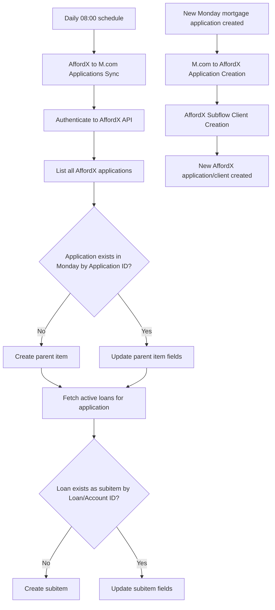

# AUTO-AFFORDX-001 — AffordX Mortgage Application Synchronisation

## 1. Purpose

Keep the AffordX Submissions board in Monday.com synchronised with mortgage applications and their active loans in AffordX (daily pull), and create a new AffordX application when a corresponding Monday mortgage application is created, so advisers get an up-to-date operational view of both systems without manual re-entry.

## 2. Business context

AffordX supports bank-statement analysis, application tracking and meeting summaries/transcriptions and is an `Active - Expanding` system (`knowledge/02_SYSTEMS_REGISTRY.md` SYS-AFFORDX-001). This automation is the two-way bridge between AffordX applications/loans and Monday.com.

## 3. Scope

### Included

- Daily (8am) pull of all AffordX applications into a parent item per application on the AffordX Submissions board, keyed by AffordX Application ID.
- Pull of each application's active loans (Accounts → Loans) as subitems, keyed by Loan/Account ID.
- Upsert logic: create if new, update mapped fields if the record already exists (no duplicates).
- Creation of a new AffordX application from a new Monday mortgage application (`M.com to AffordX Application Creation`), using a reusable client-creation subflow.

### Excluded

- Bank-statement analysis itself, or AffordX's meeting summary/transcription features (separate, undocumented AffordX capabilities per `knowledge/01_RSFA_SYSTEM_MAP.md` §4.4 known gaps).
- The 🏧 AffordX: Bank Statements Monday board (board ID `5025365497`) is a related but functionally separate tracking board — not confirmed as part of this automation's direct scope.

## 4. Current status

Active. `High` criticality. One confirmed target-scenario gap: `AffordX to M.com Applications Sync (Aug 2025)` calls a scenario referenced as `Subflow Application Creation Monday-AffordX (Apr 2026)` (ID `9067654`) which **does not exist** in the current `Valid scenarios/working` Make folder — per `knowledge/03_AUTOMATION_REGISTRY.md` §10, this must be located or confirmed deleted before this family can be considered fully mapped.

## 5. Trigger

- `AffordX to M.com Applications Sync (Aug 2025)` (`6238398`): Scheduled, daily at 08:00.
- `M.com to AffordX Application Creation (Jul 2025)` (`6468551`): Monday.com instant trigger (watch) — fires on new mortgage application creation.
- `AffordX Subflow Client Creation (Sep 2025)` (`7292131`): On-demand, called by the parent scenario above (also independently callable as a subscenario).

## 6. Inputs

- AffordX API: Application Summary (Application Date, Applicants/Account Holders, Application Status) and Accounts → Loans (Account/Loan No., Account Holders, Product Name, Repayment Frequency/Amount/Date, Interest Type & Rate, dates, terms).
- Monday.com mortgage application data (for the creation-direction scenario).

## 7. Outputs

- Parent item per AffordX application on the AffordX Submissions board, with subitems per active loan.
- New AffordX application/client created from a new Monday mortgage application.

## 8. Systems involved

AffordX (HTTP/Custom API), Monday.com, Make.com (execution).

## 9. Related Monday boards

| Board | ID | Role |
|---|---|---|
| AffordX Submissions | Not confirmed in `knowledge/04_MONDAY_BOARDS_REGISTRY.md` under this exact name | Destination for the daily AffordX sync — **TODO: verify** the exact current board ID; it may correspond to, or be distinct from, `🏧 AffordX: Bank Statements` (`5025365497`) |

## 10. Platform implementation

### Make.com scenarios

| Scenario ID | Exact Make name | Role | Status | Trigger | Calls | Called by | Source confidence |
|---|---|---|---|---|---|---|---|
| `6238398` | AffordX to M.com Applications Sync (Aug 2025) | Parent | Active | Scheduled (daily 08:00) | `Outlook: Email Notification after Failed Scenario` (`8732008`); `Subflow Application Creation Monday-AffordX (Apr 2026)` (`9067654`, **not found** in Valid scenarios/working) | None confirmed | Current for name/trigger/status; **unresolved dependency** on missing scenario `9067654` |
| `6468551` | M.com to AffordX Application Creation (Jul 2025) | Parent | Active | Monday.com instant trigger (watch) | `Outlook: Email Notification after Failed Scenario` (`8732008`); `AffordX Subflow Client Creation (Sep 2025)` (`7292131`) | None confirmed | Current (registry + call graph) |
| `7292131` | AffordX Subflow Client Creation (Sep 2025) | Parent (also callable as subscenario) | Active | On-demand (called by parent scenario) | `Outlook: Email Notification after Failed Scenario` (`8732008`) | `M.com to AffordX Application Creation (Jul 2025)` (`6468551`) | Current (registry + call graph). **Shared component — document once here, do not create a separate canonical automation ID.** |

`source-material/make/AffordX Applications Sync to Monday.md` describes the daily sync's business logic (parent/subitem upsert by Application ID / Loan ID) in detail and is treated as the primary walkthrough for `6238398`, though the source document does not use Make scenario IDs directly — the mapping to `6238398` is based on the matching daily-8am schedule and identical upsert logic.

### Power Automate flows

Not applicable.

### Monday native automations or workflows

Not applicable, per available evidence.

### Native integrations

Not applicable — this is a Make.com-mediated integration, not a native Monday/AffordX connector.

### Shared subflows and components

`AffordX Subflow Client Creation (Sep 2025)` (`7292131`) — reusable client-creation logic called by `6468551`; also flagged in `knowledge/03_AUTOMATION_REGISTRY.md` §8 as a component to document inside this automation rather than as its own canonical ID.

`COMP-MAKE-ERROR-001` — called by all three scenarios in this family.

## 11. End-to-end process

## 12. Data mapping

| AffordX field (Application Summary) | Monday parent item column | Notes |
|---|---|---|
| Application ID | De-duplication key | Used to decide create vs. update |
| Application Date | Application Date | — |
| Applicants / Account Holders | Applicants / Account Holders (Text) | Planned enhancement: link to Contacts board (not yet implemented per source material) |
| Application Status | Application Status | — |

| AffordX field (Accounts → Loans) | Monday subitem column | Notes |
|---|---|---|
| Loan/Account ID | De-duplication key | Used to decide create vs. update |
| Account Holders | Account Holders | — |
| Product Name | Product Name | — |
| Repayment Frequency / Next Amount / Next Date | Repayment Frequency / Repayment Next Amount / Repayment Next Date | — |
| Interest Type & Rate, Interest Expiry Date, Is Interest Only, Interest Only Expiry Date | Corresponding interest columns | — |
| Original Drawdown Date, Initial Principal, Total Year Term, Remaining Time, Maturity Date | Corresponding loan-term columns | — |

## 13. Decision and routing logic

- Parent items are keyed by AffordX Application ID; subitems by Loan/Account ID — both are strict upsert (create-or-update), never duplicate-create.
- Only **active** loans are pulled as subitems (closed-loan handling is a stated roadmap item, not yet implemented per source material).

## 14. Dependencies

- Missing scenario `9067654` (`Subflow Application Creation Monday-AffordX`) is an open, unresolved dependency of `6238398` — this scenario's full sync behaviour cannot be considered fully verified until this is located.
- AffordX API credentials and Monday API token, stored in Make's connection vault.
- Board/column IDs stored as Make scenario variables — must be updated if the board is cloned or fields renamed (explicit warning in source material).

## 15. Error handling

All three scenarios call `COMP-MAKE-ERROR-001` on failure.

## 16. Logging and observability

No dedicated log board confirmed. "Last Synced At" is listed as an optional audit column on the Monday parent item in source material — TODO: verify whether this column is actually implemented.

## 17. Manual operations and reprocessing

Not confirmed. TODO: verify whether the daily sync can be manually re-run on demand (e.g. after fixing a mapping issue) without waiting for the next 08:00 schedule.

## 18. Known limitations

- Missing subscenario `9067654` — an open, unresolved gap that must be found or confirmed deleted (`knowledge/03_AUTOMATION_REGISTRY.md` §8, §10).
- Applicants are currently stored as plain text on the Monday parent item, not yet linked to the Contacts board (explicitly flagged as a planned enhancement in source material, not yet implemented).
- Closed/inactive AffordX loans are not currently archived or flagged in Monday — also a stated roadmap item, not yet implemented.
- No Slack notification for new applications or status changes currently exists (also on the roadmap, not implemented).

## 19. Security and sensitive data

AffordX application and loan data includes detailed client financial information (loan amounts, repayment schedules, interest rates). Never use real client loan data as test data; use fictional test applications and loans only.

## 20. Testing

### Confirmed tests

None recorded.

### Required regression tests

- New AffordX application not yet in Monday → parent item created.
- Existing AffordX application with changed status → parent item updated, not duplicated.
- New active loan under an existing application → subitem created.
- Existing loan with changed repayment details → subitem updated, not duplicated.
- New Monday mortgage application → AffordX application/client created via the subflow.

### Test data restrictions

Use fictional applications, loans and client names only; never sync real client loan data into a test board.

## 21. Validation after change

Run the daily sync (or trigger manually if possible) against a test AffordX application, confirm the parent item and its loan subitems appear/update correctly in Monday without duplication. For the creation direction, create a test Monday mortgage application and confirm a corresponding AffordX application/client is created.

## 22. Rollback

Disable the affected Make.com scenario(s). No automated rollback of already-synced Monday items or already-created AffordX applications is defined.

## 23. Troubleshooting guide

1. Confirm the daily schedule actually ran (check Make.com scenario run history for `6238398`).
2. Confirm AffordX API authentication succeeded.
3. If a specific application/loan is missing or stale in Monday, check its Application ID / Loan ID against the AffordX source record.
4. For the creation direction, confirm the new Monday mortgage application actually triggered scenario `6468551`, and check whether `AffordX Subflow Client Creation` completed successfully.
5. Check for `COMP-MAKE-ERROR-001` failure emails.
6. If a mapping issue is suspected, check the Make scenario variables for board/column IDs — these must be updated if the board is cloned or fields renamed.

## 24. Source references

- `source-material/make/AffordX Applications Sync to Monday.md` — Current. Detailed daily-sync business logic, data model and roadmap notes.
- `exports/make/valid-scenarios-working-inventory.md`, `exports/make/make-scenario-call-graph.md` — Current. Scenario IDs, trigger types, the confirmed missing-subscenario gap.
- `knowledge/03_AUTOMATION_REGISTRY.md` §3, §4, §8, §10 — Current. Canonical ID, family grouping, shared-component treatment of the client-creation subflow, and the explicit missing-scenario gap.
- `knowledge/02_SYSTEMS_REGISTRY.md` SYS-AFFORDX-001 — Current. Platform description and status.

## 25. Known gaps

- Missing scenario `9067654` must be located in Make.com or confirmed deleted.
- Exact current Monday board ID for "AffordX Submissions" is not confirmed against `knowledge/04_MONDAY_BOARDS_REGISTRY.md` — it may be the same as, or different from, `🏧 AffordX: Bank Statements` (`5025365497`); needs direct verification.
- Roadmap items (Contacts linkage, closed-loan handling, Slack notifications) are explicitly not yet implemented — do not describe them as current behaviour.

## 26. Change history

| Date | Change | Author |
|---|---|---|
| 2026-07-30 | Initial canonical documentation created from registry, call-graph and source-material evidence; missing-scenario gap and unconfirmed board ID recorded. | Claude (documentation task) |
