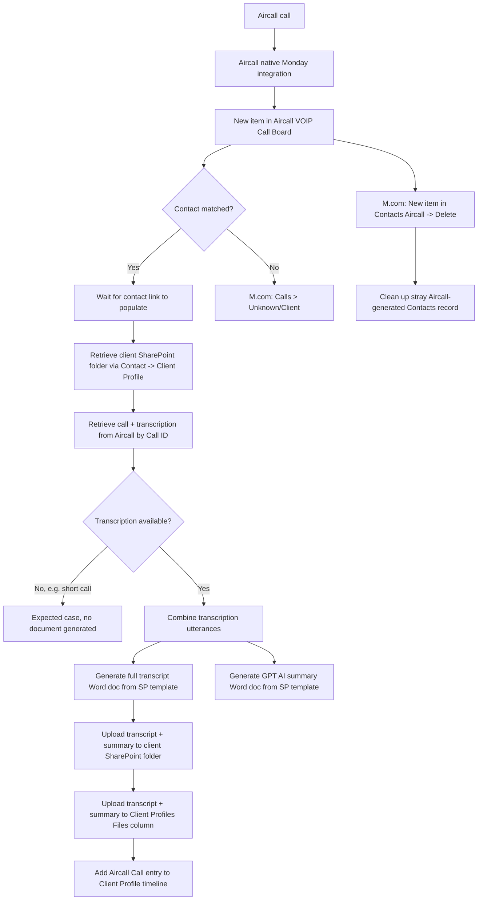

# AUTO-AIRCALL-001 — Aircall Call Processing, Transcription and Summary

## 1. Purpose

Automatically match Aircall calls to the correct client, generate a full written transcript and a concise AI-generated summary of the conversation in Word format, file both documents in the client's SharePoint folder and Monday Files column, and add the call to the client's activity timeline — so every advice-relevant phone call becomes a durable, reviewable written record.

## 2. Business context

Aircall's native Monday integration creates a call record in the `📞 Aircall: VOIP Call Board` for every call. `knowledge/01_RSFA_SYSTEM_MAP.md` §11 describes the full flow: native integration → call board → Monday native automation + Make.com processing → client matching, transcription, AI summary, SharePoint filing, Slack notification. Short calls may not produce a transcription; this is treated as an expected case, not a failure.

## 3. Scope

### Included

- Matching an incoming call's phone number/contact to a Client Profile.
- Handling calls that cannot be matched to a known contact ("Unknown/Client" routing).
- Retrieving the call recording and transcription from Aircall by Call ID.
- Combining transcription utterances into a single conversation.
- Generating a full transcript Word document and a separate GPT-generated summary Word document from SharePoint-stored templates.
- Uploading both documents to the client's SharePoint folder and to the Client Profiles Files column.
- Adding the call to the Client Profile's activity timeline, tagged as an Aircall Call.
- Cleanup of stray Contacts records created by the Aircall native integration.

### Excluded

- Call routing/answering within Aircall itself.
- Slack notification for new calls (described in the system map as "currently being developed" — not yet confirmed live).

## 4. Current status

Active - Under Improvement. Registry criticality: High. Two of the four family scenarios show recent errors per the Make inventory export (`M.com: Aircall Upload Transcriptions To SP (Jul 2026)`: 6 recent errors, per `exports/make/valid-scenarios-working-inventory.md`) — TODO: verify current error status and root cause before relying on this automation as fully stable.

## 5. Trigger

- `Aircall Transcript Summary` (6123035): Monday.com instant trigger (watch) on the Aircall VOIP Call Board.
- `M.com: Aircall Upload Transcriptions To SP (Jul 2026)` (9498962): Monday.com instant trigger (watch) — fires when a new Aircall call is registered.
- `M.com: Calls > Unknown/Client` (5543887): Monday.com instant trigger (watch).
- `M.com: New item in Contacts (Aircall) -> Delete` (6548539): Monday.com instant trigger (watch), for cleanup of Aircall-generated Contacts.

## 6. Inputs

- New item in `📞 Aircall: VOIP Call Board` (Call ID, linked contact).
- Aircall call and transcription data, retrieved via the stored Call ID.
- Word template files stored in the Aircall Templates SharePoint folder (transcript template and summary template).
- GPT (OpenAI) for summary generation.

## 7. Outputs

- Full call transcript Word document, filed in the client's SharePoint folder.
- AI-generated call summary Word document, filed in the client's SharePoint folder.
- Both documents also uploaded to the Client Profiles board Files column.
- New Client Profile timeline entry tagged "Aircall Call".

## 8. Systems involved

Aircall (native integration + API), Monday.com (call board, Contacts, Client Profiles), Make.com (execution), OpenAI/GPT (summary generation), Docx Templater (document population), Microsoft SharePoint (template source and document destination), Slack (planned, not yet confirmed live).

## 9. Related Monday boards

| Board | ID | Role |
|---|---|---|
| 📞 Aircall: VOIP Call Board | `5026308494` | Trigger source; stores Call ID, linked Contact, transcription-availability flag |
| Contacts | `2074688484` | Client matching by phone; also the target of the cleanup scenario |
| Client Profiles | `5024661649` | Destination for Files column upload and activity timeline entry |

## 10. Platform implementation

### Make.com scenarios

| Scenario ID | Exact Make name | Role | Status | Trigger | Calls | Called by | Source confidence |
|---|---|---|---|---|---|---|---|
| `6123035` | Aircall Transcript Summary | Standalone | Active | Monday.com instant trigger (watch) | None confirmed | None confirmed | Current (registry + call graph) |
| `9498962` | M.com: Aircall Upload Transcriptions To SP (Jul 2026) | Parent | Active | Monday.com instant trigger (watch) | `Outlook: Email Notification after Failed Scenario` (`8732008`) | None confirmed | Current (registry + call graph); matches source-material walkthrough in detail |
| `5543887` | M.com: Calls > Unknown/Client | Standalone | Active | Monday.com instant trigger (watch) | None confirmed | None confirmed | Current (registry + call graph) |
| `6548539` | M.com: New item in Contacts (Aircall) -> Delete | Standalone | Active | Monday.com instant trigger (watch) | None confirmed | None confirmed | Current (registry + call graph) |

`Outlook: Email Notification after Failed Scenario` (`8732008`, `COMP-MAKE-ERROR-001`) is called by `9498962` as a shared error-handling component, not part of this automation's own logic.

### Power Automate flows

Not applicable.

### Monday native automations or workflows

Monday native automations participate in the call board's routing per `knowledge/01_RSFA_SYSTEM_MAP.md` §11 (`MondayAutomation` node in the flow diagram) — exact recipe not documented. TODO: verify.

### Native integrations

Aircall native Monday integration creates the initial call record in the Aircall VOIP Call Board (`knowledge/02_SYSTEMS_REGISTRY.md` SYS-AIRCALL-001).

### Shared subflows and components

`COMP-MAKE-ERROR-001` (Shared Make Failure Email Notification) — used by scenario `9498962`.

## 11. End-to-end process

## 12. Data mapping

| Source field | Destination | Notes |
|---|---|---|
| Aircall Call ID (Monday) | Aircall API call/transcription lookup | Key used to retrieve call detail |
| Linked Contact -> Client Profile -> SP folder | Upload destination | Resolved via the Contact's Client Profile relation |
| Combined transcription utterances | Full transcript Word template | Populated via Docx Templater |
| GPT-generated summary text | Summary Word template | Populated via Docx Templater |

TODO: complete mapping from current production configuration for exact template placeholder names and Monday Files-column field IDs.

## 13. Decision and routing logic

- If the call cannot be matched to a known contact, `M.com: Calls > Unknown/Client` handles routing instead of the main transcription path.
- If no transcription is available (typically short calls), no transcript/summary document is generated — this is expected behaviour, not an error.
- The Aircall native integration occasionally creates a stray Contacts record; `M.com: New item in Contacts (Aircall) -> Delete` removes it.

## 14. Dependencies

- Client's SharePoint folder must already exist (`AUTO-SP-FOLDER-001`).
- Aircall Templates SharePoint folder must contain the current transcript and summary Word templates.
- OpenAI/GPT availability for summary generation.

## 15. Error handling

`M.com: Aircall Upload Transcriptions To SP (Jul 2026)` calls the shared `COMP-MAKE-ERROR-001` Outlook failure-notification component on error.

## 16. Logging and observability

Recent-errors counts are visible in the Make inventory export (`exports/make/valid-scenarios-working-inventory.md`) but are not otherwise summarised in a Monday board. TODO: verify whether a dedicated error/health board (e.g. System Health Monitor, board `5030207135`) currently tracks this automation.

## 17. Manual operations and reprocessing

Not confirmed. TODO: verify whether a failed transcription/summary generation can be manually re-triggered, or requires a Make.com scenario re-run from the error point.

## 18. Known limitations

- Short calls may not produce a transcription — expected, not a defect.
- Slack notification for new Aircall processing is described in the system map as "currently being developed" and should not be assumed live.
- Two of the four scenarios in this family have unconfirmed recent-error counts as of the last Make inventory export — needs follow-up before being treated as fully stable.

## 19. Security and sensitive data

Call recordings, transcriptions and summaries may contain sensitive client financial/personal information. Never use real call recordings or transcripts as test data; use synthetic test calls only, and never commit real transcript content to this repository.

## 20. Testing

### Confirmed tests

None recorded.

### Required regression tests

- Call with a matched contact and available transcription → transcript + summary generated and filed correctly.
- Call with a matched contact but no transcription (short call) → no document generated, no error raised.
- Call with no matched contact → routed via `M.com: Calls > Unknown/Client`.
- Stray Aircall Contacts record → correctly deleted by the cleanup scenario.

### Test data restrictions

Use synthetic/test Aircall calls only; never process real client call recordings as test data.

## 21. Validation after change

Place a test call through Aircall with a known test contact, confirm the call item appears on the Aircall VOIP Call Board, confirm the transcript and summary documents are generated (where transcription is available) and filed to both SharePoint and the Client Profiles Files column, and confirm the activity timeline entry appears.

## 22. Rollback

Disable the affected Make.com scenario(s). No automated rollback of already-generated documents is defined.

## 23. Troubleshooting guide

1. Confirm the call appears in the Aircall VOIP Call Board with a Call ID.
2. Confirm the linked Contact and its Client Profile relation are populated (the flow explicitly waits for this).
3. If no transcript/summary was generated, check whether the call was short enough that Aircall itself produced no transcription (expected) versus a genuine processing failure.
4. Check for `COMP-MAKE-ERROR-001` failure emails.
5. Check the Make inventory export for recent-error counts on the relevant scenario.

## 24. Source references

- `source-material/make/M.com_ Aircall Upload Transcriptions To SP (Jul 2026).md` — Current. Detailed step-by-step walkthrough matching scenario `9498962`.
- `exports/make/valid-scenarios-working-inventory.md` — Current. Scenario IDs, trigger types, recent-error counts.
- `exports/make/make-scenario-call-graph.md` — Current. Confirmed call to `COMP-MAKE-ERROR-001`.
- `knowledge/03_AUTOMATION_REGISTRY.md` §3, §4 — Current. Family grouping and canonical ID.
- `knowledge/01_RSFA_SYSTEM_MAP.md` §11 — Current. Business-process flow and expected-short-call behaviour.
- `knowledge/04_MONDAY_BOARDS_REGISTRY.md` — Current. Aircall VOIP Call Board description.

## 25. Known gaps

- Exact Monday native automation recipe used in the call-routing path is not documented.
- Slack notification status (built vs. planned) is unconfirmed.
- Root cause of recent errors on scenarios `9498962` and `9254149`-adjacent flows is not investigated in this pass.
- Manual reprocessing procedure for a failed transcription/summary generation is not confirmed.

## 26. Change history

| Date | Change | Author |
|---|---|---|
| 2026-07-30 | Initial canonical documentation created from registry, call-graph and source-material evidence. | Claude (documentation task) |
