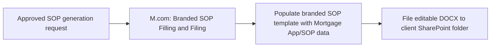

# AUTO-BRANDED-SOP-001 — Branded Mortgage SOP Generation

## 1. Purpose

Generate a branded, editable Statement of Position (SOP) Word document from approved Mortgage App/SOP data and file it into the client's SharePoint folder, so advisers receive a ready-to-use, correctly-branded SOP without manual document assembly.

## 2. Business context

`knowledge/01_RSFA_SYSTEM_MAP.md` §19 lists "Branded Mortgage SOP Generation" as an initial documentation priority (#5), and `✍ Mortgage App/SOP` explicitly supports SOP generation per `knowledge/04_MONDAY_BOARDS_REGISTRY.md`'s operational notes for that board.

## 3. Scope

### Included

- Populating a branded SOP Word template from Mortgage App/SOP data via Docx Templater.
- Filing the generated, editable SOP document to the client's SharePoint folder.

### Excluded

- The initial Mortgage App/SOP Super Form submission and PDF filing (`AUTO-FORMS-001`).
- Mortgage Application → Masterboard consolidation (`AUTO-MASTERBOARD-001`).
- `M.com: Review Broken SP Links on CP Board (May 2026)` (`9277255`) — an **inactive** maintenance scenario in the same "SharePoint and Documents" functional area per `knowledge/03_AUTOMATION_REGISTRY.md` §4, but not part of SOP generation itself; not documented as part of this automation.

## 4. Current status

Active. `High` criticality per `knowledge/03_AUTOMATION_REGISTRY.md` §3.

## 5. Trigger

`M.com: Branded SOP Filling and Filing (Jul 2026)` (`9555578`): Webhook (custom webhook) — fired by an approved SOP generation request (exact triggering condition/source of the webhook call not confirmed — TODO: verify).

## 6. Inputs

Mortgage App/SOP data for the relevant Monday item; a branded SOP Word template (source and exact storage location not confirmed — TODO: verify, likely SharePoint per the pattern used by `AUTO-AIRCALL-001`'s templates).

## 7. Outputs

A branded, editable SOP DOCX document filed to the client's SharePoint folder.

## 8. Systems involved

Monday.com (data source), Make.com (execution), Docx Templater (document population), Microsoft SharePoint (destination).

## 9. Related Monday boards

| Board | ID | Role |
|---|---|---|
| ✍ Mortgage App/SOP | `5025483251` | Data source for SOP generation |

## 10. Platform implementation

### Make.com scenarios

| Scenario ID | Exact Make name | Role | Status | Trigger | Calls | Called by | Source confidence |
|---|---|---|---|---|---|---|---|
| `9555578` | M.com: Branded SOP Filling and Filing (Jul 2026) | Standalone | Active | Webhook (custom webhook) | None confirmed | None confirmed | Current (registry + call graph); no dedicated source-material walkthrough |

No `source-material/make/` file exists for this scenario — all implementation detail beyond name/trigger/status/systems is inferred from the registry and call-graph exports only.

### Power Automate flows

Not applicable.

### Monday native automations or workflows

Not applicable, per available evidence.

### Native integrations

Not applicable.

### Shared subflows and components

None confirmed for this scenario in the current call-graph export (no call to `COMP-MAKE-ERROR-001` recorded, unlike most other Make family members — TODO: verify this is not simply an unresolved edge in the call graph).

## 11. End-to-end process

## 12. Data mapping

TODO: complete mapping from current production configuration. No field-level template mapping is confirmed from available evidence.

## 13. Decision and routing logic

Not confirmed. TODO: verify what determines "approved" for the purpose of triggering SOP generation, and whether there is any per-adviser or per-brand template selection logic (as seen in the renewal-email automations' adviser/JV template selection pattern).

## 14. Dependencies

Depends on the client's SharePoint folder already existing (`AUTO-SP-FOLDER-001`) and on Mortgage App/SOP data being sufficiently complete.

## 15. Error handling

Not confirmed for this scenario specifically — see §10 note on the absence of a confirmed `COMP-MAKE-ERROR-001` call.

## 16. Logging and observability

Not confirmed. TODO: verify.

## 17. Manual operations and reprocessing

Not confirmed. TODO: verify whether a SOP can be manually regenerated on demand.

## 18. Known limitations

This automation currently has the thinnest evidence base of the Make.com family: no source-material walkthrough exists, and the call graph does not confirm an error-handling call, which is unusual relative to its sibling scenarios.

## 19. Security and sensitive data

Generated SOP documents contain client financial and personal mortgage-application data. Never generate a real client's SOP as test data; use a dedicated fictional test Mortgage App/SOP item.

## 20. Testing

### Confirmed tests

None recorded.

### Required regression tests

- Approved test Mortgage App/SOP item → correctly-populated branded SOP generated and filed.
- Missing required source field → confirm behaviour (fails gracefully vs. generates an incomplete document) — TODO: verify expected behaviour before writing this test.

### Test data restrictions

Use a dedicated fictional test Mortgage App/SOP item only.

## 21. Validation after change

Trigger SOP generation for a test item, confirm the resulting DOCX is correctly branded, contains the expected test data, and is filed to the expected test SharePoint location.

## 22. Rollback

Disable the `M.com: Branded SOP Filling and Filing (Jul 2026)` scenario. No automated rollback of already-generated documents is defined.

## 23. Troubleshooting guide

1. Confirm the webhook that triggers this scenario actually fired (check the source system that calls the webhook, once confirmed).
2. Confirm the Mortgage App/SOP item has the data fields the template expects.
3. Confirm the client's SharePoint folder exists and is reachable.
4. Check Make.com scenario run history for this scenario directly, since no shared error-handler call is currently confirmed.

## 24. Source references

- `exports/make/valid-scenarios-working-inventory.md`, `exports/make/make-scenario-call-graph.md` — Current. Scenario ID, trigger type, systems, status.
- `knowledge/03_AUTOMATION_REGISTRY.md` §3, §4 — Current. Canonical ID, family grouping, documentation priority.
- `knowledge/01_RSFA_SYSTEM_MAP.md` §19 — Current. Documentation priority listing.
- `knowledge/04_MONDAY_BOARDS_REGISTRY.md` — Current. Mortgage App/SOP board's SOP-generation note.
- No `source-material/make/` file exists for this scenario.

## 25. Known gaps

- No implementation walkthrough exists; exact trigger source, template location, and error-handling behaviour are all unconfirmed.
- Relationship (if any) to the inactive `M.com: Review Broken SP Links on CP Board (May 2026)` scenario in the same functional area is not established.

## 26. Change history

| Date | Change | Author |
|---|---|---|
| 2026-07-30 | Initial canonical documentation created from registry and call-graph evidence only; no source-material walkthrough available. | Claude (documentation task) |
