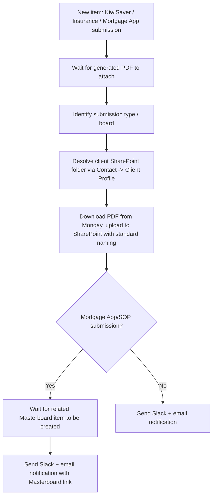

# AUTO-FORMS-001 — New Form Submission Filing

## 1. Purpose

File the generated PDF from a new KiwiSaver Questionnaire, Insurance Questionnaire or Mortgage App/SOP submission into the corresponding client's SharePoint folder, using a standardised naming convention, and notify the team via Slack and email so nobody has to manually check whether a new submission was filed.

## 2. Business context

RSFA collects KiwiSaver and Mortgage submissions via Superforms, and Insurance submissions via Monday Forms (`knowledge/01_RSFA_SYSTEM_MAP.md` §4.3, §9). Each submission type generates a PDF attached to the Monday item; this automation is responsible for getting that PDF into the client's document store reliably.

## 3. Scope

### Included

- Detecting a new item on the KiwiSaver Questionnaire, Insurance Questionnaire, or Mortgage App/SOP board.
- Waiting for the generated PDF to be attached to the item.
- Resolving the client's SharePoint folder via the related Contact → Client Profile relationship.
- Downloading and re-uploading the PDF using the naming convention `{{lastname}}_{{questionnaire_name}}_{{month}}{{year}}`.
- For Mortgage App/SOP submissions specifically, waiting for the corresponding Masterboard item to be created before notifying, and including a link to it.
- Slack and email notification once filing is complete.

### Excluded

- The Mortgage Application → Masterboard consolidation itself (`AUTO-MASTERBOARD-001`).
- Lead/Client Profile/Contact creation triggered by these same form submissions (`AUTO-LEADS-001`).

## 4. Current status

Active. `High` criticality per `knowledge/03_AUTOMATION_REGISTRY.md` §3. One recent error recorded against this scenario in the Make inventory export — TODO: verify current error status.

## 5. Trigger

`M.com: New Form Submission in IQ/MA/KQ (Jun 2026)` (`9447215`): Webhook (custom webhook) — fires when a new item is created in `🐖 KiwiSaver Questionnaire`, `❓️Insurance Questionnaire`, or `✍ Mortgage App/SOP`.

## 6. Inputs

- New item on one of the three source boards, with its attached generated PDF.
- Related Contact(s) and their linked Client Profile, to resolve the client SharePoint folder.
- For Mortgage submissions: the corresponding item on `Masterboard: End Forms` (created by `AUTO-MASTERBOARD-001`).

## 7. Outputs

- PDF filed to the client's SharePoint folder, named `{{lastname}}_{{questionnaire_name}}_{{month}}{{year}}`.
- Slack notification confirming filing (with a Masterboard link for Mortgage submissions).
- Email notification confirming filing.

## 8. Systems involved

Monday.com (KiwiSaver Questionnaire, Insurance Questionnaire, Mortgage App/SOP, Contacts, Client Profiles, Masterboard: End Forms), Make.com (execution), Microsoft SharePoint (destination), Microsoft Outlook/Email and Slack (notifications).

## 9. Related Monday boards

| Board | ID | Role |
|---|---|---|
| 🐖 KiwiSaver Questionnaire | `5026459551` | Trigger source |
| ❓️Insurance Questionnaire | `5025365501` | Trigger source |
| ✍ Mortgage App/SOP | `5025483251` | Trigger source; also requires waiting on the related Masterboard item |

## 10. Platform implementation

### Make.com scenarios

| Scenario ID | Exact Make name | Role | Status | Trigger | Calls | Called by | Source confidence |
|---|---|---|---|---|---|---|---|
| `9447215` | M.com: New Form Submission in IQ/MA/KQ (Jun 2026) | Parent | Active | Webhook (custom webhook) | `Outlook: Email Notification after Failed Scenario` (`8732008`) | None confirmed | Current — matches `source-material/make/M.com_ New Form Submission in IQ_MA_KQ (Jun 2026).md` exactly |

### Power Automate flows

Not applicable.

### Monday native automations or workflows

Not applicable, per available evidence.

### Native integrations

Superforms (KiwiSaver, Mortgage App/SOP) and Monday Forms (Insurance Questionnaire) write submissions directly into their respective boards, which then trigger this automation (`knowledge/03_AUTOMATION_REGISTRY.md` §7).

### Shared subflows and components

`COMP-MAKE-ERROR-001` — called on failure.

## 11. End-to-end process

## 12. Data mapping

| Source field | Destination | Notes |
|---|---|---|
| Applicant last name | Filename component | `{{lastname}}` |
| Board/questionnaire type | Filename component | `{{questionnaire_name}}` |
| Submission month/year | Filename component | `{{month}}{{year}}` |
| Related Contact -> Client Profile -> SP folder | Upload destination | — |

## 13. Decision and routing logic

- The flow branches by which of the three boards triggered it, to select the correct naming/notification path.
- For Mortgage App/SOP submissions only, the flow waits for the Masterboard item (created asynchronously by `AUTO-MASTERBOARD-001`) before sending its notification, so the notification can include a working Masterboard link.

## 14. Dependencies

- Client's SharePoint folder must already exist (`AUTO-SP-FOLDER-001`).
- For Mortgage submissions, depends on `AUTO-MASTERBOARD-001` completing in a timely manner; a slow or failed Masterboard creation could delay or affect this automation's notification step.

## 15. Error handling

Calls `COMP-MAKE-ERROR-001` on failure.

## 16. Logging and observability

Slack and email notifications serve as the operational confirmation log for each filed submission. No dedicated Monday board log confirmed.

## 17. Manual operations and reprocessing

Not confirmed. TODO: verify whether a submission that failed to file (e.g. PDF never generated) can be manually re-triggered.

## 18. Known limitations

- Depends on the source board's PDF-generation step completing before this automation's wait step times out — TODO: verify the wait step's timeout behaviour if the PDF is delayed or never generated.
- One recent error recorded in the last Make inventory export — root cause not investigated in this pass.

## 19. Security and sensitive data

Filed PDFs contain client financial, insurance or KiwiSaver personal data. Never use real client submissions as test data; use fictional test submissions only.

## 20. Testing

### Confirmed tests

None recorded.

### Required regression tests

- New KiwiSaver Questionnaire submission → PDF filed with correct naming, notifications sent.
- New Insurance Questionnaire submission → PDF filed with correct naming, notifications sent.
- New Mortgage App/SOP submission → PDF filed, notification waits for and includes the Masterboard link.
- PDF not yet generated at trigger time → confirm the wait behaviour (does not fail prematurely).

### Test data restrictions

Use fictional applicant data and test submissions only.

## 21. Validation after change

Submit a test item to each of the three source boards, confirm the PDF is correctly named and filed to the expected test SharePoint location, and confirm Slack/email notifications fire — including the Masterboard link for the Mortgage App/SOP case.

## 22. Rollback

Disable the `M.com: New Form Submission in IQ/MA/KQ (Jun 2026)` scenario. No automated rollback of already-filed PDFs is defined.

## 23. Troubleshooting guide

1. Confirm the source board item actually has the generated PDF attached.
2. Confirm the related Contact/Client Profile resolves to a valid SharePoint folder.
3. For Mortgage App/SOP submissions, confirm the corresponding Masterboard item exists (see `AUTO-MASTERBOARD-001`) if the notification appears stuck.
4. Check for `COMP-MAKE-ERROR-001` failure emails.

## 24. Source references

- `source-material/make/M.com_ New Form Submission in IQ_MA_KQ (Jun 2026).md` — Current. Exact match to the registered scenario.
- `exports/make/valid-scenarios-working-inventory.md`, `exports/make/make-scenario-call-graph.md` — Current. Scenario ID, trigger, recent-error count.
- `knowledge/03_AUTOMATION_REGISTRY.md` §3, §7 — Current. Canonical ID and native-integration relationships.
- `knowledge/01_RSFA_SYSTEM_MAP.md` §9 — Current. Form/end-form data flow context.

## 25. Known gaps

- Wait-step timeout behaviour if a PDF is delayed or never generated is unconfirmed.
- Manual reprocessing procedure for a failed filing is unconfirmed.
- Root cause of the one recorded recent error is not investigated.

## 26. Change history

| Date | Change | Author |
|---|---|---|
| 2026-07-30 | Initial canonical documentation created from registry and source-material evidence. | Claude (documentation task) |
