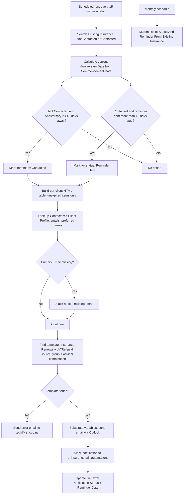

# AUTO-INSURANCE-RENEWAL-001 — Insurance Expiry and Anniversary Processing

## 1. Purpose

Identify insurance policies on `✔️ Existing Insurance` approaching their Anniversary Date, send a first client notification 45 days before the anniversary and a follow-up reminder 15 days later if unanswered, notify the internal team via Slack, and reset renewal-notification state where needed — so anniversary-driven renewal outreach happens automatically and consistently.

## 2. Business context

`knowledge/01_RSFA_SYSTEM_MAP.md` §7 describes the insurance lifecycle: completed insurance business moves to Existing Insurance, where anniversary/review dates drive client notification and possible return to the Insurance Deals Pipeline for new or updated cover. This automation is the mechanism behind that anniversary-driven notification step, closely mirroring `AUTO-MORTGAGE-RENEWAL-001`'s design.

## 3. Scope

### Included

- Filtering Existing Insurance for items whose `Renewal Notification Status` is "Not Contacted" (index 5) or "Contacted" (index 0), pre-filtered at the search level.
- Replicating the `Anniversary Date` calculation in-flow (from `Commencement Date`), since Anniversary Date is a Monday formula column that cannot be extracted directly.
- Moving a "Not Contacted" item to "Contacted" if the calculated Anniversary Date is 23–45 days away; moving a "Contacted" item to "Reminder Sent" if the Reminder Date was more than 15 days ago.
- Building a per-client HTML table of unexpired insurance items (Insurance Provider, Anniversary Date), grouped by client.
- Selecting the correct HTML template by `Email Campaign = Insurance Renewal`, the item's JV/Referral Source group (TOG / Key Mortgages / Other), and the adviser combination.
- Sending the email, notifying Slack channel `e_insurance_all_automations`, and updating `Renewal Notification Status` and `Reminder Date`.
- Resetting status/reminder state on Existing Insurance items where required (`9235525`).

### Excluded

- The insurance-specific unsubscribe path (`AUTO-UNSUBSCRIBE-001`, scenario `7178534`).
- Renaming after insurance policy/owner changes (`AUTO-NAMING-001`, scenario `1215342`).

## 4. Current status

Active. `High` criticality per `knowledge/03_AUTOMATION_REGISTRY.md` §3.

## 5. Trigger

- `M.com: Insurance Expiry Email (Jul 2025)` (`6279522`): Scheduled, every 900 seconds within a restricted time window.
- `M.com Reset Status And Reminder From Exisitng Insurance` (`9235525`): scheduled, monthly (per "Unknown/other (monthly)" trigger classification in the Make inventory export).

## 6. Inputs

- Existing Insurance items with `Renewal Notification Status` = "Not Contacted" (index 5) or "Contacted" (index 0), and a `Commencement Date` from which the current-cycle Anniversary Date is derived.
- Contacts linked via Client Profile, for recipient email(s) and preferred name(s).
- `✉️ Client Renewal/Reviews` board: HTML template matched by `Email Campaign = Insurance Renewal`, JV/Referral Source group, and adviser combination.

## 7. Outputs

- Outlook email to the client(s).
- Slack message to `e_insurance_all_automations` with status, client name, email, Anniversary Date, Insurance Provider.
- Updated `Renewal Notification Status` (Not Contacted → Contacted → Reminder Sent) and `Reminder Date`.
- Error email to `tech@rsfa.co.nz` if no matching adviser-combination template is found.
- Monthly reset of status/reminder fields via `9235525` (exact reset condition not confirmed — TODO: verify).

## 8. Systems involved

Monday.com (Existing Insurance, Contacts, Client Profiles, Email Campaigns Templates), Make.com (execution), Microsoft Outlook/Email (delivery), Slack (internal notification).

## 9. Related Monday boards

| Board | ID | Role |
|---|---|---|
| ✔️ Existing Insurance | `5024672437` | Primary source and status-update target |
| Contacts | `2074688484` | Recipient email/name resolution via linked Client Profile |
| Client Profiles | `5024661649` | Links the insurance item to its Contacts |
| ✉️ Client Renewal/Reviews | `5027616908` | HTML email template source, keyed by campaign + JV/Referral Source group + adviser combination |

## 10. Platform implementation

### Make.com scenarios

| Scenario ID | Exact Make name | Role | Status | Trigger | Calls | Called by | Source confidence |
|---|---|---|---|---|---|---|---|
| `6279522` | M.com: Insurance Expiry Email (Jul 2025) | Parent | Active | Scheduled (every 900s, restricted window) | `Outlook: Email Notification after Failed Scenario` (`8732008`) | None confirmed | Current — matches `source-material/make/M.com_ Insurance Expiry Email (Jul 2025).md` exactly |
| `9235525` | M.com Reset Status And Reminder From Exisitng Insurance | Parent | Active | Unknown/other (monthly) | `Outlook: Email Notification after Failed Scenario` (`8732008`) | None confirmed | Current (registry + call graph) only; no dedicated source-material walkthrough |

### Power Automate flows

Not applicable.

### Monday native automations or workflows

Not applicable, per available evidence.

### Native integrations

Not applicable.

### Shared subflows and components

`COMP-MAKE-ERROR-001` — called by both scenarios. A separate in-flow error path in `6279522` sends directly to `tech@rsfa.co.nz` when no matching adviser-combination/JV-group template is found.

## 11. End-to-end process

## 12. Data mapping

| Source field | Destination | Notes |
|---|---|---|
| `Commencement Date` | Calculated Anniversary Date | Replicated in-flow since the Monday `Anniversary Date` column is a formula column and cannot be read directly |
| Insurance Provider, Anniversary Date | Loans/policy table in email | Only unexpired items included |
| Item's JV/Referral Source (TOG / Key Mortgages / Other) | Template-selection filter | Determines which of three distinct HTML template sets is used |
| `%URLClientNames%`, `%LoansTable%`, `%ClientNames%`, `%BannerByStatus%` | HTML template placeholders | Must be present verbatim in any replacement template |

TODO: complete mapping from current production configuration for exact Monday column IDs and the exact reset condition used by `9235525`.

## 13. Decision and routing logic

- **Status-index dependency (fragile by design):** 5 = Not Contacted, 0 = Contacted for the initial search filter at time of writing. Reordering the `Renewal Notification Status` dropdown labels will silently change these indexes and break the filter — this is the single most important operational constraint on this automation.
- Template selection requires **three** matching dimensions: `Email Campaign = Insurance Renewal`, the correct JV/Referral Source group (TOG, Key Mortgages, or Other — each with its own distinct template set), and the exact adviser combination.
- If no matching template is found, the flow stops that record's route and alerts `tech@rsfa.co.nz` rather than sending an incorrect email.

## 14. Dependencies

- Depends on `Commencement Date` being correctly populated, since Anniversary Date cannot be read directly.
- Depends on the `.eml Examples (Only Visual)` preview files being manually kept in sync — not read by the flow itself.
- Depends on Contacts having a Primary Email for full functionality.

## 15. Error handling

Both scenarios call `COMP-MAKE-ERROR-001` on failure. `6279522` additionally sends a dedicated no-template-match error to `tech@rsfa.co.nz`.

## 16. Logging and observability

Slack channel `e_insurance_all_automations` receives a message per successfully-processed item.

## 17. Manual operations and reprocessing

Not confirmed for `6279522`. `9235525`'s monthly reset is itself a form of scheduled reprocessing/cleanup, but its exact reset condition and scope are unconfirmed — TODO: verify before relying on it operationally.

## 18. Known limitations

- Hard dependency on Monday status-index stability for both the insurance board and the template board.
- Three-dimensional template matching (campaign + JV group + adviser combination) is more complex than the mortgage equivalent (campaign + adviser only) and has more ways to silently fail to match.
- `9235525`'s exact behaviour is undocumented beyond its name and schedule — it resets *something* about status/reminder state monthly, but the precise trigger condition and scope of records affected are unconfirmed.

## 19. Security and sensitive data

This automation processes real client names, emails and insurance policy details to build outgoing emails. Never redirect this automation at real client data for testing; use a dedicated test insurance item with fictional data and a test mailbox.

## 20. Testing

### Confirmed tests

None recorded.

### Required regression tests

- Test item at 45/44/24/23 days from Anniversary Date (Not Contacted) → correct boundary behaviour for moving to Contacted.
- Test item at 15/16 days since Reminder Date (Contacted) → correct boundary behaviour for moving to Reminder Sent.
- Test item outside both windows → no action taken.
- Contact missing Primary Email → Slack notice fires, no crash.
- Each JV/Referral Source group (TOG, Key Mortgages, Other) with a valid adviser combination → correct template selected.
- No matching adviser-combination/JV-group template → error email to `tech@rsfa.co.nz`.
- Monthly reset scenario → confirm which records/fields are actually affected (this needs to be established before a meaningful regression test can be written).

### Test data restrictions

Use a dedicated test item on Existing Insurance with a fictional client and fictional policy data, and a test mailbox recipient.

## 21. Validation after change

Manually set a test item's Commencement Date and status to fall inside each boundary condition in turn, run the scenario (or wait for its scheduled window), and confirm the correct status transition, email content (including correct JV-group template selection), Slack message, and column updates.

## 22. Rollback

Disable the affected Make.com scenario(s). No automated rollback of already-sent emails, already-updated statuses, or already-applied monthly resets is defined.

## 23. Troubleshooting guide

1. Confirm the item's `Renewal Notification Status` label and its underlying Monday index still match what the scenario expects (5 = Not Contacted, 0 = Contacted).
2. Confirm `Commencement Date` is populated so the Anniversary Date calculation can run.
3. If no email was sent, check whether template matching failed on campaign, JV group, or adviser combination (look for the `tech@rsfa.co.nz` error email).
4. Check Contacts for a missing Primary Email.
5. If reminder/status fields look unexpectedly reset, check whether `9235525`'s monthly run is the cause.

## 24. Source references

- `source-material/make/M.com_ Insurance Expiry Email (Jul 2025).md` — Current. Full detailed walkthrough matching scenario `6279522` exactly.
- `exports/make/valid-scenarios-working-inventory.md`, `exports/make/make-scenario-call-graph.md` — Current. Scenario IDs, trigger, status.
- `knowledge/03_AUTOMATION_REGISTRY.md` §3, §4 — Current. Canonical ID and family grouping.
- `knowledge/01_RSFA_SYSTEM_MAP.md` §7 — Current. Insurance lifecycle context.
- `knowledge/04_MONDAY_BOARDS_REGISTRY.md` — Current. Board IDs and column notes for Existing Insurance.

## 25. Known gaps

- No source-material walkthrough exists for `9235525`; its exact reset condition and scope are unconfirmed.
- Manual reprocessing/reset procedure for `6279522` is unconfirmed.
- Exact current Monday status indexes should be re-verified directly in Monday before relying on this documentation.

## 26. Change history

| Date | Change | Author |
|---|---|---|
| 2026-07-30 | Initial canonical documentation created from registry and source-material evidence. | Claude (documentation task) |
