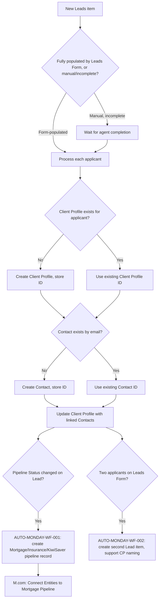

# AUTO-LEADS-001 — Lead to Contact and Client Profile Creation

## 1. Purpose

When a new Lead is created (via the Leads Form or manually), ensure each applicant has a linked Contact and Client Profile — creating whichever records are missing — and route the lead into the correct pipeline (Mortgage, Insurance or KiwiSaver) via the corresponding Monday Workflow, so every prospect becomes a consistently-structured, correctly-linked operational record.

## 2. Business context

The Leads board is the entry point for new prospects, reached via the external Leads Form or the website contact page (`source-material/make/M.com_ Mortgage Questionnaire find contact in Mortgage Pipeline (Jan 26).md`'s sibling document and `knowledge/01_RSFA_SYSTEM_MAP.md` §5). This automation family is `Critical`: every downstream process (Mortgage Pipeline, Insurance Deals Pipeline, KiwiSaver Pipeline, SharePoint folder creation, email filing) depends on the Client Profile and Contact records this family creates being correct and correctly linked.

## 3. Scope

### Included

- Waiting to determine whether a new Leads item was fully populated by the Leads Form or created manually and still needs agent completion.
- Per-applicant check for an existing Client Profile; creating one if missing.
- Per-applicant check for an existing Contact by email; creating one if missing.
- Updating the Client Profile with the correct linked Contacts once all applicants are processed.
- Connecting Client Profile / Contact / Trust entities to a newly-created Mortgage Pipeline record (`8278547`).
- Routing a Lead into the Mortgage, Insurance or KiwiSaver pipeline when its `Pipeline Status` changes (`AUTO-MONDAY-WF-001`, a Monday Workflow, not a Make scenario).
- Creating a second Lead item and supporting Client Profile naming when a Leads Form submission contains two applicants (`AUTO-MONDAY-WF-002`, a Monday Workflow).

### Excluded

- Client, Deal and Policy naming synchronisation after initial creation (`AUTO-NAMING-001`).
- Mortgage Application / ROMA data consolidation into Masterboard (`AUTO-MASTERBOARD-001`).

## 4. Current status

Active. `Critical` per `knowledge/03_AUTOMATION_REGISTRY.md` §3.

## 5. Trigger

- `M.com: Creating Contact and Client Profile after Lead was Added (Mar 2026)` (`8800779`): new Leads Form submission or manually-created item in the Leads board.
- `M.com: Connect Entities to Mortgage Pipeline (Dec25)` (`8278547`): Webhook (custom webhook) — fired when a Mortgage Pipeline record needs its related entities connected (exact triggering condition not confirmed — TODO: verify; likely fired by `AUTO-MONDAY-WF-001`'s pipeline-creation action).
- `AUTO-MONDAY-WF-001` (Monday Workflow): `Pipeline Status` change on Leads.
- `AUTO-MONDAY-WF-002` (Monday Workflow): Leads Form application contains two applicants.

## 6. Inputs

- New Leads board item (applicant name(s), email(s), service-interest fields).
- Existing Client Profiles and Contacts data, for match-or-create logic.

## 7. Outputs

- New or confirmed-existing Client Profile per applicant.
- New or confirmed-existing Contact per applicant, matched by email.
- Client Profile updated with correctly linked Contacts.
- New Mortgage/Insurance/KiwiSaver pipeline record, with Client Profile/Contact/Trust entities connected.
- (Two-applicant case) A second Lead item created.

## 8. Systems involved

Monday.com only (Leads, Contacts, Client Profiles, Mortgage/Insurance/KiwiSaver Pipeline boards), via Make.com scenarios and native Monday Workflows.

## 9. Related Monday boards

| Board | ID | Role |
|---|---|---|
| Leads | `2074688480` | Trigger source |
| Contacts | `2074688484` | Match-or-create target, by email |
| Client Profiles | `5024661649` | Match-or-create target; updated with linked Contacts |
| 💲Mortgage Pipeline | `5025201889` | Pipeline destination for mortgage-interest leads |
| ➕Insurance Deals Pipeline | `5025201920` | Pipeline destination for insurance-interest leads |
| 📈 KiwiSaver Pipeline | `5025201954` | Pipeline destination for KiwiSaver-interest leads |

## 10. Platform implementation

### Make.com scenarios

| Scenario ID | Exact Make name | Role | Status | Trigger | Calls | Called by | Source confidence |
|---|---|---|---|---|---|---|---|
| `8800779` | M.com: Creating Contact and Client Profile after Lead was Added (Mar 2026) | Parent | Active | Webhook (custom webhook) | `Outlook: Email Notification after Failed Scenario` (`8732008`) | None confirmed | Current — matches source material exactly |
| `8278547` | M.com: Connect Entities to Mortgage Pipeline (Dec25) | Parent | Active | Webhook (custom webhook) | `Outlook: Email Notification after Failed Scenario` (`8732008`) | None confirmed | Current (registry + call graph); no dedicated source-material walkthrough |

### Power Automate flows

Not applicable.

### Monday native automations or workflows

- `AUTO-MONDAY-WF-001` — Move to Pipeline Workflow (New), board `5025429617`: creates the Mortgage, Insurance or KiwiSaver pipeline record from a `Pipeline Status` change on Leads. See `knowledge/automations/monday/AUTO-MONDAY-WF-001-move-to-pipeline.md`.
- `AUTO-MONDAY-WF-002` — Leads App 2 Creation + CP Name, board `5025430003`: creates the second Lead item for two-applicant submissions and supports Client Profile naming. See `knowledge/automations/monday/AUTO-MONDAY-WF-002-second-applicant.md`.

### Native integrations

Superforms/Monday Forms write the initial Leads Form submission directly into the Leads board (`knowledge/03_AUTOMATION_REGISTRY.md` §7).

### Shared subflows and components

`COMP-MAKE-ERROR-001` — called by both confirmed Make scenarios in this family.

A shared search utility, `M.com: Subflow Search Contacts in Monday (Feb 26)` (`8518416`), appears in the same "Client Profile / Contact Lifecycle" functional area per `exports/make/valid-scenarios-working-inventory.md`, but **no confirmed caller** has been identified in the current call-graph export. It may be used by this family (or another) — **TODO: verify** its actual caller(s) before assuming it is part of this automation's execution path.

## 11. End-to-end process

## 12. Data mapping

| Source field | Destination | Notes |
|---|---|---|
| Applicant email | Contacts Primary Email (match key) | Existing-contact lookup |
| Applicant → Client Profile (new or matched) | Client Profiles linked Contacts | Updated after all applicants processed |
| Lead `Pipeline Status` | Mortgage/Insurance/KiwiSaver Pipeline record creation | Handled by `AUTO-MONDAY-WF-001`, not a Make scenario |

TODO: complete mapping from current production configuration for exact column IDs.

## 13. Decision and routing logic

- The flow first determines whether the Lead item is already fully populated (Leads Form submission) or was created manually and needs agent completion, before processing applicants — avoiding premature processing of an incomplete manual entry.
- Each applicant is processed independently: Client Profile check-or-create, then Contact check-or-create by email.
- `AUTO-MONDAY-WF-001` determines which pipeline (Mortgage/Insurance/KiwiSaver) to route into based on the Lead's declared service interest and `Pipeline Status` value.

## 14. Dependencies

- Downstream automations (`AUTO-SP-FOLDER-001`, `AUTO-EMAIL-001`, `AUTO-MASTERBOARD-001`, etc.) all depend on this family creating correct, correctly-linked Client Profile and Contact records.
- `M.com: Connect Entities to Mortgage Pipeline` depends on the Mortgage Pipeline record already existing (created by `AUTO-MONDAY-WF-001`).

## 15. Error handling

Both confirmed Make scenarios call `COMP-MAKE-ERROR-001` on failure.

## 16. Logging and observability

No dedicated log board confirmed for this family.

## 17. Manual operations and reprocessing

Not confirmed. TODO: verify whether a manually-created, incomplete Lead item can be safely re-processed once completed, or whether the automation only fires once per item creation.

## 18. Known limitations

- Contact matching is by email only; a lead with no email, or a duplicate/mistyped email, could result in duplicate Contact creation — TODO: verify whether any secondary matching (name, phone) exists.
- `M.com: Update Dependents (Dec25)` (`8260037`) and the inactive `M.com: CRM Migration - Connect Client Profiles and Pipelines (Dec25)` (`8264526`) sit in the same "Leads and Client Profiles" functional area per the Make inventory export but are **not confirmed** to be part of this automation's execution path — they are not documented here and should be investigated separately before being assigned a canonical automation ID. `8264526` is inactive and should be retained as a historical migration utility per `knowledge/03_AUTOMATION_REGISTRY.md` §9.
- The shared search utility `8518416` has no confirmed caller and may or may not be part of this family's execution — flagged above.

## 19. Security and sensitive data

Leads, Contacts and Client Profiles contain client personal data. Never use real prospect data as test data; use fictional test leads only.

## 20. Testing

### Confirmed tests

None recorded.

### Required regression tests

- New Leads Form submission, single applicant, no existing Client Profile/Contact → both created and correctly linked.
- New Leads Form submission, applicant matches existing Contact by email → existing Contact reused, no duplicate.
- Manually-created, initially-incomplete Lead item → automation waits appropriately before processing.
- Two-applicant Leads Form submission → second Lead item created via `AUTO-MONDAY-WF-002`.
- `Pipeline Status` change → correct pipeline record created via `AUTO-MONDAY-WF-001`, entities connected via `8278547`.

### Test data restrictions

Use fictional prospect names and emails only; never submit real prospect data as a test.

## 21. Validation after change

Submit a test Lead (via a test Leads Form entry or manual creation) with a known fictional applicant, confirm the Client Profile and Contact are created and linked correctly, change `Pipeline Status` and confirm the correct pipeline record is created with entities connected.

## 22. Rollback

Disable the affected Make.com scenario(s) or Monday Workflow. No automated rollback of already-created Client Profile/Contact/pipeline records is defined.

## 23. Troubleshooting guide

1. Confirm the Leads item actually reached a "fully populated" state before assuming the automation should have run.
2. Check whether a Client Profile/Contact already existed for the applicant's email, to understand which branch executed.
3. If pipeline routing didn't occur, confirm `Pipeline Status` was actually changed (not just displayed) on the Lead.
4. Check for `COMP-MAKE-ERROR-001` failure emails.
5. For two-applicant cases, confirm the Leads Form submission actually contained two applicants before expecting `AUTO-MONDAY-WF-002` to fire.

## 24. Source references

- `source-material/make/M.com_ Creating Contact and Client Profile after Lead was Added (Mar 2026).md` — Current. Exact match to scenario `8800779`.
- `exports/make/valid-scenarios-working-inventory.md`, `exports/make/make-scenario-call-graph.md` — Current. Scenario IDs, status, and the unresolved caller of `8518416`.
- `knowledge/03_AUTOMATION_REGISTRY.md` §3, §4, §6 — Current. Canonical ID, family grouping, Monday Workflow inventory.
- `knowledge/01_RSFA_SYSTEM_MAP.md` §5, §9 — Current. Leads Form context.
- `knowledge/04_MONDAY_BOARDS_REGISTRY.md` — Current. Board IDs and relationships.

## 25. Known gaps

- No source-material walkthrough exists for `8278547` (Connect Entities to Mortgage Pipeline).
- The exact trigger condition for `8278547` is not confirmed.
- `8260037` (Update Dependents) and the inactive `8264526` (CRM Migration) are not confirmed to belong to this automation family — flagged for follow-up, not assumed.
- The shared search utility `8518416`'s actual caller(s) are unconfirmed.
- Secondary (non-email) contact-matching logic, if any, is unconfirmed.

## 26. Change history

| Date | Change | Author |
|---|---|---|
| 2026-07-30 | Initial canonical documentation created from registry, call-graph and source-material evidence; unclassified adjacent scenarios flagged rather than assumed. | Claude (documentation task) |
