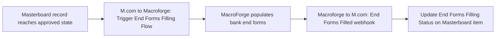

# AUTO-MACROFORGE-001 — MacroForge End-Forms Integration

## 1. Purpose

Trigger MacroForge's automated bank end-form population from an approved `Masterboard: End Forms` record, and record the completion status back into Monday.com once MacroForge has filled the forms, so advisers know when a client's bank end forms are ready without checking MacroForge directly.

## 2. Business context

MacroForge is a desktop tool that reads `Masterboard: End Forms` to populate bank end forms automatically (`knowledge/01_RSFA_SYSTEM_MAP.md` §4.4, `knowledge/02_SYSTEMS_REGISTRY.md` SYS-MACROFORGE-001). This automation is the trigger/completion bridge between Monday.com and MacroForge, and depends entirely on `AUTO-MASTERBOARD-001` having already produced a current, complete Masterboard record.

## 3. Scope

### Included

- Triggering the MacroForge end-forms filling process from an approved Monday data state.
- Receiving MacroForge's completion callback and recording it against the originating Masterboard item.

### Excluded

- Populating or consolidating the Masterboard dataset itself (`AUTO-MASTERBOARD-001`).
- MacroForge's own local/desktop synchronisation behaviour (documented, if at all, under `knowledge/systems/macroforge/`).

## 4. Current status

Active. `Critical` per `knowledge/03_AUTOMATION_REGISTRY.md` §3. One recent error is recorded against scenario `8731317` in the Make inventory export (`exports/make/valid-scenarios-working-inventory.md`) — TODO: verify current error status.

## 5. Trigger

- `M.com to Macroforge: Trigger Macroforge End Forms Filling Flow (Feb 2026)` (`8731317`): Monday.com instant trigger (watch) — fires on an approved Monday data state on the Masterboard (exact triggering column/value not confirmed from available evidence — TODO: verify).
- `Macroforge to M.com: End Forms Filled (May 2026)` (`9254149`): Webhook (custom webhook) — fires when MacroForge signals completion.

## 6. Inputs

- Approved Masterboard: End Forms record data (exact payload not confirmed).
- MacroForge completion webhook payload (exact payload not confirmed).

## 7. Outputs

- Payload sent to MacroForge to initiate end-forms population (mechanism: HTTP/Custom API and/or a Google Cloud function, plus OpenAI per the scenario's listed systems — exact roles not confirmed).
- Completion status recorded back onto the Masterboard item (`End Forms Filling Status` column, per `knowledge/04_MONDAY_BOARDS_REGISTRY.md`'s key-columns list for Masterboard: End Forms).

## 8. Systems involved

Monday.com (trigger + completion record), Make.com (execution), MacroForge (end-form population), Google Cloud (custom function calls — per the scenario's listed system "code" and "HTTP / Custom API"), OpenAI/GPT (role in this scenario not confirmed from available evidence — TODO: verify).

## 9. Related Monday boards

| Board | ID | Role |
|---|---|---|
| Masterboard: End Forms | `5026186805` | Source of the trigger data and destination for the completion status (`End Forms Filling Status` column) |

## 10. Platform implementation

### Make.com scenarios

| Scenario ID | Exact Make name | Role | Status | Trigger | Calls | Called by | Source confidence |
|---|---|---|---|---|---|---|---|
| `8731317` | M.com to Macroforge: Trigger Macroforge End Forms Filling Flow (Feb 2026) | Parent | Active | Monday.com instant trigger (watch) | `Outlook: Email Notification after Failed Scenario` (`8732008`) | None confirmed | Current (registry + call graph); no dedicated source-material walkthrough |
| `9254149` | Macroforge to M.com: End Forms Filled (May 2026) | Standalone | Active | Webhook (custom webhook) | None confirmed | None confirmed | Current (registry + call graph); no dedicated source-material walkthrough |

No `source-material/make/` file exists for either scenario in this family — all implementation detail beyond name/trigger/status is inferred from the registry and call-graph exports only.

### Power Automate flows

Not applicable.

### Monday native automations or workflows

Not applicable, per available evidence.

### Native integrations

Not applicable — MacroForge is invoked via Make.com, not a native Monday integration.

### Shared subflows and components

`COMP-MAKE-ERROR-001` — called by scenario `8731317`.

## 11. End-to-end process

## 12. Data mapping

TODO: complete mapping from current production configuration. No field-level payload structure is confirmed from available evidence for either the trigger or the completion webhook.

## 13. Decision and routing logic

Not confirmed. TODO: verify the exact Monday condition (column/value) that triggers scenario `8731317`.

## 14. Dependencies

- Depends on `AUTO-MASTERBOARD-001` having already produced a complete, current Masterboard record.
- Depends on MacroForge's desktop application being able to reach the Masterboard data and complete its local processing before calling back.

## 15. Error handling

Scenario `8731317` calls `COMP-MAKE-ERROR-001` on failure.

## 16. Logging and observability

The `End Forms Filling Status` column on the Masterboard item is the primary observability signal. No dedicated error/health board confirmed for this specific automation.

## 17. Manual operations and reprocessing

Not confirmed. TODO: verify whether a stalled or failed MacroForge run can be manually re-triggered from Monday, or requires direct MacroForge desktop intervention.

## 18. Known limitations

- One recent error recorded against scenario `8731317` in the last Make inventory export — root cause not investigated in this pass.
- Exact trigger condition and payload structure are unconfirmed; this documentation is necessarily thin pending a scenario blueprint review or a dedicated source-material walkthrough.

## 19. Security and sensitive data

Masterboard data sent to MacroForge includes extensive client financial and personal information. Never trigger this automation against real client data for testing; use a dedicated test Masterboard item.

## 20. Testing

### Confirmed tests

None recorded.

### Required regression tests

- Approved test Masterboard item → MacroForge trigger fires correctly.
- MacroForge completion webhook → `End Forms Filling Status` updates correctly on the originating item.
- Failure during triggering → `COMP-MAKE-ERROR-001` notification fires.

### Test data restrictions

Use a dedicated test Masterboard item with fictional applicant data only.

## 21. Validation after change

Move a test Masterboard item into the state that triggers scenario `8731317`, confirm MacroForge receives the trigger (via MacroForge-side confirmation, not just Make.com "success"), and confirm the completion webhook correctly updates the test item's status.

## 22. Rollback

Disable the affected Make.com scenario. No automated rollback of MacroForge-side document generation is defined.

## 23. Troubleshooting guide

1. Confirm the Masterboard item actually reached the state expected to trigger scenario `8731317`.
2. Check for `COMP-MAKE-ERROR-001` failure emails.
3. If MacroForge ran but the status never updated in Monday, check whether the completion webhook (`9254149`) fired and whether it targeted the correct item.
4. Check the Make inventory export for recent-error counts on either scenario.

## 24. Source references

- `exports/make/valid-scenarios-working-inventory.md`, `exports/make/make-scenario-call-graph.md` — Current. Scenario IDs, trigger types, systems, recent-error count.
- `knowledge/03_AUTOMATION_REGISTRY.md` §3, §4 — Current. Canonical ID, family grouping.
- `knowledge/01_RSFA_SYSTEM_MAP.md` §4.4 — Current. MacroForge's role and data source.
- `knowledge/02_SYSTEMS_REGISTRY.md` SYS-MACROFORGE-001 — Current. Platform description.
- `knowledge/04_MONDAY_BOARDS_REGISTRY.md` — Current. Masterboard key columns including `End Forms Filling Status`.
- No `source-material/make/` file exists for either scenario in this family.

## 25. Known gaps

- No implementation walkthrough exists for either scenario; trigger condition, payload structure and the exact role of Google Cloud/OpenAI in this flow are all unconfirmed.
- Manual reprocessing procedure for a stalled MacroForge run is unconfirmed.
- MacroForge's own local/SharePoint/OneDrive synchronisation behaviour (`knowledge/01_RSFA_SYSTEM_MAP.md` §19 known gap) remains undocumented and is out of scope for this file.

## 26. Change history

| Date | Change | Author |
|---|---|---|
| 2026-07-30 | Initial canonical documentation created from registry and call-graph evidence only; no source-material walkthrough available. | Claude (documentation task) |
