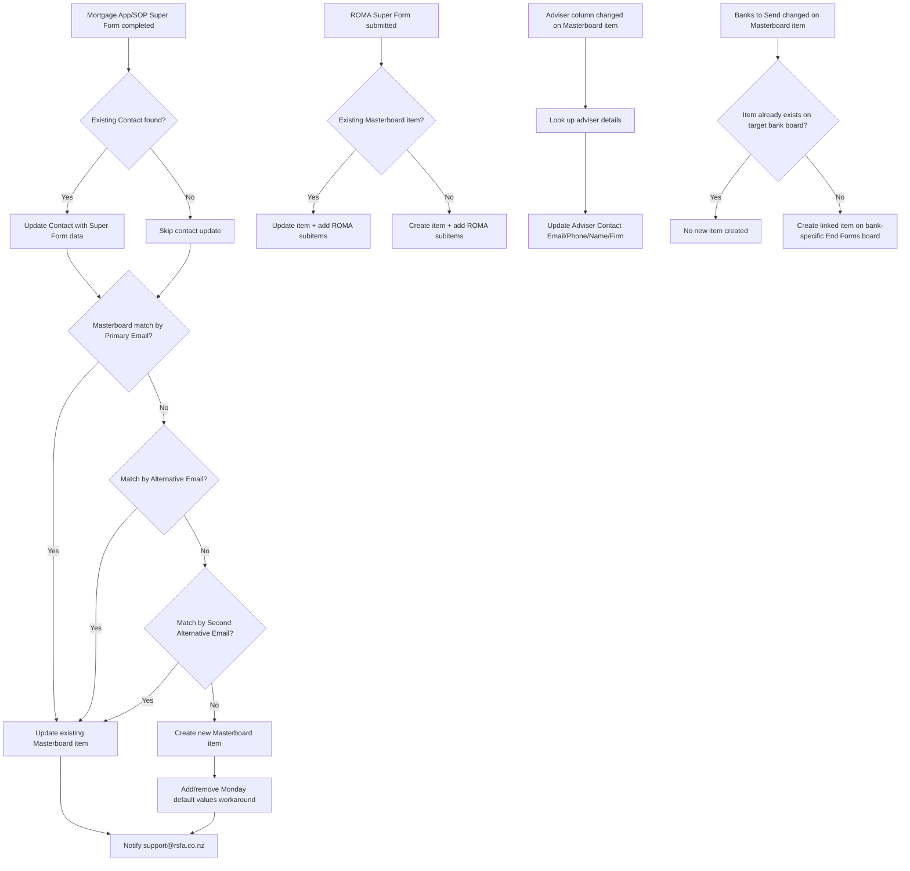

# AUTO-MASTERBOARD-001 — Mortgage Application to Masterboard End Forms

## 1. Purpose

Consolidate mortgage application data — from the Mortgage App/SOP Super Form, ROMA, Contacts and manual adviser entry — into a single record on `Masterboard: End Forms`, then keep that record's adviser details and bank-specific mirror views in sync, so MacroForge (`AUTO-MACROFORGE-001`) always has one complete, current, structured dataset to populate bank end forms from.

## 2. Business context

`knowledge/01_RSFA_SYSTEM_MAP.md` §4.4 and §9 describe `Masterboard: End Forms` as the consolidated dataset that combines Mortgage Application, Client Profile, Contacts, ROMA and manual adviser entry, specifically to support MacroForge. Bank-specific boards (ANZ, ASB, BNZ, KB, WBC) mirror only the relevant columns for advisers reviewing a specific lender's end forms. This is a `Critical` automation: if it breaks, the Masterboard dataset silently drifts out of date and MacroForge's end-form output becomes unreliable.

## 3. Scope

### Included

- Matching each Mortgage App/SOP Super Form applicant against an existing Contacts record, updating it if found.
- Searching Masterboard: End Forms by Primary Email, then Alternative Email, then Second Alternative Email, to find an existing record before creating a new one.
- Creating a new Masterboard item (with required Monday default-value workaround) when no match is found, and notifying `support@rsfa.co.nz`.
- Updating (or creating, with subitems) the Masterboard record from new ROMA Super Form submissions.
- Updating adviser contact details (email, phone, name, firm) on a Masterboard item whenever the `Adviser` column is changed.
- Routing a Masterboard item to the correct bank-specific End Forms board when `Banks to Send` is updated, without creating duplicates.

### Excluded

- MacroForge's own end-form population from Masterboard data (`AUTO-MACROFORGE-001`).
- Filing the generated Mortgage App/ROMA PDF into SharePoint (`AUTO-FORMS-001`).

## 4. Current status

Active. `Critical` per `knowledge/03_AUTOMATION_REGISTRY.md` §3. Two of the three scenarios that make up this family (`8890068` and `8410524`) have **unresolved subscenario call targets** in the current call-graph export — their blueprints were not fully inspected, so any subscenario dependency beyond the shared error handler is unconfirmed (`exports/make/make-scenario-call-graph.md`).

## 5. Trigger

- Mortgage App/SOP Super Form completion (main app-to-Masterboard mapping, scenario `8410524`).
- New ROMA Super Form submission (Masterboard update/create + subitems) — see §25, this path has no confirmed scenario ID in the current Make export.
- `Adviser` column changed on a Masterboard item (`8890068`).
- `Banks to Send` column changed on a Masterboard item (`8666173`).

## 6. Inputs

- Mortgage App/SOP Super Form fields (applicant details, addresses, dates of birth, proof-of-residency files, etc. — the board has 492 columns per `knowledge/04_MONDAY_BOARDS_REGISTRY.md`).
- ROMA Super Form fields and subitems (later-stage mortgage information not captured on the initial application).
- Contacts board (existing-record lookup by email).
- Masterboard adviser lookup (contact email, phone, name, firm per adviser).

## 7. Outputs

- New or updated item on `Masterboard: End Forms`.
- New or updated Contacts record (when a matching contact is found for a Mortgage App applicant).
- Notification email to `support@rsfa.co.nz` when a new Masterboard item is created.
- New or updated mirrored item on the relevant bank-specific End Forms board.
- Updated `Adviser Contact Email`, `Adviser Contact Phone`, `Adviser Name`, `Adviser Firm` columns on the Masterboard item.

## 8. Systems involved

Monday.com (all boards involved), Make.com (execution), Microsoft Outlook/Email (support notification).

## 9. Related Monday boards

| Board | ID | Role |
|---|---|---|
| ✍ Mortgage App/SOP | `5025483251` | Primary Super Form source |
| ✍️ ROMA/Stage3: Mortgages | `5026093057` | Secondary/later-stage Super Form source |
| Contacts | `2074688484` | Applicant match target |
| Masterboard: End Forms | `5026186805` | Consolidated destination (400 columns) |
| ANZ: End Forms | `5025622850` | Bank-specific mirror |
| ASB: End Forms | `5026525627` | Bank-specific mirror |
| BNZ: End Forms | `5026525749` | Bank-specific mirror |
| KB: End Forms | `5026525794` | Kiwibank-specific mirror |
| WBC: End Forms | `5026525927` | Westpac-specific mirror |

## 10. Platform implementation

### Make.com scenarios

| Scenario ID | Exact Make name | Role | Status | Trigger | Calls | Called by | Source confidence |
|---|---|---|---|---|---|---|---|
| `8410524` | M.com: New item in Mortgage App Copy to Masterboard End Forms (Jan 26) | Parent | Active | Webhook (custom webhook) | `Outlook: Email Notification after Failed Scenario` (`8732008`); at least one further unresolved subscenario call target | None confirmed | Partial — call-graph confirms parent role and shared error handler; further subscenario targets unresolved. Content strongly corroborated by `source-material/make/M.com_ Mortgage Questionnaire find contact in Mortgage Pipeline (Jan 26).md`, whose title does not match the registry name — **TODO: verify** these describe the same scenario (same functional area, same "Jan 26" timeframe, same Masterboard-matching logic) before treating the source-material title as authoritative |
| `8890068` | M.com: New Adviser Assigned in Masterboard (Mar 26) | Parent | Active | Webhook (custom webhook) | `Outlook: Email Notification after Failed Scenario` (`8732008`); at least one further unresolved subscenario call target | None confirmed | Partial — call-graph confirms parent role; further subscenario targets unresolved. Content confirmed in detail by `source-material/make/M.com_ New Adviser Assigned in Masterboard (Mar 26).md`, whose title matches exactly |
| `8666173` | M.com: Banks to send change in Masterboard v2 (Feb 26) | Parent | Active | Webhook (custom webhook) | `Outlook: Email Notification after Failed Scenario` (`8732008`) | None confirmed | Current — matches `source-material/make/M.com_ Banks to send change in Masterboard v2 (Feb 26).md` exactly |

### Power Automate flows

Not applicable.

### Monday native automations or workflows

Not applicable — Masterboard: End Forms is populated by Make.com scenarios, not native Monday automations, per available evidence.

### Native integrations

Superforms writes Mortgage App/SOP and ROMA submissions directly into their respective Monday boards, which then feed this automation (`knowledge/03_AUTOMATION_REGISTRY.md` §7).

### Shared subflows and components

`COMP-MAKE-ERROR-001` (Shared Make Failure Email Notification) — called by all three confirmed scenarios in this family.

## 11. End-to-end process

## 12. Data mapping

| Source field | Destination | Notes |
|---|---|---|
| Mortgage App/SOP applicant Primary/Alternative/Second-Alternative Email | Masterboard: End Forms match key | Fallback sequence: Primary → Alternative → Second Alternative |
| ROMA Super Form fields and subitems | Masterboard: End Forms item + subitems | Adds/updates rather than replacing existing Masterboard data |
| Masterboard `Adviser` column value | `Adviser Contact Email`, `Adviser Contact Phone`, `Adviser Name`, `Adviser Firm` | Looked up from adviser master data |
| Masterboard `Banks to Send` value | Bank-specific End Forms board item | One mirrored item per selected bank, linked back to the Masterboard item |

TODO: complete mapping from current production configuration — the 400-column Masterboard schema and its per-field source mapping are not enumerated here; see `knowledge/schemas/monday/5026186805-masterboard-end-forms.md` when populated.

## 13. Decision and routing logic

- Contact/Masterboard matching uses an email fallback sequence (Primary → Alternative → Second Alternative) before falling back to creating a new record.
- New Masterboard item creation requires a documented Monday.com workaround: temporarily adding then removing default values required for the creation call to succeed.
- Bank routing checks the target bank board for an existing linked item before creating a new one, to prevent duplicates.

## 14. Dependencies

- `AUTO-FORMS-001` (Super Form submission and PDF filing) precedes this automation's trigger.
- `AUTO-MACROFORGE-001` depends on this automation keeping Masterboard current.
- Contacts and Client Profiles data must be accurate for the email-matching fallback sequence to succeed.

## 15. Error handling

All three confirmed scenarios call `COMP-MAKE-ERROR-001` on failure/validation error.

## 16. Logging and observability

`support@rsfa.co.nz` receives an email whenever a new Masterboard item is created, functioning as a lightweight audit trail for new-record creation. No confirmed log exists for updates to existing records.

## 17. Manual operations and reprocessing

Not confirmed. TODO: verify whether a Masterboard item can be manually re-triggered to re-pull Mortgage App/ROMA data if a mapping was missed.

## 18. Known limitations

- Two of the three scenarios in this family have unresolved subscenario call targets in the current call-graph export — meaning there may be additional dependent scenarios not yet documented (`exports/make/make-scenario-call-graph.md` §"Unresolved").
- `source-material/make/M.com_ New Submission in ROMA Update Masterboard (Mar 26).md` describes a ROMA-to-Masterboard update/create scenario (with subitem creation) that **does not appear under this exact name in the current Make inventory export** (`exports/make/valid-scenarios-working-inventory.md`). This is an unresolved contradiction: either the scenario was renamed/retired since the export, or the export is incomplete for this family. **TODO: verify** — do not assume this ROMA path is currently active without confirming it against a fresh Make export.
- A historical JotForm-based predecessor (`source-material/make/Mortgage Questionnaire to Monday.md`, "Real Savvy questionnaire" → Monday "Mortgage Application" table) exists in source material. Jotform is retired per `knowledge/02_SYSTEMS_REGISTRY.md` (SYS-JOTFORM-001) — this document is **Historical** evidence only and does not describe current production behaviour.

## 19. Security and sensitive data

Masterboard: End Forms contains extensive mortgage application financial and personal data (400 columns). Never use real applicant data in test items; use clearly-labelled fictional test applicants.

## 20. Testing

### Confirmed tests

None recorded.

### Required regression tests

- New Mortgage App Super Form, no existing Contact/Masterboard match → new Contact and new Masterboard item created, support notified.
- New Mortgage App Super Form, existing Contact match, no Masterboard match by any email → Contact updated, new Masterboard item created.
- New Mortgage App Super Form, existing Masterboard match by Alternative Email → existing item updated, no duplicate created.
- New ROMA submission against an existing Masterboard item → item and subitems updated (pending confirmation this scenario is currently active — see §18).
- Adviser column change → adviser detail columns update correctly.
- Banks to Send change, no existing bank-board item → new linked item created.
- Banks to Send change, existing bank-board item already linked → no duplicate created.

### Test data restrictions

Use fictional applicant names, emails and addresses only; never replay real mortgage application data.

## 21. Validation after change

Submit a test Mortgage App Super Form with a known fictional applicant, confirm the correct Contact/Masterboard matching path is taken, confirm the Masterboard item is created/updated as expected, and confirm the support notification email fires only on new-item creation.

## 22. Rollback

Disable the affected Make.com scenario. No automated rollback of already-created/updated Masterboard items is defined.

## 23. Troubleshooting guide

1. Confirm the Mortgage App/SOP or ROMA Super Form submission actually completed and populated the triggering board.
2. Check whether a Contact/Masterboard match was found, and via which email field, to understand which branch of the flow ran.
3. If a new item was expected to be created, confirm the Monday default-value workaround succeeded (a common point of failure for Monday item-creation calls with required fields).
4. Check for `COMP-MAKE-ERROR-001` failure emails.
5. For adviser-detail or bank-routing issues, confirm the triggering column (`Adviser` or `Banks to Send`) was actually changed, not just displayed differently.

## 24. Source references

- `source-material/make/M.com_ Mortgage Questionnaire find contact in Mortgage Pipeline (Jan 26).md` — Partial/Current. Detailed Mortgage App → Masterboard matching logic; title does not match registry scenario name for `8410524` — treat the mapping to `8410524` as inference pending verification.
- `source-material/make/M.com_ New Adviser Assigned in Masterboard (Mar 26).md` — Current. Exact name and content match for `8890068`.
- `source-material/make/M.com_ Banks to send change in Masterboard v2 (Feb 26).md` — Current. Exact name and content match for `8666173`.
- `source-material/make/M.com_ New Submission in ROMA Update Masterboard (Mar 26).md` — Unverified. Describes a ROMA-to-Masterboard scenario not found by this name in the current Make export; flagged as an open contradiction.
- `source-material/make/Mortgage Questionnaire to Monday.md` — Historical. JotForm-era predecessor process; Jotform is retired.
- `exports/make/valid-scenarios-working-inventory.md`, `exports/make/make-scenario-call-graph.md` — Current. Scenario IDs, status, unresolved call targets.
- `knowledge/03_AUTOMATION_REGISTRY.md` §3, §4, §10 — Current. Canonical ID, family grouping, documented unresolved call targets.
- `knowledge/01_RSFA_SYSTEM_MAP.md` §4.4, §9 — Current. Masterboard purpose and consolidation sources.
- `knowledge/04_MONDAY_BOARDS_REGISTRY.md` — Current. Board IDs, column counts, relationships.

## 25. Known gaps

- Unresolved subscenario call targets for `8890068` and `8410524` (per `knowledge/03_AUTOMATION_REGISTRY.md` §10) — must be located before this family's dependency graph can be considered complete.
- The ROMA-to-Masterboard update scenario described in source material is not confirmed against the current Make export by name — needs a direct Make.com lookup to resolve.
- Exact Masterboard column-level data mapping (400 columns) is not enumerated.
- Support-notification behaviour on update (vs. create-only) is unconfirmed.

## 26. Change history

| Date | Change | Author |
|---|---|---|
| 2026-07-30 | Initial canonical documentation created from registry, call-graph and source-material evidence; open contradiction on ROMA-update scenario recorded. | Claude (documentation task) |
