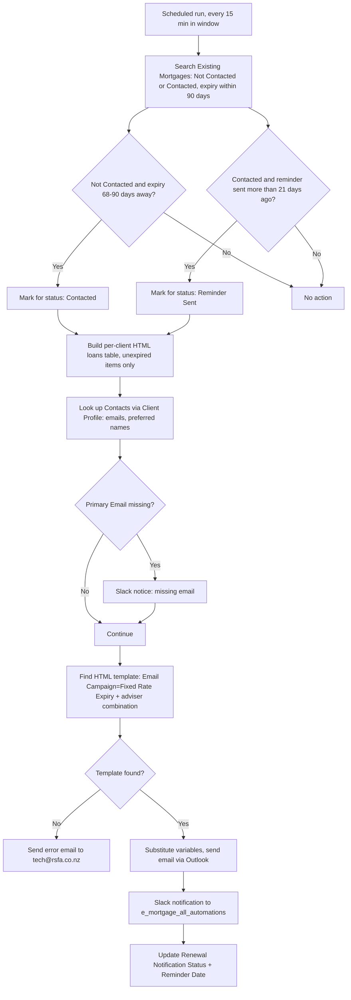

# AUTO-MORTGAGE-RENEWAL-001 — Mortgage Fixed Rate Expiry and Renewal

## 1. Purpose

Identify mortgages on the `✅️ Existing Mortgages` board approaching their fixed-rate expiry, send a first client notification 90 days before expiry and a follow-up reminder three weeks later if unanswered, notify the internal team via Slack, and update the record's renewal status — so renewal outreach happens automatically and on schedule.

## 2. Business context

`knowledge/01_RSFA_SYSTEM_MAP.md` §6 describes the mortgage lifecycle: a completed mortgage moves to Existing Mortgages, where fixed-rate expiry drives client notification and review, potentially returning the client to the Mortgage Pipeline for restructuring or refinancing. This automation is the mechanism behind that expiry-driven notification step.

## 3. Scope

### Included

- Filtering Existing Mortgages for items whose `Renewal Notification Status` is "Not Contacted" or "Contacted", pre-filtered at the search level for efficiency.
- Calculating whether a "Not Contacted" item is now within 68–90 days of expiry (→ move to "Contacted") or a "Contacted" item's reminder was sent more than 21 days ago (→ move to "Reminder Sent").
- Building a per-client HTML table grouping all of that client's mortgage items not yet expired (Lender, Loan Amount, Expiry Date).
- Selecting the correct HTML email template based on the adviser combination recorded in the item's `Automation` column.
- Sending the email via Outlook, notifying Slack channel `e_mortgage_all_automations`, and updating `Renewal Notification Status` and `Reminder Date`.

### Excluded

- The unsubscribe webhook that sets `Renewal Notification Status` to "Unsubscribed" (`AUTO-UNSUBSCRIBE-001`).
- Actually moving a renewed/restructured mortgage back into the Mortgage Pipeline (a separate, undocumented adviser process per `knowledge/01_RSFA_SYSTEM_MAP.md` §6 known gaps).

## 4. Current status

Active. `High` criticality per `knowledge/03_AUTOMATION_REGISTRY.md` §3.

## 5. Trigger

`M.com: Fixed Rate Expiry Email Alert (May25)` (`4840595`): Scheduled, every 900 seconds within a restricted time window.

## 6. Inputs

- Existing Mortgages items with `Renewal Notification Status` = "Not Contacted" (Monday status index `1`) or "Contacted" (index `5`) and a fixed-rate expiry date within the next 90 days.
- Contacts linked via Client Profile, for recipient email(s) and preferred name(s).
- `✉️ Client Renewal/Reviews` (Email Campaigns Templates) board: HTML template matched by `Email Campaign = Fixed Rate Expiry` and the adviser combination.

## 7. Outputs

- Outlook email to the client(s), built from the matched HTML template with the loans table and greeting substituted in.
- Slack message to `e_mortgage_all_automations` with status, client name, email, bank, expiry date, loan amount.
- Updated `Renewal Notification Status` (Not Contacted → Contacted → Reminder Sent) and `Reminder Date` (set to today) on the Existing Mortgages item.
- Error email to `tech@rsfa.co.nz` if no matching adviser-combination template is found.

## 8. Systems involved

Monday.com (Existing Mortgages, Contacts, Client Profiles, Email Campaigns Templates), Make.com (execution), Microsoft Outlook/Email (delivery), Slack (internal notification).

## 9. Related Monday boards

| Board | ID | Role |
|---|---|---|
| ✅️ Existing Mortgages | `5024672364` | Primary source and status-update target |
| Contacts | `2074688484` | Recipient email/name resolution via linked Client Profile |
| Client Profiles | `5024661649` | Links the mortgage item to its Contacts |
| ✉️ Client Renewal/Reviews | `5027616908` | HTML email template source, keyed by campaign + adviser combination |

## 10. Platform implementation

### Make.com scenarios

| Scenario ID | Exact Make name | Role | Status | Trigger | Calls | Called by | Source confidence |
|---|---|---|---|---|---|---|---|
| `4840595` | M.com: Fixed Rate Expiry Email Alert (May25) | Parent | Active | Scheduled (every 900s, restricted window) | `Outlook: Email Notification after Failed Scenario` (`8732008`) | None confirmed | Current. Content matches `source-material/make/Real Savvy Fixed Rate Expiry Email (May25).md` in full detail; the source-material title ("Real Savvy Fixed Rate Expiry Email") differs slightly from the registry name ("M.com: Fixed Rate Expiry Email Alert") — treated as the same scenario based on identical "(May25)" dating and identical logic, but **TODO: verify** this is not in fact two different scenarios |
| `722853` | M.com: Mortgage renewals board, assign adviser and support | Standalone | Active | Monday.com instant trigger (watch) | None confirmed | None confirmed | Current (registry + call graph) only; no dedicated source-material walkthrough. Included here as a related adviser-assignment utility for the renewals board, not confirmed to share logic with the expiry-email scenario — **TODO: verify** its exact relationship to this family |

### Power Automate flows

Not applicable.

### Monday native automations or workflows

Not applicable, per available evidence.

### Native integrations

Not applicable.

### Shared subflows and components

`COMP-MAKE-ERROR-001` — called by `4840595` on scenario failure. A **separate, in-flow** error path (not the shared component) sends directly to `tech@rsfa.co.nz` when no matching HTML template/adviser-combination is found — this is business logic specific to this scenario, not the shared failure-notification component.

## 11. End-to-end process

## 12. Data mapping

| Source field | Destination | Notes |
|---|---|---|
| `Current Loan ($)` (fallback: `Original Loan ($)`) | Loans table "Loan Amount" | Fallback only if Current Loan is empty |
| Lender, Expiry Date | Loans table | Only unexpired items included |
| Contacts Primary Email / Preferred Name | Email recipient / greeting | Missing Primary Email triggers a Slack notice, not a hard failure |
| `%URLClientNames%`, `%LoansTable%`, `%ClientNames%`, `%BannerByStatus%` | HTML template placeholders | Must be present verbatim (case, spacing, `%` delimiters) in any replacement template |

TODO: complete mapping from current production configuration for exact Monday column IDs.

## 13. Decision and routing logic

- **Status-index dependency (fragile by design):** the initial search filter depends on the *internal Monday status index*, not the label text — 1 = Not Contacted, 5 = Contacted at time of writing. **Reordering the dropdown labels in `Renewal Notification Status` will silently change these indexes and break the filter.** This is the single most important operational constraint on this automation.
- Template selection depends on the `Email Campaign` = "Fixed Rate Expiry" filter plus an exact adviser-combination match on the Email Campaigns Templates board — also index-dependent for the `Email Campaign` label.
- If no adviser-combination template is found, the flow deliberately stops that record's route and alerts `tech@rsfa.co.nz`, rather than sending a generic/incorrect email.

## 14. Dependencies

- Depends on the `.eml Examples (Only Visual)` preview files being manually kept in sync when a template changes — these are visual references only and are **not read by the flow**.
- Depends on Contacts having a Primary Email for full functionality (missing email degrades to a Slack-only notice, not a failure).

## 15. Error handling

- Scenario-level failures call `COMP-MAKE-ERROR-001`.
- Business-logic failure (no matching adviser-combination template) sends a dedicated error email directly to `tech@rsfa.co.nz`, separate from the shared component.
- Missing Primary Email on a Contact triggers a Slack notice so the gap can be fixed before the next run.

## 16. Logging and observability

Slack channel `e_mortgage_all_automations` receives a message per successfully-processed item, functioning as the operational log (status, client, email, bank, expiry date, loan amount).

## 17. Manual operations and reprocessing

Not confirmed. TODO: verify whether an item can be manually reset to "Not Contacted" to force re-notification outside the normal 90/21-day cadence.

## 18. Known limitations

- Hard dependency on Monday status-index stability for both the mortgage board and the template board — a label-reordering incident in either would silently break this automation without an obvious error.
- Template variable names must match exactly; any typo or renamed placeholder breaks substitution silently (does not raise the "no template found" error path, since the template *is* found — it simply won't populate correctly).
- Relationship between `722853` (adviser assignment on the renewals board) and the expiry-email scenario is unconfirmed — they may be entirely independent despite both touching "renewals".

## 19. Security and sensitive data

This automation processes real client names, emails, loan amounts and lenders to build outgoing emails. Never redirect this automation at real client data for testing; use a dedicated test mortgage item with fictional data and a test mailbox.

## 20. Testing

### Confirmed tests

None recorded.

### Required regression tests

- Test item at 90/89/69/68 days from expiry (Not Contacted) → correct boundary behaviour for moving to Contacted.
- Test item at 21/22 days since Reminder Date (Contacted) → correct boundary behaviour for moving to Reminder Sent.
- Test item outside both windows → no action taken.
- Contact missing Primary Email → Slack notice fires, no crash.
- No matching adviser-combination template → error email to `tech@rsfa.co.nz`, no incorrect email sent.
- Client with multiple mortgage items → single email with a combined loans table, not one email per item.

### Test data restrictions

Use a dedicated test item on Existing Mortgages with a fictional client and fictional loan data, and a test mailbox recipient; never let a test run send a real client an email.

## 21. Validation after change

Manually set a test item's fixed-rate expiry date and status to fall inside each boundary condition in turn, run the scenario (or wait for its scheduled window), and confirm the correct status transition, email content, Slack message, and column updates.

## 22. Rollback

Disable the `M.com: Fixed Rate Expiry Email Alert (May25)` scenario. No automated rollback of already-sent emails or already-updated statuses is defined — a status could be manually reset if a run needs to be redone.

## 23. Troubleshooting guide

1. Confirm the item's `Renewal Notification Status` label and its underlying Monday index still match what the scenario expects (1 = Not Contacted, 5 = Contacted) — check this first if items are being missed or wrongly included.
2. Confirm the fixed-rate expiry date and Reminder Date are correctly populated.
3. If no email was sent, check whether an adviser-combination template match failed (look for the `tech@rsfa.co.nz` error email).
4. If the email content looks wrong, check the HTML template for the exact required variable names.
5. Check Contacts for a missing Primary Email if a client was skipped without an obvious error.

## 24. Source references

- `source-material/make/Real Savvy Fixed Rate Expiry Email (May25).md` — Current. Full detailed walkthrough of filtering, status logic, templating, and notification; title differs slightly from the registry scenario name.
- `exports/make/valid-scenarios-working-inventory.md`, `exports/make/make-scenario-call-graph.md` — Current. Scenario ID, trigger, status.
- `knowledge/03_AUTOMATION_REGISTRY.md` §3, §4 — Current. Canonical ID and family grouping.
- `knowledge/01_RSFA_SYSTEM_MAP.md` §6 — Current. Mortgage lifecycle context.
- `knowledge/04_MONDAY_BOARDS_REGISTRY.md` — Current. Board IDs and column notes for Existing Mortgages.

## 25. Known gaps

- Exact relationship of `722853` (Mortgage renewals board, assign adviser and support) to this family is unconfirmed — no source-material walkthrough exists for it.
- Manual reprocessing/reset procedure is unconfirmed.
- Exact current Monday status indexes should be re-verified directly in Monday before relying on this documentation, since they are explicitly fragile to reordering.

## 26. Change history

| Date | Change | Author |
|---|---|---|
| 2026-07-30 | Initial canonical documentation created from registry and source-material evidence. | Claude (documentation task) |
