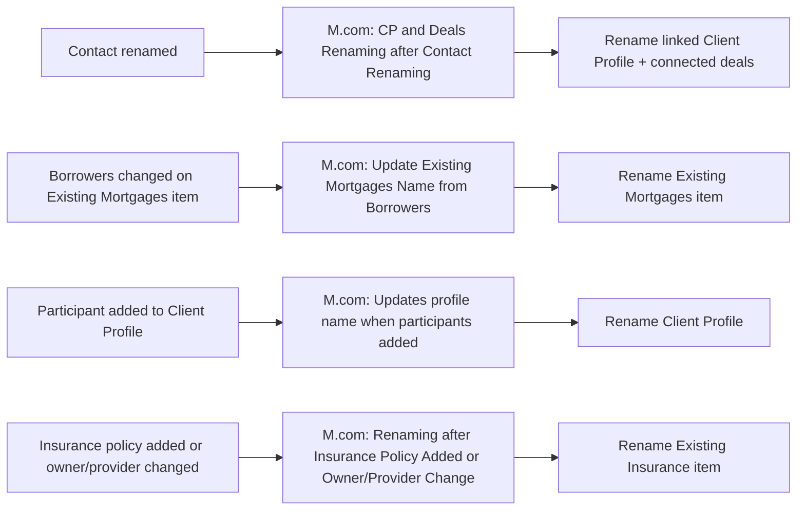

# AUTO-NAMING-001 — Client, Deal and Policy Naming Synchronisation

## 1. Purpose

Keep the display name of a Client Profile, deal, mortgage or insurance-policy item aligned with its underlying Contact, participant, borrower, adviser or policy-ownership data whenever that data changes — so records remain recognisable and consistent across boards without an adviser manually renaming them after every change.

## 2. Business context

Monday item names are the primary way advisers recognise a record when scanning a board or a linked-item picker. When a Contact is renamed, a participant is added, a mortgage's borrowers change, or an insurance policy's owner/provider changes, every dependent record referencing that entity needs its display name updated to match, or the board becomes confusing and error-prone to work in.

## 3. Scope

### Included

- Renaming Client Profiles and connected deals after a Contact is renamed.
- Renaming an Existing Mortgages item after its Borrowers change.
- Renaming a Client Profile after new participants are added.
- Renaming an Existing Insurance item after a policy is added, or its owner/provider changes.

### Excluded

- The initial creation of Client Profiles/Contacts from a new Lead (`AUTO-LEADS-001`).
- Insurance expiry/anniversary notification logic (`AUTO-INSURANCE-RENEWAL-001`).

## 4. Current status

Active. `Medium` criticality per `knowledge/03_AUTOMATION_REGISTRY.md` §3 — a naming-sync failure affects clarity and efficiency, not correctness of the underlying data.

## 5. Trigger

- `M.com: CP and Deals Renaming after Contact Renaming` (`1054927`): Monday.com instant trigger (watch) — Contact renamed.
- `M.com: Renaming after Insurance Policy Added or Owner/Provider Change (Feb 2026)` (`1215342`): Webhook (custom webhook) — insurance policy added, or owner/provider changed.
- `M.com: Update Existing Mortgages Name from Borrowers (Dec25)` (`1228763`): Monday.com instant trigger (watch) — Borrowers column changed on an Existing Mortgages item.
- `M.com: Updates profile name when participants added` (`1054932`): Monday.com instant trigger (watch) — participant added to a Client Profile.

## 6. Inputs

- Renamed Contact record (name change).
- Existing Mortgages item's `Borrowers` relation.
- Client Profile's linked participants/Contacts.
- Insurance policy's owner and provider fields.

## 7. Outputs

- Updated name on the relevant Client Profile, deal, Existing Mortgages item, or Existing Insurance item.

## 8. Systems involved

Monday.com only (Client Profiles, Contacts, Existing Mortgages, Existing Insurance), via Make.com.

## 9. Related Monday boards

| Board | ID | Role |
|---|---|---|
| Client Profiles | `5024661649` | Renamed on Contact rename or new participant |
| Contacts | `2074688484` | Source of the rename trigger |
| ✅️ Existing Mortgages | `5024672364` | Renamed on Borrowers change |
| ✔️ Existing Insurance | `5024672437` | Renamed on policy add or owner/provider change |

## 10. Platform implementation

### Make.com scenarios

| Scenario ID | Exact Make name | Role | Status | Trigger | Calls | Called by | Source confidence |
|---|---|---|---|---|---|---|---|
| `1054927` | M.com: CP and Deals Renaming after Contact Renaming | Parent | Active | Monday.com instant trigger (watch) | `Outlook: Email Notification after Failed Scenario` (`8732008`) | None confirmed | Current (registry + call graph) only; no dedicated source-material walkthrough |
| `1215342` | M.com: Renaming after Insurance Policy Added or Owner/Provider Change (Feb 2026) | Parent | Active | Webhook (custom webhook) | `Outlook: Email Notification after Failed Scenario` (`8732008`) | None confirmed | Current (registry + call graph) only; no dedicated source-material walkthrough |
| `1228763` | M.com: Update Existing Mortgages Name from Borrowers (Dec25) | Standalone | Active | Monday.com instant trigger (watch) | None confirmed | None confirmed | Current (registry + call graph) only; no dedicated source-material walkthrough |
| `1054932` | M.com: Updates profile name when participants added | Standalone | Active | Monday.com instant trigger (watch) | None confirmed | None confirmed | Current (registry + call graph) only; no dedicated source-material walkthrough |

No `source-material/make/` file exists for any of these four scenarios — this documentation is built entirely from the registry and call-graph exports.

### Power Automate flows

Not applicable.

### Monday native automations or workflows

Not applicable, per available evidence.

### Native integrations

Not applicable.

### Shared subflows and components

`COMP-MAKE-ERROR-001` — called by `1054927` and `1215342`. `1228763` and `1054932` show no confirmed call to the shared error handler — TODO: verify whether this is a genuine gap.

## 11. End-to-end process

## 12. Data mapping

TODO: complete mapping from current production configuration. No field-level naming-format rules (e.g. how multiple borrower/participant names are concatenated) are confirmed from available evidence.

## 13. Decision and routing logic

Not confirmed in detail for any of the four scenarios. TODO: verify the exact naming-format rules (ordering, separators, truncation) applied when combining multiple names into a single item title.

## 14. Dependencies

- Depends on the source data (Contact name, Borrowers, participants, policy owner/provider) being accurate at the time of the triggering change.
- Interacts with `AUTO-LEADS-001` (initial creation) and `AUTO-MASTERBOARD-001`/`AUTO-MORTGAGE-RENEWAL-001`/`AUTO-INSURANCE-RENEWAL-001` (which reference these same items by name in generated documents and emails) — a naming inconsistency here could cause a mismatched display name to appear downstream, though the underlying record link itself is unaffected.

## 15. Error handling

`1054927` and `1215342` call `COMP-MAKE-ERROR-001`. `1228763` and `1054932` have no confirmed error-handling call in the current call-graph export.

## 16. Logging and observability

No dedicated log confirmed for this family.

## 17. Manual operations and reprocessing

Not confirmed. TODO: verify whether an item's name can be safely manually corrected without being immediately overwritten on the next trigger, or whether a manual edit would be reverted.

## 18. Known limitations

- No implementation walkthrough exists for any of the four scenarios in this family — naming-format rules, edge cases (e.g. very long names, special characters) and error-handling completeness are all unconfirmed.
- Two of the four scenarios show no confirmed shared-error-handler call, unlike their siblings in other families.

## 19. Security and sensitive data

This automation only manipulates item display names, which are typically client names — treat as client personal data; do not use real client names in test items.

## 20. Testing

### Confirmed tests

None recorded.

### Required regression tests

- Contact renamed → linked Client Profile and connected deals renamed correctly.
- Existing Mortgages `Borrowers` changed → item renamed correctly.
- New participant added to a Client Profile → profile renamed correctly.
- Insurance policy added, or owner/provider changed → Existing Insurance item renamed correctly.
- Manual name edit → confirm whether it survives the next unrelated trigger, or is overwritten.

### Test data restrictions

Use fictional test Contacts, Client Profiles, mortgages and insurance policies only.

## 21. Validation after change

Rename a test Contact and confirm the linked Client Profile and any connected test deals update correctly; change Borrowers on a test mortgage and confirm the item renames correctly; add a participant to a test Client Profile and confirm renaming; add/change a test insurance policy's owner/provider and confirm renaming.

## 22. Rollback

Disable the affected Make.com scenario(s). No automated rollback of already-applied name changes is defined — a name could be manually reverted if needed.

## 23. Troubleshooting guide

1. Confirm the underlying triggering field (Contact name, Borrowers, participants, policy owner/provider) actually changed, not just displayed differently.
2. Check for `COMP-MAKE-ERROR-001` failure emails on `1054927` and `1215342`.
3. For `1228763` and `1054932`, check Make.com scenario run history directly, since no shared error-handler call is currently confirmed.

## 24. Source references

- `exports/make/valid-scenarios-working-inventory.md`, `exports/make/make-scenario-call-graph.md` — Current. Scenario IDs, trigger types, status, error-handler calls.
- `knowledge/03_AUTOMATION_REGISTRY.md` §3, §4 — Current. Canonical ID and family grouping.
- `knowledge/04_MONDAY_BOARDS_REGISTRY.md` — Current. Board IDs and column context.
- No `source-material/make/` file exists for any scenario in this family.

## 25. Known gaps

- No implementation walkthrough exists for any of the four scenarios; naming-format rules and edge-case handling are unconfirmed.
- Missing shared-error-handler call for two of the four scenarios is unexplained.
- Manual-edit survivability is unconfirmed.

## 26. Change history

| Date | Change | Author |
|---|---|---|
| 2026-07-30 | Initial canonical documentation created from registry and call-graph evidence only; no source-material walkthrough available for any scenario in this family. | Claude (documentation task) |
