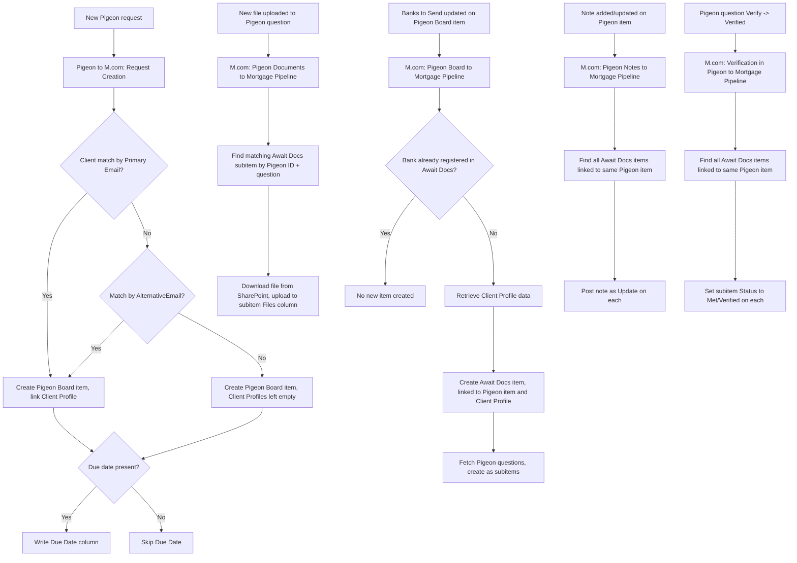

# AUTO-PIGEON-001 — Pigeon Integration Suite

## 1. Purpose

Synchronise Pigeon document requests, uploaded files, notes and question-verification status with the `Await Docs` stage of the Mortgage Pipeline, so advisers can track a client's document-collection progress entirely from Monday.com without checking Pigeon directly.

## 2. Business context

Pigeon provides online client document-upload requests, which can be linked to mortgage pipeline items (`knowledge/01_RSFA_SYSTEM_MAP.md` §12, `knowledge/02_SYSTEMS_REGISTRY.md` SYS-PIGEON-001). This automation family is a set of five Make.com scenarios that keep Pigeon and the Mortgage Pipeline `Await Docs` process aligned in both directions.

## 3. Scope

### Included

- Creating a `Pigeon Board JV` item when a new Pigeon request is created, with best-effort Client Profile matching by email.
- Creating an `Await Docs` item in Mortgage Pipeline JV when a bank is added to `Banks to Send` on a Pigeon Board item (with duplicate prevention), and creating Pigeon-question subitems under it.
- Filing newly-uploaded Pigeon question files into the matching Mortgage Pipeline JV subitem's Files column.
- Propagating notes added/updated on a Pigeon item to every linked `Await Docs` item's Updates section.
- Propagating question verification (Pigeon "Verify" → "Verified") to the corresponding subitem's Status column ("Met/Verified") across every linked `Await Docs` item.

### Excluded

- The Mortgage Pipeline's own stage progression outside of `Await Docs` document tracking.

## 4. Current status

Active. `High` criticality per `knowledge/03_AUTOMATION_REGISTRY.md` §3. All five scenarios in this family are confirmed Active in the current Make inventory export.

## 5. Trigger

- `Pigeon to M.com: Request Creation (Nov25)` (`7883004`): new request created in Pigeon.
- `M.com: Pigeon Board to Mortgage Pipeline (Nov 25)` (`7950443`): `Banks to Send` field updated on the Pigeon Board JV board.
- `M.com: Pigeon Documents to Mortgage Pipeline (Dec 25)` (`8367350`): new file uploaded to any Pigeon question.
- `M.com: Pigeon Notes to Mortgage Pipeline (Dec 25)` (`8399114`): note created or updated on a Pigeon item.
- `M.com: Verification in Pigeon to Mortgage Pipeline (Dec 25)` (`8356342`): a Pigeon question's Verify column changes from "Verify" to "Verified".

## 6. Inputs

- Pigeon request/question data: request name, creation date, due date, question list, uploaded files, notes, verification status.
- Contacts JV :: Public board: Primary Email / AlternativeEmail lookup for client matching on new-request creation.
- Client Profiles JV :: Private board: client detail lookup for linking a new Await Docs item.

## 7. Outputs

- New item on `Pigeon Board JV`, with Client Profiles linked when matched, request name, creation date, and an empty `Banks to Send` (populated manually to trigger downstream processing).
- New item on `Mortgage Pipeline JV → Await Docs` per bank added to `Banks to Send`, linked to the originating Pigeon item and the correct Client Profile, with Pigeon-question subitems.
- Uploaded files placed in the Files column of the matching Await Docs subitem.
- Pigeon notes posted as Updates on every linked Await Docs item (all banks, not just the one that originated the note).
- Subitem Status set to "Met/Verified" on every linked Await Docs item when a Pigeon question is verified.

## 8. Systems involved

Pigeon (source), Make.com (execution), Monday.com (Pigeon Board JV, Contacts JV :: Public, Client Profiles JV :: Private, Mortgage Pipeline JV), Microsoft SharePoint (file download source for uploaded documents).

## 9. Related Monday boards

| Board | ID | Role |
|---|---|---|
| 📋 Pigeon - Finance Checklist | `5025365499` | Referred to as "Pigeon Board JV" in source material; primary Pigeon-linked board |
| 💲Mortgage Pipeline | `5025201889` | Contains the `Await Docs` view/table that this automation populates |
| Client Profiles | `5024661649` | Referred to as "Client Profiles JV :: Private" / "Contacts JV :: Public" in source material — TODO: verify whether these are views of the Client Profiles/Contacts boards or distinct boards |

Note: source material consistently uses the suffix "JV" (e.g. "Pigeon Board JV", "Mortgage Pipeline JV", "Client Profiles JV :: Private", "Contacts JV :: Public") which does not exactly match the board names in `knowledge/04_MONDAY_BOARDS_REGISTRY.md`. This is treated as the same underlying boards referenced by a JV-specific view/filter naming convention — **TODO: verify** this assumption against a live Monday check before relying on exact view names.

## 10. Platform implementation

### Make.com scenarios

| Scenario ID | Exact Make name | Role | Status | Trigger | Calls | Called by | Source confidence |
|---|---|---|---|---|---|---|---|
| `7883004` | Pigeon to M.com: Request Creation (Nov25) | Parent | Active | Webhook (custom webhook) | `Outlook: Email Notification after Failed Scenario` (`8732008`) | None confirmed | Current — matches source material exactly |
| `7950443` | M.com: Pigeon Board to Mortgage Pipeline (Nov 25) | Parent | Active | Webhook (custom webhook) | `Outlook: Email Notification after Failed Scenario` (`8732008`) | None confirmed | Current — matches source material exactly |
| `8367350` | M.com: Pigeon Documents to Mortgage Pipeline (Dec 25) | Standalone | Active | Webhook (custom webhook) | None confirmed | None confirmed | Current — matches source material exactly |
| `8399114` | M.com: Pigeon Notes to Mortgage Pipeline (Dec 25) | Parent | Active | Webhook (custom webhook) | `Outlook: Email Notification after Failed Scenario` (`8732008`) | None confirmed | Current — matches source material exactly; source material notes this scenario **depends on** `7950443` having already created the Await Docs record |
| `8356342` | M.com: Verification in Pigeon to Mortgage Pipeline (Dec 25) | Standalone | Active | Webhook (custom webhook) | None confirmed | None confirmed | Current — matches source material exactly; also depends on `7950443` per source material |

Note: the dependency of `8399114` and `8356342` on `7950443` is a **functional** dependency (the Await Docs record must already exist) confirmed in source material, not a Make.com subscenario call — the call-graph export correctly shows no direct call relationship between these scenarios.

### Power Automate flows

Not applicable.

### Monday native automations or workflows

Not applicable, per available evidence.

### Native integrations

Not applicable — Pigeon integrates via Make.com webhooks, not a native Monday connector.

### Shared subflows and components

`COMP-MAKE-ERROR-001` — called by `7883004`, `7950443`, and `8399114`.

## 11. End-to-end process

## 12. Data mapping

| Source field | Destination | Notes |
|---|---|---|
| Pigeon request email | Contacts JV :: Public Primary Email, then AlternativeEmail | Fallback sequence for client matching |
| Matched Client → Client Profiles | Pigeon Board item's Client Profiles column | Left empty if no match found |
| Pigeon request name, creation date | Pigeon Board item | Always populated |
| Pigeon due date (if present) | Due Date column | Conditional — skipped if absent |
| Pigeon Board item's `Banks to Send` (per bank) | Await Docs item | One item per bank, keyed against existing Await Docs items to prevent duplicates |
| Pigeon question list | Await Docs item subitems | One subitem per question |
| Pigeon question file upload | Await Docs subitem Files column | Downloaded from SharePoint location referenced by the Pigeon request |
| Pigeon note | Await Docs item Updates section | Posted to **all** linked Await Docs items regardless of bank |
| Pigeon question Verify → Verified | Await Docs subitem Status → Met/Verified | Applied to **all** linked Await Docs items regardless of bank |

## 13. Decision and routing logic

- New-request client matching: Primary Email → AlternativeEmail fallback; if neither matches, the item is still created with Client Profiles left empty (not blocked).
- Bank routing: existing Await Docs items are checked first to avoid creating a duplicate entry for the same bank on the same client/request.
- Notes and verification are explicitly **bank-agnostic** — they update every linked Await Docs item regardless of which bank the note/question belongs to, since these reflect client-level, not bank-level, information.

## 14. Dependencies

- `M.com: Pigeon Notes to Mortgage Pipeline` and `M.com: Verification in Pigeon to Mortgage Pipeline` both functionally depend on `M.com: Pigeon Board to Mortgage Pipeline` having already created the Await Docs record for the relevant bank/client — if that hasn't happened yet, notes/verification have nothing to attach to.
- Client Profiles/Contacts data accuracy affects the reliability of new-request client matching.

## 15. Error handling

`COMP-MAKE-ERROR-001` is called by three of the five scenarios (`7883004`, `7950443`, `8399114`). `8367350` (file upload) and `8356342` (verification) show no confirmed call to the shared error handler in the current call-graph export — TODO: verify whether this is a genuine gap or an artefact of the export's scope.

## 16. Logging and observability

No dedicated log board confirmed for this family beyond the Await Docs items themselves.

## 17. Manual operations and reprocessing

Not confirmed. TODO: verify whether a missed file upload or note can be manually re-triggered from Pigeon, or requires direct Make.com scenario re-execution.

## 18. Known limitations

- Board naming in source material ("...JV" suffix, "Client Profiles JV :: Private", "Contacts JV :: Public") does not exactly match `knowledge/04_MONDAY_BOARDS_REGISTRY.md` board names — treated as views of the same underlying boards pending verification.
- Two of the five scenarios show no confirmed shared-error-handler call, unlike their siblings.
- New-request client matching only checks two email fields; a client with neither matching address will always have an unlinked Pigeon Board item.

## 19. Security and sensitive data

Pigeon data includes client-uploaded financial and identity documents. Never use real client documents, notes or verification data as test data; use a dedicated fictional test Pigeon request.

## 20. Testing

### Confirmed tests

None recorded.

### Required regression tests

- New Pigeon request, client match by Primary Email → Pigeon Board item created and linked correctly.
- New Pigeon request, no match → item created with Client Profiles empty.
- `Banks to Send` updated with a new bank → new Await Docs item + subitems created.
- `Banks to Send` updated with an already-registered bank → no duplicate created.
- New file upload on a Pigeon question → correct subitem Files column updated.
- Note added on a Pigeon item linked to multiple banks → Update posted on every linked Await Docs item.
- Question verified → Status set to Met/Verified on every linked Await Docs item.

### Test data restrictions

Use a dedicated fictional test Pigeon request, test client, and test documents only.

## 21. Validation after change

Create a test Pigeon request with a known test client email, confirm correct Client Profile linking, add a bank to `Banks to Send` and confirm a single Await Docs item and its subitems are created, upload a test file and confirm correct filing, add a note and verify a question, and confirm both propagate to all linked Await Docs items.

## 22. Rollback

Disable the affected Make.com scenario(s). No automated rollback of already-created Monday items or already-filed documents is defined.

## 23. Troubleshooting guide

1. Confirm the Pigeon event (request/upload/note/verification) actually occurred in Pigeon.
2. For a missing new-request item, check whether the client email matched Primary or Alternative Email in the relevant Contacts board.
3. For a missing Await Docs item, confirm `Banks to Send` was actually changed (not just displayed) and check for an existing duplicate that may have been correctly suppressed.
4. For a missing note/verification update, confirm the Await Docs item for the relevant bank already existed at the time of the Pigeon event.
5. Check for `COMP-MAKE-ERROR-001` failure emails on the three scenarios confirmed to call it.

## 24. Source references

- `source-material/make/Pigeon to M.com_ Request Creation (Nov25).md` — Current. Request-creation logic.
- `source-material/make/M.com_ Pigeon Board to Mortgage Pipeline (Nov 25).md` — Current. Bank/Await Docs creation logic.
- `source-material/make/M.com_ Pigeon Documents to Mortgage Pipeline (Dec 25).md` — Current. File-upload logic.
- `source-material/make/M.com_ Pigeon Notes to Mortgage Pipeline (Dec 25).md` — Current. Notes propagation logic; confirms dependency on the Board-to-Pipeline scenario.
- `source-material/make/M.com_ Verification in Pigeon to Mortgage Pipeline (Dec 25).md` — Current. Verification propagation logic; confirms dependency on the Board-to-Pipeline scenario.
- `exports/make/valid-scenarios-working-inventory.md`, `exports/make/make-scenario-call-graph.md` — Current. Scenario IDs, status, error-handler calls.
- `knowledge/03_AUTOMATION_REGISTRY.md` §3, §4 — Current. Canonical ID and family grouping.
- `knowledge/02_SYSTEMS_REGISTRY.md` SYS-PIGEON-001 — Current. Platform description.

## 25. Known gaps

- Exact correspondence between source-material board names ("...JV") and the canonical board names/IDs in `knowledge/04_MONDAY_BOARDS_REGISTRY.md` is unverified.
- Missing shared-error-handler call for two of the five scenarios is unexplained.
- Manual reprocessing procedure for missed uploads/notes is unconfirmed.

## 26. Change history

| Date | Change | Author |
|---|---|---|
| 2026-07-30 | Initial canonical documentation created from registry, call-graph and source-material evidence; board-naming discrepancy flagged. | Claude (documentation task) |
