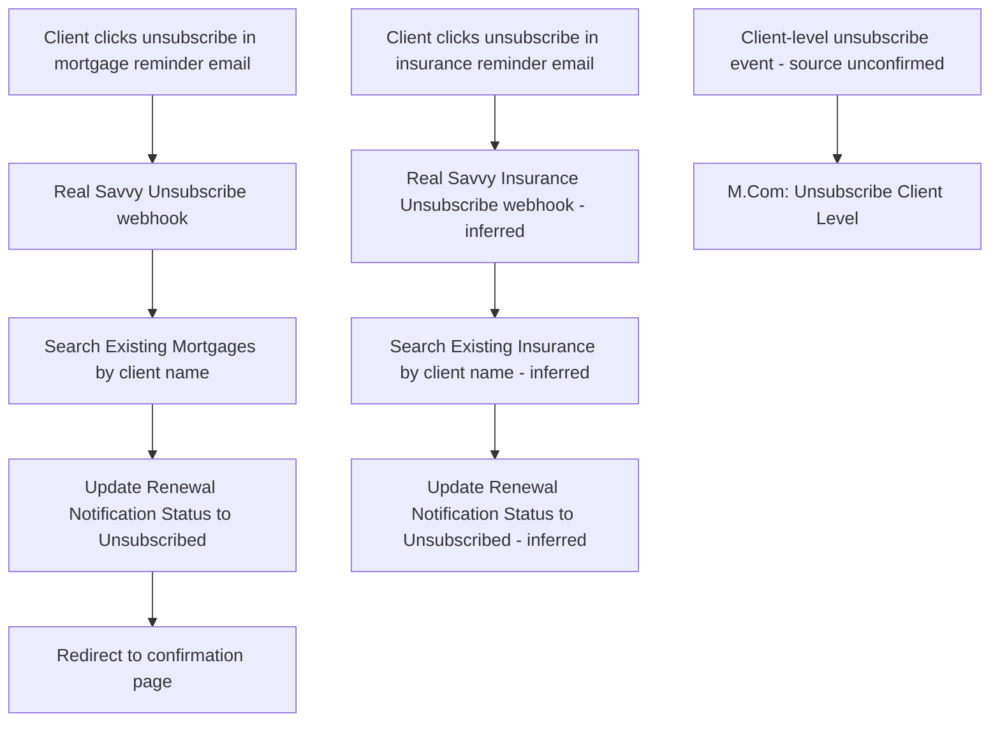

# AUTO-UNSUBSCRIBE-001 — Client Unsubscribe and Email Preferences

## 1. Purpose

When a client clicks the unsubscribe link embedded in a mortgage or insurance renewal-reminder email, update their `Renewal Notification Status` to "Unsubscribed" in the relevant Monday.com board, so `AUTO-MORTGAGE-RENEWAL-001` and `AUTO-INSURANCE-RENEWAL-001` stop sending them further reminders — without any manual list-management step.

## 2. Business context

Both `AUTO-MORTGAGE-RENEWAL-001` and `AUTO-INSURANCE-RENEWAL-001` embed an unsubscribe button in their reminder emails (using the `%URLClientNames%` template variable to identify the client). This automation is the webhook target of that unsubscribe link.

## 3. Scope

### Included

- Handling the unsubscribe webhook fired from a mortgage fixed-rate-expiry reminder email, updating `Existing Mortgages` → `Renewal Notification Status` to "Unsubscribed".
- Handling the equivalent unsubscribe webhook for insurance anniversary reminder emails, updating `Existing Insurance` → `Renewal Notification Status` to "Unsubscribed" (by inference from the mortgage-side pattern — see §25).
- Redirecting the client to a confirmation page after the status update.
- Handling a broader "Client Level" unsubscribe (`9229914`) — scope relative to the two board-specific unsubscribes not fully confirmed (see §25).

### Excluded

- The renewal-reminder emails themselves (`AUTO-MORTGAGE-RENEWAL-001`, `AUTO-INSURANCE-RENEWAL-001`).

## 4. Current status

Active. `Medium` criticality per `knowledge/03_AUTOMATION_REGISTRY.md` §3.

## 5. Trigger

- `Real Savvy Unsubscribe (12May)` (`5195381`): webhook, fired when a client clicks the unsubscribe button in a mortgage fixed-rate-expiry reminder email.
- `Real Savvy Insurance Unsubscribe (11Sep)` (`7178534`): webhook, fired when a client clicks the unsubscribe button in an insurance anniversary reminder email (inferred by symmetry — see §25).
- `M.Com: Unsubscribe Client Level (May 26)` (`9229914`): webhook (custom webhook) — exact triggering source/UI not confirmed (see §25).

## 6. Inputs

- Webhook payload containing the client's name/username (used to search the target board), per source material for `5195381`.

## 7. Outputs

- `Renewal Notification Status` updated to "Unsubscribed" on the matching Existing Mortgages (or, inferred, Existing Insurance) item.
- Browser redirect to a confirmation page: `https://firbotpages.github.io/unsubscribe/`.

## 8. Systems involved

Make.com (webhook + execution), Monday.com (Existing Mortgages / Existing Insurance).

## 9. Related Monday boards

| Board | ID | Role |
|---|---|---|
| ✅️ Existing Mortgages | `5024672364` | Updated by `5195381` |
| ✔️ Existing Insurance | `5024672437` | Updated by `7178534` (inferred) |

## 10. Platform implementation

### Make.com scenarios

| Scenario ID | Exact Make name | Role | Status | Trigger | Calls | Called by | Source confidence |
|---|---|---|---|---|---|---|---|
| `5195381` | Real Savvy Unsubscribe (12May) | Standalone | Active | Webhook (custom webhook) | None confirmed | None confirmed | Current — matches `source-material/make/Real Savvy Unsubscribe (12May).md` exactly |
| `7178534` | Real Savvy Insurance Unsubscribe (11Sep) | Standalone | Active | Webhook (custom webhook) | None confirmed | None confirmed | Current (registry + call graph) only; no dedicated source-material walkthrough — logic **inferred** to mirror `5195381` against Existing Insurance instead of Existing Mortgages |
| `9229914` | M.Com: Unsubscribe Client Level (May 26) | Parent | Active | Webhook (custom webhook) | `Outlook: Email Notification after Failed Scenario` (`8732008`) | None confirmed | Current (registry + call graph) only; no dedicated source-material walkthrough; scope/relationship to the other two scenarios unconfirmed |

### Power Automate flows

Not applicable.

### Monday native automations or workflows

Not applicable.

### Native integrations

Not applicable.

### Shared subflows and components

`COMP-MAKE-ERROR-001` — called by `9229914` only; `5195381` and `7178534` show no confirmed call to the shared error handler.

## 11. End-to-end process

## 12. Data mapping

| Source field | Destination | Notes |
|---|---|---|
| Webhook `username` parameter | Existing Mortgages match key | Confirmed for `5195381` only |
| Match result | `Renewal Notification Status` = "Unsubscribed" | Confirmed for `5195381`; inferred for `7178534` |

## 13. Decision and routing logic

The unsubscribe webhook searches the target board by the name passed in the webhook payload and updates the single matching record — no confirmed handling for an ambiguous match (multiple records with the same name) or a no-match case.

## 14. Dependencies

Depends on `AUTO-MORTGAGE-RENEWAL-001` and `AUTO-INSURANCE-RENEWAL-001` correctly embedding the unsubscribe link/webhook call with the correct client identifier.

## 15. Error handling

`9229914` calls `COMP-MAKE-ERROR-001`. `5195381` and `7178534` show no confirmed shared-error-handler call — no-match or ambiguous-match behaviour is unconfirmed for either.

## 16. Logging and observability

No dedicated log confirmed. The redirect confirmation page is the only client-facing signal; no confirmed internal (Slack/email) notification when an unsubscribe occurs.

## 17. Manual operations and reprocessing

Not confirmed. TODO: verify whether a client can be manually re-subscribed (status reset) if they unsubscribed in error.

## 18. Known limitations

- `7178534`'s exact implementation is **inferred by symmetry** with `5195381`, not directly confirmed — no source-material walkthrough exists for the insurance-side unsubscribe.
- `9229914` ("Client Level") is not confirmed to relate to, overlap with, or supersede the two board-specific unsubscribe scenarios — its exact scope is an open question.
- Name-based matching (rather than a unique ID) risks an incorrect match if two clients share a name — not confirmed to be handled.

## 19. Security and sensitive data

Unsubscribe webhooks carry a client identifier in the URL/payload. Treat as client personal data; never share a real unsubscribe link outside RSFA systems, and use fictional client names for testing.

## 20. Testing

### Confirmed tests

None recorded.

### Required regression tests

- Valid unsubscribe click (mortgage) → correct Existing Mortgages item updated to Unsubscribed, redirect works.
- Valid unsubscribe click (insurance) → correct Existing Insurance item updated to Unsubscribed, redirect works (pending confirmation this scenario mirrors the mortgage one).
- Ambiguous match (two records, same name) → confirm actual behaviour before assuming correctness.
- No match found → confirm actual behaviour (currently unconfirmed).

### Test data restrictions

Use fictional test client names and a test unsubscribe link; never trigger this automation against a real client record.

## 21. Validation after change

Trigger a test unsubscribe webhook against a known fictional test item on each board, confirm `Renewal Notification Status` updates to "Unsubscribed" and the confirmation page loads correctly.

## 22. Rollback

Disable the affected Make.com scenario. To reverse an individual unsubscribe, manually reset the item's `Renewal Notification Status` in Monday.

## 23. Troubleshooting guide

1. Confirm the unsubscribe link in the original reminder email actually points to the current, active webhook URL.
2. Search the relevant board directly for the client's name to confirm whether a match should have been found.
3. Check for `COMP-MAKE-ERROR-001` failure emails on `9229914` only.
4. If the confirmation page didn't load, check whether the webhook call itself succeeded versus a purely front-end redirect issue.

## 24. Source references

- `source-material/make/Real Savvy Unsubscribe (12May).md` — Current. Exact match to scenario `5195381`.
- `exports/make/valid-scenarios-working-inventory.md`, `exports/make/make-scenario-call-graph.md` — Current. Scenario IDs, trigger types, status.
- `knowledge/03_AUTOMATION_REGISTRY.md` §3, §4 — Current. Canonical ID and family grouping.

## 25. Known gaps

- `7178534`'s implementation is inferred, not confirmed — needs a direct source-material or blueprint check.
- `9229914`'s relationship to the other two scenarios (does it supersede them, or handle a different unsubscribe surface entirely, e.g. marketing email campaigns rather than renewal reminders?) is unconfirmed.
- Ambiguous-match and no-match handling is unconfirmed for all three scenarios.
- Manual re-subscribe procedure is unconfirmed.

## 26. Change history

| Date | Change | Author |
|---|---|---|
| 2026-07-30 | Initial canonical documentation created from registry and source-material evidence; insurance-side logic explicitly flagged as inferred, not confirmed. | Claude (documentation task) |
