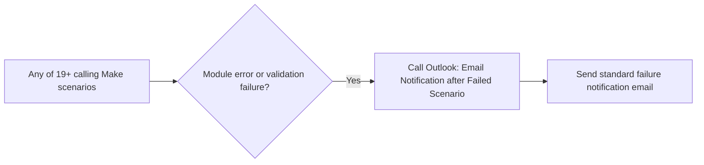

# COMP-MAKE-ERROR-001 — Shared Make Failure Email Notification

## 1. Purpose

Provide a single, reusable subscenario that any Make.com scenario can call — as an `onerror` handler or an explicit validation-failure branch — to send a standard Outlook failure notification, so RSFA does not need bespoke error-handling logic duplicated across dozens of scenarios.

## 2. Business context

Per `exports/make/make-scenario-call-graph.md`, this is the single most important shared component in RSFA's entire Make.com estate: it is called by **19 of the 20 resolved scenarios** in the `Valid scenarios/working` folder, in every confirmed case as either an `onerror` handler or an explicit validation-failure branch. It calls nothing itself. `knowledge/03_AUTOMATION_REGISTRY.md` explicitly registers it as `COMP-MAKE-ERROR-001` — a shared cross-cutting utility, not an independent business automation.

## 3. Scope

### Included

- Receiving an error/failure signal from a calling scenario.
- Sending a standard failure-notification email via Microsoft Outlook/Email.

### Excluded

- Any business logic specific to the calling scenario — this component is intentionally generic.
- `Real Savvy Fixed Rate Expiry Email` and `M.com: Insurance Expiry Email`'s own **separate, in-flow** no-template-match error path to `tech@rsfa.co.nz` — that is bespoke business logic inside those scenarios, not a call to this shared component.

## 4. Current status

Active. Used across nearly the entire active Make.com estate.

## 5. Trigger

Called on-demand by a parent scenario, either from an `onerror` handler attached to a module, or from an explicit validation-failure route within the scenario's own logic.

## 6. Inputs

Error/failure context passed from the calling scenario (exact payload structure — e.g. scenario name, error message, affected record — not confirmed from available evidence).

## 7. Outputs

An Outlook email notification (recipient(s) and exact content not confirmed from available evidence — TODO: verify).

## 8. Systems involved

Make.com (execution), Microsoft Outlook/Email (delivery).

## 9. Related Monday boards

Not applicable — this component has no direct Monday.com involvement of its own.

## 10. Platform implementation

### Make.com scenarios

| Scenario ID | Exact Make name | Role | Status | Trigger | Calls | Called by | Source confidence |
|---|---|---|---|---|---|---|---|
| `8732008` | Outlook: Email Notification after Failed Scenario | Subscenario (shared component) | Active | On-demand (called by parent scenario) | None | 19 confirmed callers across nearly every active automation family (see §11) | Current — confirmed from blueprint inspection of all 19 callers per `exports/make/make-scenario-call-graph.md` |

### Power Automate flows

Not applicable.

### Monday native automations or workflows

Not applicable.

### Native integrations

Not applicable.

### Shared subflows and components

This document describes the component itself.

## 11. End-to-end process

Confirmed callers, per `exports/make/make-scenario-call-graph.md`:

`AffordX to M.com Applications Sync (Aug 2025)` (`6238398`), `M.com: Banks to send change in Masterboard v2 (Feb 26)` (`8666173`), `M.com: Aircall Upload Transcriptions To SP (Jul 2026)` (`9498962`), `M.com: Creating Contact and Client Profile after Lead was Added (Mar 2026)` (`8800779`), `M.com: CP and Deals Renaming after Contact Renaming` (`1054927`), `M.com: Fixed Rate Expiry Email Alert (May25)` (`4840595`), `M.com: Insurance Expiry Email (Jul 2025)` (`6279522`), `M.com: New Form Submission in IQ/MA/KQ (Jun 2026)` (`9447215`), `M.com: Pigeon Notes to Mortgage Pipeline (Dec 25)` (`8399114`), `M.com: Pigeon Board to Mortgage Pipeline (Nov 25)` (`7950443`), `M.com: Renaming after Insurance Policy Added or Owner/Provider Change (Feb 2026)` (`1215342`), `M.com: Subflow Search Contacts in Monday (Feb 26)` (`8518416`), `M.com to AffordX Application Creation (Jul 2025)` (`6468551`), `M.Com: Unsubscribe Client Level (May 26)` (`9229914`), `M.com to Macroforge: Trigger Macroforge End Forms Filling Flow (Feb 2026)` (`8731317`), `Pigeon to M.com: Request Creation (Nov25)` (`7883004`), `AffordX Subflow Client Creation (Sep 2025)` (`7292131`), `M.com: Connect Entities to Mortgage Pipeline (Dec25)` (`8278547`), `M.com Reset Status And Reminder From Exisitng Insurance` (`9235525`).

Scenarios **not** currently confirmed to call this component: `Aircall Transcript Summary`, `Macroforge to M.com: End Forms Filled (May 2026)`, `M.com: Calls > Unknown/Client`, `M.com: New item in Contacts (Aircall) -> Delete`, `M.com: Branded SOP Filling and Filing (Jul 2026)`, `M.com: Mortgage renewals board, assign adviser and support`, `M.com: Update Existing Mortgages Name from Borrowers (Dec25)`, `M.com: Updates profile name when participants added`, `M.com: Pigeon Documents to Mortgage Pipeline (Dec 25)`, `M.com: Verification in Pigeon to Mortgage Pipeline (Dec 25)`, `M.com: Update Dependents (Dec25)`, `Real Savvy Insurance Unsubscribe (11Sep)`, `Real Savvy Unsubscribe (12May)`, `Monday Board Columns Generator from JSON`, plus the two unresolved parent scenarios `M.com: New Adviser Assigned in Masterboard (Mar 26)` and `M.com: New item in Mortgage App Copy to Masterboard End Forms (Jan 26)` (whose full blueprints were not inspected). This is either a genuine design gap in those scenarios' error handling, or an artefact of the call-graph export's scope — **TODO: verify** case by case.

## 12. Data mapping

TODO: complete mapping from current production configuration. Exact payload fields passed from caller to this component, and the exact email template/recipient, are not confirmed from available evidence.

## 13. Decision and routing logic

Not applicable — this is a terminal notification component with no further branching of its own confirmed.

## 14. Dependencies

Depended upon by 19 confirmed scenarios across nearly every RSFA Make.com automation family. A change to this component's behaviour (e.g. recipient address, template) would have estate-wide impact — treat changes to this scenario with proportionally higher caution than a single-family scenario change.

## 15. Error handling

Not applicable — this component *is* the error-handling mechanism for its callers. TODO: verify what happens if this component itself fails (e.g. Outlook send failure) — no further fallback is confirmed.

## 16. Logging and observability

The Outlook email itself is the primary observability signal. No dedicated Monday board or additional log is confirmed.

## 17. Manual operations and reprocessing

Not applicable — this is a passive notification component, not an operation requiring manual reprocessing.

## 18. Known limitations

- Exact recipient(s) and email content are not confirmed from available evidence.
- At least 14 active scenarios plus 2 unresolved parent scenarios show no confirmed call to this component — worth investigating whether these are intentionally excluded (e.g. scenarios where a failure has low operational impact) or represent an error-handling gap.

## 19. Security and sensitive data

Failure notification emails may reference scenario names, record IDs, or error context. Avoid including full client data in this component's payload; keep failure notifications limited to technical/operational detail.

## 20. Testing

### Confirmed tests

None recorded.

### Required regression tests

- A calling scenario's module error correctly triggers this component and produces an email.
- A calling scenario's explicit validation-failure branch correctly triggers this component and produces an email.

### Test data restrictions

Use a test scenario and a test recipient mailbox; never trigger this component against live production error paths purely for testing.

## 21. Validation after change

Force a controlled failure in a low-risk test scenario that calls this component, and confirm the expected Outlook email is received with the expected content.

## 22. Rollback

Disable or revert changes to the `Outlook: Email Notification after Failed Scenario` scenario directly. Given its estate-wide use, any change should be validated against multiple caller scenarios before being considered safe.

## 23. Troubleshooting guide

1. If a scenario failure went unnoticed, first confirm whether that scenario is actually a confirmed caller of this component (see the "not confirmed" list in §11) — its absence of notification may be by design, not a bug.
2. If a confirmed caller failed silently, check whether the Outlook send itself failed (no further fallback is confirmed).
3. Check the calling scenario's own error branch configuration to confirm it is still correctly wired to call this component.

## 24. Source references

- `exports/make/make-scenario-call-graph.md` — Current. Authoritative source for the confirmed caller list and the "one shared error-notification utility dominates the graph" finding.
- `exports/make/valid-scenarios-working-inventory.md` — Current. Scenario ID, trigger, status.
- `knowledge/03_AUTOMATION_REGISTRY.md` §3, §4, §7, §8 — Current. Canonical component ID and explicit registry treatment as a shared, non-business-automation component.

## 25. Known gaps

- Exact email content/recipient is unconfirmed.
- Whether the ~14 scenarios with no confirmed call to this component are an intentional design choice or a gap is unconfirmed.
- Behaviour if this component itself fails is unconfirmed.

## 26. Change history

| Date | Change | Author |
|---|---|---|
| 2026-07-30 | Initial canonical documentation created from call-graph and registry evidence. | Claude (documentation task) |
