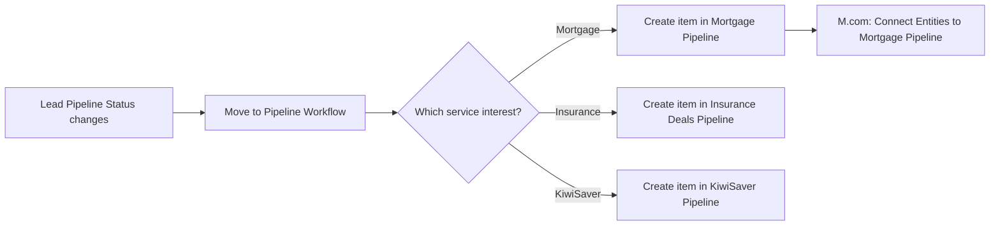

# AUTO-MONDAY-WF-001 — Move to Pipeline Workflow (New)

## 1. Purpose

Create the correct pipeline record — in Mortgage Pipeline, Insurance Deals Pipeline, or KiwiSaver Pipeline — as soon as a Lead's `Pipeline Status` column indicates the lead is ready to progress, so advisers never have to manually create a pipeline item from a qualified lead.

## 2. Business context

This is a native Monday Workflow (Monday's workflow-automation feature), not a Make.com scenario or Power Automate flow. It is the mechanism directly behind the "New lead and pipeline status change" trigger described for `AUTO-LEADS-001` in `knowledge/03_AUTOMATION_REGISTRY.md` §3, and is explicitly referenced from the Leads board's operational notes in `knowledge/04_MONDAY_BOARDS_REGISTRY.md`: "Pipeline Status is used by `Move to Pipeline Workflow (New)`."

## 3. Scope

### Included

- Detecting a `Pipeline Status` change on a Leads item.
- Creating the corresponding record in Mortgage Pipeline, Insurance Deals Pipeline, or KiwiSaver Pipeline depending on the declared service interest/status value.

### Excluded

- Creating the initial Client Profile/Contact records for the lead (`AUTO-LEADS-001`'s Make.com scenario `8800779`).
- Connecting entities (Client Profile, Contacts, Trusts) to the newly-created Mortgage Pipeline record — this is handled separately by `M.com: Connect Entities to Mortgage Pipeline (Dec25)` (`8278547`), part of `AUTO-LEADS-001`.
- Creating a second Lead for two-applicant submissions (`AUTO-MONDAY-WF-002`).

## 4. Current status

Active. `High` criticality per `knowledge/03_AUTOMATION_REGISTRY.md` §6 and `knowledge/04_MONDAY_BOARDS_REGISTRY.md`.

## 5. Trigger

`Pipeline Status` column changes on an item in the Leads board (`2074688480`).

## 6. Inputs

- The Leads item's `Pipeline Status` value, and its service-interest fields (mortgage, insurance, KiwiSaver — per `knowledge/01_RSFA_SYSTEM_MAP.md` §5's description of the Leads board supporting all three service interests).

## 7. Outputs

A new item created in the corresponding pipeline board:

| Pipeline Status value / service interest | Destination board | Board ID |
|---|---|---|
| Mortgage interest | 💲Mortgage Pipeline | `5025201889` |
| Insurance interest | ➕Insurance Deals Pipeline | `5025201920` |
| KiwiSaver interest | 📈 KiwiSaver Pipeline | `5025201954` |

Exact `Pipeline Status` value-to-pipeline mapping is not enumerated in available evidence — TODO: verify the precise status values that route to each pipeline.

## 8. Systems involved

Monday.com only — this is a native Monday Workflow, with no external platform involvement.

## 9. Related Monday boards

| Board | ID | Role |
|---|---|---|
| Leads | `2074688480` | Trigger source |
| 💲Mortgage Pipeline | `5025201889` | Destination for mortgage-interest leads |
| ➕Insurance Deals Pipeline | `5025201920` | Destination for insurance-interest leads |
| 📈 KiwiSaver Pipeline | `5025201954` | Destination for KiwiSaver-interest leads |
| Move to Pipeline Workflow (New) | `5025429617` | The workflow's own board (4 columns: `Status`, `Person`, `Date`, and one further column) — records workflow run instances rather than business data |

## 10. Platform implementation

### Make.com scenarios

Not applicable directly, but `M.com: Connect Entities to Mortgage Pipeline (Dec25)` (`8278547`, part of `AUTO-LEADS-001`) runs immediately after this workflow creates a Mortgage Pipeline record, to connect Client Profile/Contact/Trust entities to it.

### Power Automate flows

Not applicable.

### Monday native automations or workflows

This automation **is** a Monday Workflow. Its own board (`5025429617`, "Move to Pipeline Workflow (New)") has only 4 columns (`Status`, `Person`, `Date`, and one other), consistent with a Monday Workflow's own execution-log board rather than a business-data board — TODO: verify the exact recipe steps configured inside this workflow, since Monday Workflow logic is not exposed in the exports currently available to this documentation task.

### Native integrations

Not applicable.

### Shared subflows and components

Not applicable.

## 11. End-to-end process

## 12. Data mapping

TODO: complete mapping from current production configuration. The exact fields copied from the Lead item into the new pipeline item are not confirmed from available evidence.

## 13. Decision and routing logic

The workflow presumably branches on the Lead's declared service interest and/or the specific `Pipeline Status` value selected, to decide which of the three pipeline boards receives the new item. The precise condition set is not readable from the current exports (Monday Workflow recipe logic is not included in `exports/monday/`, which is currently empty) — **TODO: verify directly in Monday.com**.

## 14. Dependencies

- Depends on the Leads item's service-interest and `Pipeline Status` fields being correctly set (by the Leads Form submission or manual entry) before this workflow can route correctly.
- `M.com: Connect Entities to Mortgage Pipeline (Dec25)` depends on this workflow having already created the Mortgage Pipeline item.

## 15. Error handling

Not confirmed — Monday Workflows do not expose the same error-handling model as Make.com scenarios. TODO: verify what happens if the workflow cannot determine which pipeline to route to (e.g. ambiguous or missing service-interest data).

## 16. Logging and observability

The workflow's own board (`5025429617`) appears to log execution instances (`Status`, `Person`, `Date` columns), which can serve as a basic run log — TODO: verify how to read this board for troubleshooting purposes.

## 17. Manual operations and reprocessing

Not confirmed. TODO: verify whether a lead that failed to route correctly can have its `Pipeline Status` manually reset to re-trigger the workflow, or whether a pipeline item must then be created manually.

## 18. Known limitations

- Exact routing logic (status-to-pipeline mapping) is not confirmed from available evidence.
- No `exports/monday/` files currently exist to provide the workflow's configured recipe steps — this documentation is built entirely from board registry descriptions and cross-references from other automation documents.

## 19. Security and sensitive data

This workflow handles client personal data (via the Lead item) as part of creating pipeline records. No special handling beyond standard Monday.com data-handling practices is confirmed to be required.

## 20. Testing

### Confirmed tests

None recorded.

### Required regression tests

- Test Lead with mortgage interest, `Pipeline Status` changed to the qualifying value → Mortgage Pipeline item created.
- Test Lead with insurance interest → Insurance Deals Pipeline item created.
- Test Lead with KiwiSaver interest → KiwiSaver Pipeline item created.
- Test Lead with ambiguous/missing service interest → confirm actual behaviour (unconfirmed).

### Test data restrictions

Use a dedicated fictional test Lead; never trigger this workflow against a real prospect's Pipeline Status for testing purposes.

## 21. Validation after change

Create a test Lead item, set its service-interest field, and change `Pipeline Status` to the value expected to trigger routing; confirm the correct pipeline board receives the new item and that `M.com: Connect Entities to Mortgage Pipeline` subsequently runs for the mortgage case.

## 22. Rollback

Disable or edit the workflow directly in Monday.com's Workflow builder. No automated rollback of already-created pipeline items is defined.

## 23. Troubleshooting guide

1. Confirm the Lead's `Pipeline Status` was actually changed to a value expected to trigger this workflow.
2. Check the workflow's own board (`5025429617`) for a corresponding execution entry.
3. Confirm the correct pipeline board received the new item, and check for `M.com: Connect Entities to Mortgage Pipeline` execution if the mortgage path was expected.
4. If nothing happened, verify the workflow is still enabled in Monday's Workflow builder.

## 24. Source references

- `knowledge/03_AUTOMATION_REGISTRY.md` §3, §6 — Current. Canonical ID, trigger, outcome, criticality.
- `knowledge/04_MONDAY_BOARDS_REGISTRY.md` — Current. Board ID, columns, and the explicit cross-reference from the Leads board's operational notes.
- `knowledge/01_RSFA_SYSTEM_MAP.md` §5, §6 — Current. Business context for Leads and the Mortgage Pipeline lifecycle.
- No `exports/monday/` files currently exist; this workflow's internal recipe logic has not been directly exported or reviewed.

## 25. Known gaps

- Exact `Pipeline Status` value-to-pipeline routing logic is not confirmed.
- Exact fields copied from Lead to the new pipeline item are not confirmed.
- Error-handling and manual-reprocessing behaviour are unconfirmed.
- Monday Workflow recipe steps are not directly viewable in current exports; this documentation should be revisited once a live Monday Workflow export or direct review is available.

## 26. Change history

| Date | Change | Author |
|---|---|---|
| 2026-07-30 | Initial canonical documentation created from registry and board-registry evidence only; Monday Workflow recipe internals not directly available. | Claude (documentation task) |
