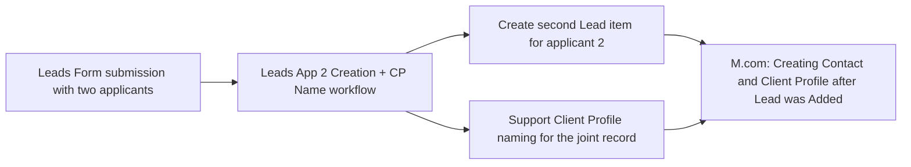

# AUTO-MONDAY-WF-002 — Leads App 2 Creation + CP Name

## 1. Purpose

When a Leads Form submission contains two applicants (a joint enquiry), create a second Lead item for the second applicant and support giving the resulting Client Profile a correctly-formatted joint name, so joint leads are represented as complete individual records rather than one applicant being lost inside a single Lead item.

## 2. Business context

This is a native Monday Workflow, referenced explicitly in `knowledge/04_MONDAY_BOARDS_REGISTRY.md`'s operational notes for the Leads board: "Two-applicant submissions may trigger `Leads App 2 Creation + CP Name`." It complements `AUTO-LEADS-001`'s per-applicant Client Profile/Contact creation logic (`source-material/make/M.com_ Creating Contact and Client Profile after Lead was Added (Mar 2026).md` explicitly processes "each applicant individually").

## 3. Scope

### Included

- Detecting that a Leads Form submission declares two applicants.
- Creating a second Lead item to represent the second applicant.
- Supporting correct Client Profile naming for the resulting joint client record (e.g. combining both applicant names in the expected format).

### Excluded

- Creating the Client Profile and Contact records themselves for each applicant — handled by `M.com: Creating Contact and Client Profile after Lead was Added (Mar 2026)` (`8800779`, part of `AUTO-LEADS-001`).
- Routing either lead into a pipeline (`AUTO-MONDAY-WF-001`).

## 4. Current status

Active. `High` criticality per `knowledge/03_AUTOMATION_REGISTRY.md` §6 and `knowledge/04_MONDAY_BOARDS_REGISTRY.md`.

## 5. Trigger

A Leads Form application submission that contains two applicants.

## 6. Inputs

The original Leads item's second-applicant fields (name, email, and other Leads Form data for the second applicant).

## 7. Outputs

- A second item created in the Leads board, representing the second applicant.
- Support for correct Client Profile naming (exact naming format not confirmed — TODO: verify, e.g. whether it combines both surnames, uses "and", or another convention consistent with the "and" formatting rule seen in `AUTO-SP-FOLDER-001`'s folder-naming logic).

## 8. Systems involved

Monday.com only — this is a native Monday Workflow.

## 9. Related Monday boards

| Board | ID | Role |
|---|---|---|
| Leads | `2074688480` | Source of the original two-applicant submission and destination for the newly-created second Lead item |
| Client Profiles | `5024661649` | Beneficiary of the supported naming logic |
| Leads App 2 Creation + CP Name | `5025430003` | The workflow's own board (4 columns: `Status`, `Person`, `Date`, and one further column) — records workflow run instances rather than business data |

## 10. Platform implementation

### Make.com scenarios

Not applicable directly, but this workflow's output feeds into `M.com: Creating Contact and Client Profile after Lead was Added (Mar 2026)` (`8800779`, part of `AUTO-LEADS-001`), which then processes each of the two resulting Lead items' applicants individually.

### Power Automate flows

Not applicable.

### Monday native automations or workflows

This automation **is** a Monday Workflow. Its own board (`5025430003`) has only 4 columns, consistent with a Monday Workflow's own execution-log board — TODO: verify the exact recipe steps configured inside this workflow, since Monday Workflow logic is not exposed in the exports currently available to this documentation task.

### Native integrations

Not applicable.

### Shared subflows and components

Not applicable.

## 11. End-to-end process

## 12. Data mapping

TODO: complete mapping from current production configuration. The exact fields copied into the second Lead item, and the exact Client Profile naming format applied, are not confirmed from available evidence.

## 13. Decision and routing logic

The workflow presumably detects the presence of second-applicant fields on the original Leads Form submission to decide whether to fire. The precise detection condition is not readable from current exports — **TODO: verify directly in Monday.com**.

## 14. Dependencies

Depends on the Leads Form correctly capturing second-applicant data when a joint enquiry is submitted. `AUTO-LEADS-001`'s Make.com scenario `8800779` depends on this workflow having already created the second Lead item, since it processes applicants per Lead item.

## 15. Error handling

Not confirmed. TODO: verify behaviour if second-applicant data is only partially populated (e.g. name present but no email).

## 16. Logging and observability

The workflow's own board (`5025430003`) appears to log execution instances (`Status`, `Person`, `Date` columns).

## 17. Manual operations and reprocessing

Not confirmed. TODO: verify whether a missed second-applicant creation can be manually triggered or must be created manually by an agent.

## 18. Known limitations

- Exact naming-format rule for the joint Client Profile is not confirmed.
- Exact detection logic for "contains two applicants" is not confirmed (e.g. whether it requires both name and email for the second applicant, or just a name).
- No `exports/monday/` files currently exist to provide the workflow's configured recipe steps.

## 19. Security and sensitive data

This workflow handles client personal data (both applicants' details). No special handling beyond standard Monday.com data-handling practices is confirmed to be required.

## 20. Testing

### Confirmed tests

None recorded.

### Required regression tests

- Test Leads Form submission with two fully-populated applicants → second Lead item created, Client Profile named correctly.
- Test Leads Form submission with a partially-populated second applicant → confirm actual behaviour (unconfirmed).
- Single-applicant submission → confirm the workflow does not fire.

### Test data restrictions

Use a dedicated fictional two-applicant test submission; never trigger this workflow against a real joint enquiry for testing.

## 21. Validation after change

Submit a test Leads Form entry with two fictional applicants, confirm a second Lead item is created for the second applicant, and confirm the resulting Client Profile name follows the expected joint-naming format.

## 22. Rollback

Disable or edit the workflow directly in Monday.com's Workflow builder. No automated rollback of an already-created second Lead item is defined.

## 23. Troubleshooting guide

1. Confirm the original Leads Form submission actually declared two applicants (both name fields populated, not just one).
2. Check the workflow's own board (`5025430003`) for a corresponding execution entry.
3. Confirm a second Lead item was created, and that `AUTO-LEADS-001`'s Make.com scenario subsequently processed it.
4. If the Client Profile name looks wrong, compare against the expected joint-naming convention (once confirmed).

## 24. Source references

- `knowledge/03_AUTOMATION_REGISTRY.md` §3, §6 — Current. Canonical ID, trigger, outcome, criticality.
- `knowledge/04_MONDAY_BOARDS_REGISTRY.md` — Current. Board ID, columns, and the explicit cross-reference from the Leads board's operational notes.
- `source-material/make/M.com_ Creating Contact and Client Profile after Lead was Added (Mar 2026).md` — Current. Confirms per-applicant processing logic that this workflow's output feeds into.
- No `exports/monday/` files currently exist; this workflow's internal recipe logic has not been directly exported or reviewed.

## 25. Known gaps

- Exact detection condition for "two applicants" is not confirmed.
- Exact Client Profile naming format is not confirmed.
- Error-handling and manual-reprocessing behaviour are unconfirmed.
- Monday Workflow recipe steps are not directly viewable in current exports; this documentation should be revisited once a live Monday Workflow export or direct review is available.

## 26. Change history

| Date | Change | Author |
|---|---|---|
| 2026-07-30 | Initial canonical documentation created from registry and board-registry evidence only; Monday Workflow recipe internals not directly available. | Claude (documentation task) |
