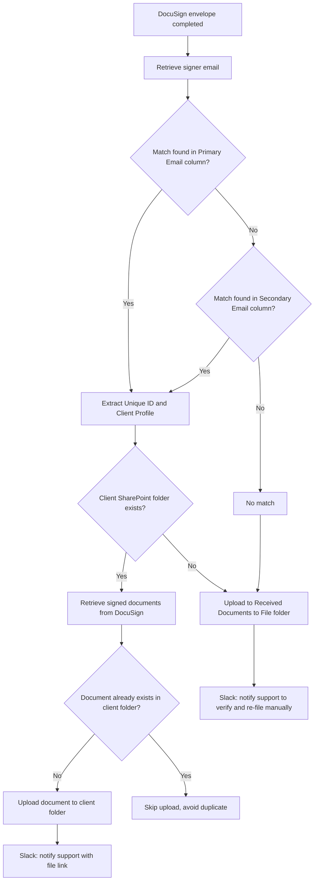

# AUTO-DOCUSIGN-001 — DocuSign Signed Document Filing

## 1. Purpose

Automatically retrieve completed DocuSign envelopes, identify the associated client, and file the signed documents into that client's SharePoint folder, so signed mortgage/insurance paperwork is filed without manual download-and-upload.

## 2. Business context

DocuSign is RSFA's current electronic-signature platform (`knowledge/02_SYSTEMS_REGISTRY.md` SYS-DOCUSIGN-001). Signed documents need to reach the same client SharePoint folder used by all other client records, so downstream processes (e.g. Client Profile file references) stay consistent.

## 3. Scope

### Included

- Detecting a completed DocuSign envelope.
- Matching the signer's email to a Monday.com record (Primary Email, then Secondary Email fallback).
- Resolving the associated Client Profile and its SharePoint folder.
- Downloading signed documents and the Certificate of Completion from DocuSign.
- Uploading documents to the client folder, or to a "Received Documents to File" holding folder if no client folder is found.
- De-duplication check before upload.
- Slack notification to the support team on both the fallback and success paths.

### Excluded

- DocuSeal (experimental, not in production — `SYS-DOCUSEAL-001`).
- General SharePoint folder lifecycle (`AUTO-SP-FOLDER-001`).

## 4. Current status

Active. Confirmed in `knowledge/03_AUTOMATION_REGISTRY.md` as `Active`, `Partially documented`.

## 5. Trigger

DocuSign envelope status changes to "envelope-completed".

## 6. Inputs

- DocuSign completed envelope (envelope ID, signer email, signed documents, certificate of completion).
- Monday.com record matched by signer email (Primary Email column, Secondary Email column as fallback).
- Monday.com Client Profile column linked to the matched record.

## 7. Outputs

- Signed document(s) and Certificate of Completion uploaded to the client's SharePoint folder (or to "Received Documents to File" if no client folder is resolved).
- Slack message to `support_team_tasks` — either a fallback notice (asking support to verify why the email isn't linked to a client, then rename/move the files) or a success notice with a link to the uploaded file.

## 8. Systems involved

DocuSign (source), Power Automate (execution), Monday.com (client matching), SharePoint (destination), Slack (notifications).

## 9. Related Monday boards

| Board | ID | Role |
|---|---|---|
| Client Profiles | `5024661649` | Provides the client's SharePoint folder path once matched |
| Contacts | `2074688484` | Primary/Secondary email lookup for the signer — TODO: verify whether the match is actually performed against Contacts or a different board; source material refers generically to "the Monday board" |

## 10. Platform implementation

### Make.com scenarios

Not applicable.

### Power Automate flows

| Exact flow name | Flow type | Role | Current status | Source confidence |
|---|---|---|---|---|
| DocuSign to SharePoint | Automated | End-to-end envelope-completed handler | Active | Confirmed from export — the `DocuSigntoSharePoint` Solution export (inspected 2026-07-30) contains exactly one cloud flow, exported as `"DocuSign to SharePoint "` (trailing space), Activated, triggered by a DocuSign `When_an_envelope_status_changes_(Connect)_(V3)` webhook filtered to `envelope-completed` — matching this document's trigger description exactly. See `exports/power-automate/solutions/docusign-to-sharepoint/manifest.md`. |

### Monday native automations or workflows

Not applicable.

### Native integrations

Not applicable.

### Shared subflows and components

None confirmed.

## 11. End-to-end process

## 12. Data mapping

| Source field | Destination | Notes |
|---|---|---|
| Signer email | Monday Primary/Secondary Email column | Determines the matched record |
| Matched record → Client Profile column | Client's SharePoint folder | Used to resolve upload destination |
| DocuSign signed document + Certificate of Completion | Client SharePoint folder, or "Received Documents to File" | Named with client name and document type per source material |

TODO: complete mapping from current production configuration for exact column IDs.

## 13. Decision and routing logic

1. Search by Primary Email; if not found, search by Secondary Email.
2. If a match is found, extract the linked Client Profile and locate its SharePoint folder.
3. If the folder exists, check for an existing copy of the document (by name) before uploading, to prevent duplicates.
4. If no match is found, or the client folder does not exist, file into "Received Documents to File" and ask support to manually verify and re-file.

## 14. Dependencies

- Client Profile must have a valid SharePoint folder link (`AUTO-SP-FOLDER-001`) for direct filing to succeed.
- Signer's email must be present in the matched Monday record.

## 15. Error handling

No confirmed automated error-handling branch beyond the "no match / no folder" fallback path, which routes to a manual Slack-notified holding folder rather than failing silently.

## 16. Logging and observability

Slack `support_team_tasks` channel serves as the operational log for both the fallback and success paths. No dedicated Monday board entry is created for this automation. TODO: verify whether Power Automate run history is otherwise reviewed for this flow.

## 17. Manual operations and reprocessing

Support staff manually move files out of "Received Documents to File" into the correct client folder once the mismatch is resolved, per the Slack instruction.

## 18. Known limitations

- Relies entirely on the signer's email matching a Monday record; a client signing from an unrecognised address always falls back to manual filing.
- No confirmed automatic retry if the initial SharePoint folder lookup fails transiently.

## 19. Security and sensitive data

Signed documents may contain full client financial/insurance data and signatures. Never use real signed documents as test data; use fictional envelopes and fictional signer identities only.

## 20. Testing

### Confirmed tests

None recorded.

### Required regression tests

- Match via Primary Email → correct folder upload.
- Match via Secondary Email (Primary miss) → correct folder upload.
- No match found → fallback folder + Slack notice.
- Existing document already filed → no duplicate created.
- Match found but SharePoint folder missing → fallback folder + Slack notice.

### Test data restrictions

Use fictional client identities and test DocuSign envelopes only.

## 21. Validation after change

Send a test envelope through DocuSign with a known test signer email that matches a test Monday record; confirm the document lands in the correct SharePoint test folder and the Slack success message fires. Then repeat with an unmatched test email and confirm the fallback path and Slack fallback message.

## 22. Rollback

Disable the `DocuSign to SharePoint` flow in Power Automate. No automated rollback of already-filed documents is defined.

## 23. Troubleshooting guide

1. Confirm the envelope actually reached "completed" status in DocuSign.
2. Check whether the signer's email exists in the relevant Monday board (Primary then Secondary).
3. If matched, confirm the linked Client Profile has a valid SharePoint folder link.
4. Check the "Received Documents to File" folder for documents awaiting manual re-filing.
5. Check the `support_team_tasks` Slack channel for the corresponding notification.

## 24. Source references

- `source-material/power-automate/DocuSign to SharePoint Workflow.md` — Current/Partial. Step-by-step logic; exact current flow name not fully confirmed against the registry's "DocuSign to SharePoint" entry.
- `knowledge/03_AUTOMATION_REGISTRY.md` §3, §5, §5.1 — Current. Status, criticality, main systems, Solution mapping.
- `knowledge/02_SYSTEMS_REGISTRY.md` SYS-DOCUSIGN-001 — Current. Platform role and status.
- `exports/power-automate/solutions/docusign-to-sharepoint/manifest.md` — Current-export-snapshot, inspected 2026-07-30. Point-in-time evidence; not a live-system verification. Confirms exact flow name (with trailing-space variant), workflow ID `911a3139-e5da-ef11-8eea-00224814e0ff`, Activated state, and the DocuSign webhook trigger.

## 25. Known gaps

- Exact Monday board used for signer-email matching is not confirmed (source material says "the Monday board" without naming it precisely; the 2026-07-30 export calls Monday.com via a direct HTTP action rather than a bound board reference, so this remains unconfirmed even from the export).
- Error-handling/retry behaviour beyond the fallback-folder path is unconfirmed.
- Exact current Power Automate flow ID is now recorded from the 2026-07-30 export (`911a3139-e5da-ef11-8eea-00224814e0ff`) — treat as point-in-time evidence, not a live-system guarantee that this ID is still current.
- **New conflict, not silently resolved:** the 2026-07-30 export shows this flow calling an OpenAI HTTP endpoint. This document's Scope/Process sections above describe no AI/OpenAI step at all. Either this document is missing a capability that has since been added to the live flow, or the OpenAI call is unused/vestigial. Requires live verification before this document's Scope is updated to include it.
- **Security finding from the 2026-07-30 export:** this flow was found to call Monday.com and OpenAI using hardcoded HTTP Authorization headers containing literal API credentials, instead of a Connection Reference or Environment Variable. The literal values have been redacted in the repository's unpacked copy; see `exports/power-automate/solutions/docusign-to-sharepoint/manifest.md` § "Security review" for detail. Both credentials should be rotated.

## 26. Change history

| Date | Change | Author |
|---|---|---|
| 2026-07-30 | Initial canonical documentation created from registry and source-material evidence. | Claude (documentation task) |
| 2026-07-30 | Added export evidence from the `DocuSigntoSharePoint` Power Automate Solution export (workflow ID, Activated state, DocuSign webhook trigger confirmed); flagged a new conflict (undocumented OpenAI call) and a security finding (hardcoded credentials) without silently resolving either. | Claude (documentation task) |
