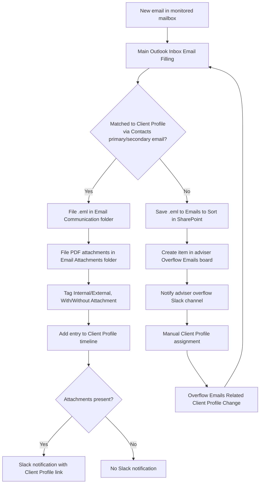

# AUTO-EMAIL-001 — Client Email Filing and Overflow Processing

## 1. Purpose

Automatically file incoming and outgoing adviser emails against the correct Client Profile in SharePoint and Monday.com, so email evidence, attachments and client activity history are captured without an adviser manually saving or forwarding anything. Emails that cannot be confidently matched to a client are routed to a human-reviewed overflow queue instead of being silently dropped or misfiled.

## 2. Business context

RSFA advisers correspond with clients almost entirely through Outlook (mailboxes for Rod, Kathleen, Seth, Jet and the shared `support` mailbox). Client folders in SharePoint and the Client Profile's activity timeline are the operational record of that correspondence. Reliable filing depends on matching the email's sender/recipient address to a Client Profile via the Contacts board's Primary/Secondary email columns.

## 3. Scope

### Included

- Monitoring of the Sent (and, per mailbox flow name, Received) folders of the mailboxes: Rod, Kathleen, Seth, Jet, and the `support` shared mailbox.
- Matching an email to a Client Profile via Contacts primary/secondary email columns.
- Filing the `.eml` file and PDF/attachment copies into the client's SharePoint folder.
- Adding processed emails to the Client Profile's Emails & Activities timeline.
- Classifying emails as Internal/External and With/Without Attachment.
- Slack notification when a client document arrives.
- Routing of unmatched emails to an adviser-specific Overflow Emails board and Slack channel, and reprocessing once a human assigns a Client Profile.

### Excluded

- Full mailbox backup and disaster recovery (`AUTO-EMAIL-BACKUP-001`).
- SharePoint client-folder creation, renaming and permissions (`AUTO-SP-FOLDER-001`).
- DocuSign envelope filing (`AUTO-DOCUSIGN-001`).

## 4. Current status

Active for Rod, Kathleen, Seth and Support mailboxes. The two Jet-related flows (`Outlook Email Filing - Jet v2`, `OLD Outlook SENT Email Filling - Jet v2`) are `Active - Planned Retirement` and are expected to be removed together with the Jet overflow board when Jet leaves RSFA (per `knowledge/01_RSFA_SYSTEM_MAP.md` §15 and §4.3). Planned additions for `it-support@rsfa.co.nz` and `leo@rsfa.co.nz` mailboxes are not yet active — TODO: verify whether these have since gone live.

## 5. Trigger

New email detected in a monitored mailbox's Sent folder (per the source-material walkthrough) or Received folder (inferred from mailbox-specific "Email Filing" flow names, not separately walked through in source material — TODO: verify Received-side step detail). The central `Main Outlook Inbox Email Filling` flow is invoked as a child flow from each mailbox-specific flow.

## 6. Inputs

- Email message: sender, To/CC/BCC recipients, subject, timestamp, attachments.
- Monday.com Contacts board: Primary Email and Secondary/Alternate Email columns, linked Client Profile.
- Monday.com Client Profiles board: `SP folder` link.
- SharePoint: existence check for an already-filed `.eml` with the same identity, to avoid duplicate filing.

## 7. Outputs

- `.eml` file saved under the client's SharePoint folder, in the `f. Email Communication` subfolder.
- PDF attachments saved under the `g. Email Attachments` subfolder, tagged Internal/External and With/Without Attachment.
- Client Profile Emails & Activities timeline entry.
- Slack notification when a new attachment is filed.
- For unmatched emails: an item created in the relevant adviser's Overflow Emails board, plus a Slack message in the adviser's overflow channel.

## 8. Systems involved

Outlook (source), Power Automate (execution), Monday.com (Contacts / Client Profiles / Overflow Emails boards), SharePoint (client folder storage), Slack (notifications), Real Savvy Ref Outlook Add-in (lets advisers force a match via the `RSFA Ref %ClientProfileID%` subject convention — per `knowledge/02_SYSTEMS_REGISTRY.md` SYS-RSFA-REF-001).

## 9. Related Monday boards

| Board | ID | Role |
|---|---|---|
| Client Profiles | `5024661649` | Match target; source of the SharePoint folder link |
| Contacts | `2074688484` | Primary/Secondary email lookup |
| 📬 Overflow Emails - Rod/Kathleen | `5029313286` | Unmatched-email queue for Rod and Kathleen |
| 📬 Overflow Emails - Seth | `5029313272` | Unmatched-email queue for Seth |
| 📬 Overflow Emails - Jet | `5029313274` | Unmatched-email queue for Jet (planned retirement) |
| 📬 Overflow Emails (OLD) | `5025365487` | Historical/legacy overflow board — TODO: verify current use |

## 10. Platform implementation

### Make.com scenarios

Not applicable. This automation runs entirely on Power Automate.

### Power Automate flows

| Exact flow name | Flow type | Role | Current status | Source confidence |
|---|---|---|---|---|
| Main Outlook Inbox Email Filling | Instant child flow | Central reusable filing logic (matching, filing, tagging, timeline, Slack) | Active | Partial — matches source-material walkthrough closely but exact flow name in source material is "Outlook Email Filing to SharePoint" |
| Outlook Email Filing - Support v2 | Automated | Mailbox-specific caller for `support` mailbox | Active | Current (registry) |
| Outlook Email Filing - Seth v2 | Automated | Mailbox-specific caller | Active | Current (registry) |
| Outlook SENT Email Filling - Seth v2 | Automated | Sent-folder caller for Seth | Active | Current (registry) |
| Outlook Email Filing - Kathleen v2 | Automated | Mailbox-specific caller | Active | Current (registry) |
| Outlook SENT Email Filling - Kathleen v2 | Automated | Sent-folder caller for Kathleen | Active | Current (registry) |
| Outlook Email Filing - Rod v2 | Automated | Mailbox-specific caller | Active | Current (registry) |
| Outlook SENT Email Filling - Rod v2 | Automated | Sent-folder caller for Rod | Active | Current (registry) |
| Outlook Email Filing - Jet v2 | Automated | Mailbox-specific caller | Active - Planned Retirement | Current (registry) |
| OLD Outlook SENT Email Filling - Jet v2 | Automated | Sent-folder caller for Jet | Active - Planned Retirement | Current (registry) |
| Overflow Emails Contact Matching | Instant | AI-suggested Client Profile match for overflow items | Active | Current (registry); implementation detail TODO: verify |
| Overflow Emails Suggested Match Approval | Automated | Human approval gate for AI-suggested match | Active | Current (registry); implementation detail TODO: verify |
| Overflow Emails Related Client Profile Change | Automated | Reprocesses an email once a Client Profile is manually assigned | Active | Current (registry); implementation detail TODO: verify |

Note: `knowledge/03_AUTOMATION_REGISTRY.md` §5 lists the exact flow names above as the current inventory. `source-material/power-automate/Outlook Email Filing to SharePoint.md` describes matching/filing logic in detail but does not use these exact flow names — treat the source-material walkthrough as **historical/partial** evidence of the filing logic, not as confirmation of current flow names. TODO: verify the source-material walkthrough still matches the current `Main Outlook Inbox Email Filling` implementation.

### Monday native automations or workflows

Not applicable — Monday's role here is as a data source (Contacts, Client Profiles) and as the destination for overflow items, not as the automation engine.

### Native integrations

Real Savvy Ref Outlook Add-in lets an adviser copy a Client Profile ID into the email subject (`RSFA Ref %ClientProfileID%`), forcing a match regardless of address-based matching.

### Shared subflows and components

None confirmed for this automation family in the current Make/Power Automate exports.

## 11. End-to-end process

## 12. Data mapping

| Source field | Destination | Notes |
|---|---|---|
| Email sender/recipient address | Contacts → Primary Email / Secondary Email | Primary checked first, Secondary (Alternate) as fallback |
| Matched Contact → Client Profile | Client Profile SharePoint folder | Used to resolve destination folder |
| Email .eml | `<Client Folder>/f. Email Communication/` | Duplicate-checked before creation |
| PDF attachments | `<Client Folder>/g. Email Attachments/` | One file per attachment |
| Internal/External + Attachment flags | SharePoint file properties | Four combinations: Internal/No Attachment, Internal/Yes Attachment, External/No Attachment, External/Yes Attachment |

TODO: complete mapping from current production configuration for the exact SharePoint column/property names and the Monday Emails & Activities timeline field structure.

## 13. Decision and routing logic

1. Sender/recipient domain compared against the RSFA domain to classify Internal vs External.
2. Contacts board searched by Primary Email; if no match, Secondary/Alternate Email is searched.
3. If a Client Profile is resolved, the client's SharePoint folder is located; if the folder cannot be found, the email is instead saved to a general/overflow SharePoint location (`Emails to sort/Rod_Shay_Kathleen` per source material — TODO: verify this is still the current path for every mailbox).
4. If no Client Profile can be resolved at all, an Overflow Emails board item is created and the adviser's Slack overflow channel is notified.
5. A duplicate check by filename/identity prevents re-filing the same email twice.

## 14. Dependencies

- Contacts and Client Profiles boards must have accurate, current Primary/Secondary email values.
- SharePoint client folder must already exist (`AUTO-SP-FOLDER-001`) for direct filing to succeed.
- Real Savvy Ref Outlook Add-in for forced-match subject convention.

## 15. Error handling

Not confirmed in source material. TODO: verify whether failed filing attempts are captured by `AUTO-EMAIL-BACKUP-001`'s "Failed Items Processing" flow or another mechanism.

## 16. Logging and observability

`knowledge/01_RSFA_SYSTEM_MAP.md` §10 records that Power Automate run history is not considered sufficient for long-term tracking, and that RSFA intends to create a dedicated board for logging all client-specific processed emails. This is a known, currently unimplemented gap — TODO: verify whether this board now exists.

## 17. Manual operations and reprocessing

An adviser can manually assign a Client Profile to an Overflow Emails item; this relation change triggers `Overflow Emails Related Client Profile Change`, which reprocesses the email through the filing logic.

## 18. Known limitations

- Matching depends entirely on the sender/recipient address appearing in Contacts; a client emailing from an unrecognised address will always land in Overflow.
- The Jet mailbox flows are active but explicitly planned for retirement.
- No long-term, queryable log of which specific emails were filed against which Client Profile currently exists outside SharePoint file properties and the Monday timeline.

## 19. Security and sensitive data

This automation handles full client email content and attachments (potentially financial and personal data). Do not include real email bodies, attachment content or client identifiers in test data or incident write-ups — use sanitised examples per `CLAUDE.md` §13.

## 20. Testing

### Confirmed tests

None recorded.

### Required regression tests

- Successful match via Primary Email.
- Successful match via Secondary/Alternate Email.
- No match found → overflow item created and Slack notified.
- Duplicate email reprocessed → no duplicate file created.
- Email with PDF attachment vs. no attachment → correct tagging.
- Internal vs. External classification for both directions.
- Manual overflow-to-Client-Profile assignment → correct reprocessing.

### Test data restrictions

Use fictional mailbox addresses and fictional Client Profile records only; never replay real client email content.

## 21. Validation after change

Confirm a test email matches the intended Client Profile, files into the correct SharePoint subfolder, appears on the Client Profile timeline, and (if it has an attachment) triggers the Slack notification. Confirm an intentionally unmatched test email lands in the correct adviser's Overflow Emails board and Slack channel.

## 22. Rollback

Disable the affected mailbox-specific flow(s) in Power Automate; the `Main Outlook Inbox Email Filling` child flow is shared, so disabling a single mailbox flow does not affect other mailboxes. No automated rollback of already-filed SharePoint files is defined — TODO: verify.

## 23. Troubleshooting guide

1. Confirm the email actually arrived in the monitored mailbox/folder.
2. Check whether the sender/recipient address exists in Contacts (Primary or Secondary).
3. If matched but not filed, check whether the Client Profile's SharePoint folder link is valid (see `AUTO-SP-FOLDER-001`).
4. If unmatched, check the relevant adviser's Overflow Emails board and Slack channel.
5. Check Power Automate run history for the relevant mailbox flow (subject to the logging limitation in §16).

## 24. Source references

- `source-material/power-automate/Outlook Email Filing to SharePoint.md` — Partial. Describes filing/matching/tagging logic step-by-step but flow name does not match current registry name; treat as historical/illustrative of logic, not confirmation of current flow structure.
- `knowledge/03_AUTOMATION_REGISTRY.md` §5 — Current. Authoritative for exact flow names, roles and status.
- `knowledge/01_RSFA_SYSTEM_MAP.md` §10, §15 — Current. Business context, overflow flow diagram, Jet retirement plan, logging gap.
- `knowledge/02_SYSTEMS_REGISTRY.md` SYS-RSFA-REF-001 — Current. Forced-match subject convention.
- `knowledge/04_MONDAY_BOARDS_REGISTRY.md` — Current. Overflow board IDs and descriptions.
- `exports/power-automate/` — Unverified. No exports currently present in this folder.

## 25. Known gaps

- Exact current flow name/structure of the central filing flow relative to the source-material walkthrough is unconfirmed (`TODO: verify`).
- Error-handling and retry behaviour for failed filing attempts is unconfirmed.
- No dedicated long-term email-processing log exists yet (per system map §10).
- Planned `it-support@rsfa.co.nz` and `leo@rsfa.co.nz` mailbox flows are not yet confirmed active.
- Exact SharePoint property/column names used for tagging are not confirmed from a current export.

## 26. Change history

| Date | Change | Author |
|---|---|---|
| 2026-07-30 | Initial canonical documentation created from registry, system map and source-material evidence. | Claude (documentation task) |
