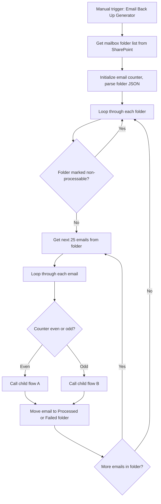

# AUTO-EMAIL-BACKUP-001 — Email Backup and Failed Item Recovery

## 1. Purpose

Provide a controlled, scalable way to back up all emails and attachments from a given Outlook mailbox into SharePoint, and to reprocess email-filing items that previously failed, so that no client correspondence is permanently lost due to a filing failure or the need to rebuild a mailbox's history.

## 2. Business context

`AUTO-EMAIL-001` files individual emails as they arrive. This automation exists as a safety net: a bulk backup mechanism for an entire mailbox, and a scheduled recovery process for items that `AUTO-EMAIL-001` failed to file the first time.

## 3. Scope

### Included

- Manually-triggered, folder-by-folder, batch-based (25 emails at a time) backup of a mailbox to SharePoint.
- Skipping folders explicitly marked "non-processable".
- Distributing email processing across two child flows by parity (even/odd counter) for parallelism.
- Scheduled reprocessing of previously failed email-filing items.

### Excluded

- Real-time filing of new emails as they arrive (`AUTO-EMAIL-001`).
- Monday.com activity/timeline backup (`AUTO-MONDAY-BACKUP-001`).

## 4. Current status

Active. Per `knowledge/03_AUTOMATION_REGISTRY.md` §5, both `Email Back Up Generator` (Manual) and `Email Filling Failed Items Processing` (Scheduled) are Active.

## 5. Trigger

- `Email Back Up Generator`: manual trigger, run on demand.
- `Email Filling Failed Items Processing`: scheduled trigger (exact schedule not confirmed — TODO: verify).

## 6. Inputs

- SharePoint list of mailbox folders to process, including a flag for folders to skip.
- Outlook mailbox content (emails + attachments), retrieved in batches of 25.
- Previously failed email-filing items (source and structure not confirmed — TODO: verify whether these are logged to a SharePoint list, a Monday board, or another store).

## 7. Outputs

- Backed-up emails and attachments stored in SharePoint, organized to mirror the source mailbox folder structure.
- Each processed email is moved to a "Processed" or "Failed" outcome folder in the mailbox.
- Reprocessed items from `Email Filling Failed Items Processing` are (re-)filed via the same logic as `AUTO-EMAIL-001` — TODO: verify whether this flow calls `AUTO-EMAIL-001`'s child flow directly or duplicates its logic.

## 8. Systems involved

Outlook (source), Power Automate (execution), SharePoint (destination), SharePoint list (folder-processing configuration).

## 9. Related Monday boards

Not applicable — no Monday board confirmed as part of this automation's direct inputs or outputs.

## 10. Platform implementation

### Make.com scenarios

Not applicable.

### Power Automate flows

| Exact flow name | Flow type | Role | Current status | Source confidence |
|---|---|---|---|---|
| Email Back Up Generator | Manual | Batch mailbox backup to SharePoint, folder-by-folder, 25 emails per batch, dispatches to two child flows by parity | Active | Current (registry); source-material file matches by name and content |
| Email Filling Failed Items Processing | Scheduled | Retries email-filing items that previously failed | Active | Confirmed from export — this flow is packaged inside the `RSFAOutlookEmailFilling` Power Automate Solution export (2026-07-30), workflow ID `04531fc5-dced-ef11-9341-6045bd3ce9ae`, Activated, `Recurrence` trigger confirming the "Scheduled" trigger type. See `exports/power-automate/solutions/rsfa-outlook-email-filing/manifest.md`. Exact recurrence interval not inspected in this pass — TODO: verify |

### Monday native automations or workflows

Not applicable.

### Native integrations

Not applicable.

### Shared subflows and components

Two unnamed child flows are called by `Email Back Up Generator` based on an even/odd counter, to allow parallel/distributed processing — TODO: verify their exact names; not identified in current exports.

## 11. End-to-end process

## 12. Data mapping

Not applicable in detail — this automation copies whole emails and attachments rather than mapping discrete fields. TODO: complete mapping from current production configuration if specific SharePoint list schema fields are confirmed.

## 13. Decision and routing logic

- Folders explicitly flagged "non-processable" in the SharePoint folder list are skipped entirely.
- Emails are split across two child flows by parity of a running counter, purely for throughput, not business logic.
- Each email's outcome (success/failure) determines whether it is moved to "Processed" or "Failed".

## 14. Dependencies

- SharePoint list of mailbox folders must be current and accurate; a folder missing from this list will not be backed up.
- "Processed" and "Failed" folders must already exist in the target mailbox.

## 15. Error handling

Failed items are moved to a "Failed" folder rather than being lost, and `Email Filling Failed Items Processing` exists specifically to retry them on a schedule.

## 16. Logging and observability

The mailbox's own "Processed"/"Failed" folder split is the primary observability mechanism. No dedicated Monday board or SharePoint log list is confirmed. TODO: verify.

## 17. Manual operations and reprocessing

`Email Back Up Generator` is itself a manual/on-demand operation — treat as a **bulk maintenance flow; execute only with explicit approval**, consistent with `knowledge/03_AUTOMATION_REGISTRY.md` §5's treatment of similar bulk flows.

## 18. Known limitations

- Batch size is fixed at 25 emails per retrieval; large mailboxes will require many iterations of the `Do until` loop.
- To adapt this automation to a new mailbox, the Outlook connection must be updated and the "Processed"/"Failed" folders must already exist in the target mailbox (explicitly noted in source material).

## 19. Security and sensitive data

This automation copies entire mailbox contents, including attachments, to SharePoint. Never run it against a real production mailbox for test purposes; use a dedicated test mailbox with fictional content only.

## 20. Testing

### Confirmed tests

None recorded.

### Required regression tests

- Folder marked non-processable is skipped.
- Batch of 25 emails processed and moved to Processed/Failed correctly.
- Even/odd distribution between the two child flows functions correctly.
- `Email Filling Failed Items Processing` successfully reprocesses a known failed item.

### Test data restrictions

Use a dedicated test mailbox; never point this automation at a live adviser mailbox for testing.

## 21. Validation after change

Run `Email Back Up Generator` manually against a test mailbox with a small, known set of emails; confirm all are backed up to the expected SharePoint location and correctly split between Processed/Failed.

## 22. Rollback

Disable the affected flow(s) in Power Automate. Since this is a backup/recovery mechanism rather than a live filing path, disabling it does not affect real-time email filing (`AUTO-EMAIL-001`).

## 23. Troubleshooting guide

1. Confirm the SharePoint folder list is current and the target folder is not marked non-processable.
2. Check the mailbox's "Failed" folder for items that did not back up successfully.
3. Confirm "Processed" and "Failed" folders exist in the target mailbox before running against a new mailbox.
4. Check the run history of `Email Filling Failed Items Processing` for recurring failures.

## 24. Source references

- `source-material/power-automate/Email Back Up Generator.md` — Current. Batch backup logic.
- `knowledge/03_AUTOMATION_REGISTRY.md` §3, §5, §5.1 — Current. Flow inventory, status and Solution mapping.
- `exports/power-automate/solutions/rsfa-outlook-email-filing/manifest.md` — Current-export-snapshot, inspected 2026-07-30. Point-in-time evidence; not a live-system verification. Confirms `Email Filling Failed Items Processing`'s workflow ID, Activated state and `Recurrence` trigger type.

## 25. Known gaps

- `Email Filling Failed Items Processing`'s exact recurrence interval and retry logic are still unconfirmed even after the 2026-07-30 export inspection (trigger type confirmed as `Recurrence`, but the schedule/interval was not inspected in this pass).
- `Email Back Up Generator` has no Power Automate Solution export in this set — no export evidence exists for it yet.
- The two child flows called by `Email Back Up Generator` are not named in available evidence.
- No confirmed dedicated log of backup runs or failure counts.

## 26. Change history

| Date | Change | Author |
|---|---|---|
| 2026-07-30 | Initial canonical documentation created from registry and source-material evidence. | Claude (documentation task) |
| 2026-07-30 | Added export evidence from the `RSFAOutlookEmailFilling` Power Automate Solution export confirming `Email Filling Failed Items Processing`'s workflow ID, Activated state and trigger type. | Claude (documentation task) |
