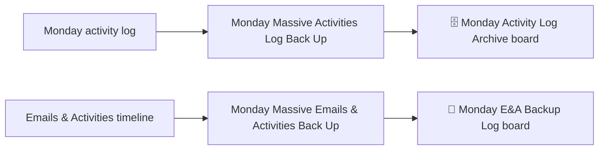

# AUTO-MONDAY-BACKUP-001 — Monday Activities and Emails Backup

## 1. Purpose

Back up large volumes of Monday.com activity-log records and Emails & Activities timeline entries so this operational history survives independently of Monday's own retention, and can be audited or recovered later.

## 2. Business context

`knowledge/01_RSFA_SYSTEM_MAP.md` §10 notes that RSFA intends to create a dedicated board for logging processed emails because Power Automate/Monday run history is not sufficient for long-term tracking. This automation family is the current backup mechanism for two related but distinct datasets: the Monday activity log, and the Emails & Activities client timeline.

## 3. Scope

### Included

- Bulk backup of Monday activity-log records to `🗄️ Monday Activity Log Archive`.
- Bulk backup of Emails & Activities timeline records to `💾 Monday E&A Backup Log`.

### Excluded

- Real-time email filing (`AUTO-EMAIL-001`).
- Mailbox content backup (`AUTO-EMAIL-BACKUP-001`).

## 4. Current status

Active. Per `knowledge/03_AUTOMATION_REGISTRY.md` §3 and §5, this automation is `Active`, `Not documented` prior to this file, with both flows flagged as bulk maintenance flows requiring explicit approval to execute.

## 5. Trigger

- `Monday Massive Activities Log Back Up`: Scheduled (exact cadence not confirmed — TODO: verify).
- `Monday Massive Emails & Activities Back Up`: Instant (exact triggering condition not confirmed — TODO: verify; "Instant" per registry suggests an event-based rather than time-based trigger, but the specific event is unknown).

## 6. Inputs

Monday.com activity-log data and Emails & Activities timeline data. No further structural detail is confirmed — TODO: verify field-level scope of what is backed up.

## 7. Outputs

- Records written to `🗄️ Monday Activity Log Archive` (board ID `5029053386`), described in `knowledge/04_MONDAY_BOARDS_REGISTRY.md` as a "long-term archive of important Monday activity-log events and raw audit data."
- Records written to `💾 Monday E&A Backup Log` (board ID `5029033494`), described in `knowledge/04_MONDAY_BOARDS_REGISTRY.md` as a "backup register for Emails & Activities timeline records and related .eml files."

## 8. Systems involved

Monday.com (source and destination boards), Power Automate (execution).

## 9. Related Monday boards

| Board | ID | Role |
|---|---|---|
| 🗄️ Monday Activity Log Archive | `5029053386` | Destination for activity-log backup |
| 💾 Monday E&A Backup Log | `5029033494` | Destination for Emails & Activities backup; classified Historical/Legacy folder in the boards registry — TODO: verify whether this board is still the active destination or has been superseded |

## 10. Platform implementation

### Make.com scenarios

Not applicable.

### Power Automate flows

| Exact flow name | Flow type | Role | Current status | Source confidence |
|---|---|---|---|---|
| Monday Massive Activities Log Back Up | Scheduled | Bulk backup of Monday activity log | Active | Current (registry name and status only — no implementation walkthrough available) |
| Monday Massive Emails & Activities Back Up | Instant | Bulk backup of Emails & Activities timeline | Active | Current (registry name and status only — no implementation walkthrough available) |

No source-material file exists for this automation family. All implementation detail below is inferred from registry and board-registry context only, not from a scenario/flow walkthrough.

### Monday native automations or workflows

Not applicable.

### Native integrations

Not applicable.

### Shared subflows and components

None confirmed.

## 11. End-to-end process

## 12. Data mapping

TODO: complete mapping from current production configuration. No field-level mapping is confirmed from any available source.

## 13. Decision and routing logic

Not confirmed. TODO: verify whether these flows perform incremental backup (only new records) or full re-export on each run.

## 14. Dependencies

Depends on Monday.com API/activity-log access remaining stable; depends on the two destination boards continuing to exist with their current structure.

## 15. Error handling

Not confirmed. TODO: verify.

## 16. Logging and observability

The destination boards themselves are the primary observability mechanism (i.e., presence/absence of expected records indicates success/failure of a run).

## 17. Manual operations and reprocessing

Both flows are bulk maintenance flows. Per `knowledge/03_AUTOMATION_REGISTRY.md` §5: **execute only with explicit approval.** Do not run either flow speculatively, since a mass backup operation against production Monday data carries real operational load and risk.

## 18. Known limitations

- No confirmed retention policy or recovery procedure exists for either destination board.
- The exact destinations and retention rules require documentation per `knowledge/03_AUTOMATION_REGISTRY.md` §10.
- `💾 Monday E&A Backup Log` is filed under "Historical Boards" in the boards registry, which may indicate it is no longer the active backup destination — this is an unresolved contradiction between the automation registry (which lists the flow as `Active`) and the board registry's historical classification.

## 19. Security and sensitive data

Activity-log and Emails & Activities data may include client-identifying references and communication metadata. Do not use this automation against production data for testing; if a test run is required, scope it to a small, non-sensitive test dataset and get explicit approval first.

## 20. Testing

### Confirmed tests

None recorded.

### Required regression tests

- Confirm a manual/scheduled run produces the expected new records in the destination board without duplicating prior backup entries.
- Confirm large-volume runs complete without truncation or throttling failures.

### Test data restrictions

Do not run against full production activity history without explicit approval; if testing, use a scoped date range or a test board.

## 21. Validation after change

Run the relevant flow against a narrow, explicitly-approved scope and confirm the expected number of new records appear in the destination board, with no duplicates of previously backed-up entries.

## 22. Rollback

Disable the affected flow in Power Automate. No automated rollback of already-written backup records is defined; manual removal of erroneous board items would be required.

## 23. Troubleshooting guide

1. Confirm whether the run was scheduled or manually triggered, and check Power Automate run history for errors.
2. Check the destination board for expected new records.
3. Confirm the source Monday data (activity log or Emails & Activities) was actually available/queryable at run time.

## 24. Source references

- `knowledge/03_AUTOMATION_REGISTRY.md` §3, §5, §10 — Current. Flow names, status, and explicit note that destinations/retention require documentation.
- `knowledge/04_MONDAY_BOARDS_REGISTRY.md` — Current. Board descriptions for both destination boards; note the historical-folder classification of `💾 Monday E&A Backup Log`.
- No `source-material/power-automate/` file exists for this automation.

## 25. Known gaps

- No implementation walkthrough exists for either flow — all detail beyond name/status/destination is `TODO: verify`.
- Contradiction between "Active" automation status and the "Historical Boards" folder classification of the E&A backup destination board is unresolved — flagged in `knowledge/03_AUTOMATION_REGISTRY.md` for follow-up.
- Retention and recovery procedures are undocumented.

## 26. Change history

| Date | Change | Author |
|---|---|---|
| 2026-07-30 | Initial canonical documentation created from registry evidence only; no source-material walkthrough available. | Claude (documentation task) |
