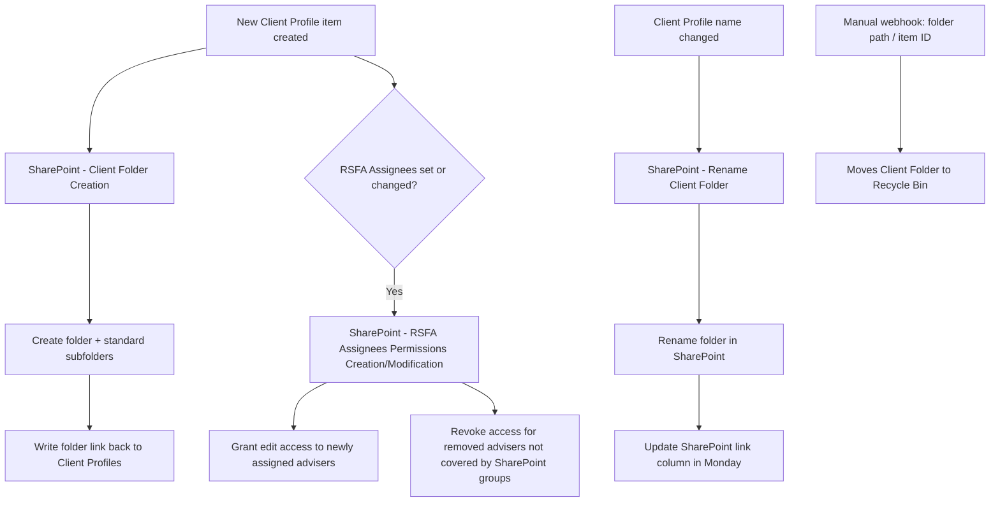

# AUTO-SP-FOLDER-001 — Client SharePoint Folder Lifecycle

## 1. Purpose

Keep each Client Profile's SharePoint folder structure, name and adviser access permissions in sync with the Client Profiles board in Monday.com, so every other automation that files documents against a client (email filing, DocuSign, Aircall, form submissions) has a reliable, correctly permissioned destination folder.

## 2. Business context

Each Client Profile in Monday has its own SharePoint folder, named to include the Monday Client Profile ID for reliable matching (`knowledge/01_RSFA_SYSTEM_MAP.md` §4.1). This family of flows keeps that folder created, correctly named, correctly permissioned for the assigned advisers, and safely removable when no longer needed.

## 3. Scope

### Included

- Creating a new client folder (with standard subfolders) when a Client Profile item is created.
- Granting/revoking adviser SharePoint edit permissions based on the `RSFA Assignees` column.
- Renaming the client folder when the Client Profile's name changes, and writing the updated SharePoint link back to Monday.
- Bulk/maintenance renaming utilities for folders and files.
- Moving a client folder to the SharePoint recycle bin on request.

### Excluded

- Filing documents into an existing folder (handled by `AUTO-EMAIL-001`, `AUTO-DOCUSIGN-001`, `AUTO-AIRCALL-001`, `AUTO-FORMS-001`).

## 4. Current status

Active. All listed flows are `Active` per `knowledge/03_AUTOMATION_REGISTRY.md` §5; the two "Massive" flows are explicitly flagged as bulk maintenance utilities requiring explicit approval before execution.

## 5. Trigger

- New item created on Client Profiles → folder creation.
- Client Profiles item created, or its `RSFA Assignees` column modified → permission creation/modification.
- A webhook/manual HTTP request triggered by a Client Profile Board update → folder rename.
- Manual webhook trigger connected to the Client Profiles Board, with folder path or item ID supplied → move to recycle bin.
- Manual/on-demand execution → bulk rename utilities.

## 6. Inputs

- Client Profiles board item data: Client Profile ID (`pulseID`), name, `RSFA Assignees`.
- Adviser email addresses resolved from Monday user fields.

## 7. Outputs

- New SharePoint folder (with subfolders such as "Mortgages", "Risk Insurance" per source material) under the client-files library.
- SharePoint folder-level permission grants/revocations for named advisers.
- Renamed SharePoint folder and updated folder-link column on the Client Profiles board.
- Folder moved to the SharePoint recycle bin.

## 8. Systems involved

Monday.com (trigger and data source), Power Automate (execution), SharePoint (target).

## 9. Related Monday boards

| Board | ID | Role |
|---|---|---|
| Client Profiles | `5024661649` | Trigger source; stores `RSFA Assignees` and the SharePoint folder link column |

## 10. Platform implementation

### Make.com scenarios

Not applicable.

### Power Automate flows

| Exact flow name | Flow type | Role | Current status | Source confidence |
|---|---|---|---|---|
| SharePoint - Client Folder Creation from Monday.com | Automated | Creates folder + standard subfolders, writes link back to Monday | Active | Confirmed from export — `SPClientFolderCreationandRenaming` Solution export (2026-07-30), workflow ID `906285cd-0f9e-f011-bbd2-000d3ae0ae9d`, Activated, HTTP-Request trigger. Exact name match. Source-material file "SharePoint Client File Creation from M.com.md" matches in substance |
| SharePoint - RSFA Assignees Permissions Creation and Modification | Automated | Grants/revokes adviser edit permissions | Active | Likely mapping — the `SPAdviserNameChange` Solution export (2026-07-30) contains `"SharePoint - RSFA Asignees Permissions Creation and Modification"` (workflow ID `74103209-0f9e-f011-bbd2-000d3ae0ae9d`, Activated, HTTP-Request trigger); registry spells "Assignees", export spells "Asignees" (missing one "s"). Not silently corrected. Source-material file "RSFA Asignees Permissions Creation_Modification.md" uses the same "Asignees" spelling |
| SharePoint - Rename Client Folder from Monday.com | Automated | Renames folder on Client Profile name change, updates Monday link | Active | Confirmed from export — `SPClientFolderCreationandRenaming` Solution export, workflow ID `8f6285cd-0f9e-f011-bbd2-000d3ae0ae9d`, Activated, HTTP-Request trigger. Exact name match. Source-material file "Rename Client SP Folder per m.com change.md" matches in substance |
| Massive Client Folders Renaming | Instant | Bulk maintenance rename utility | Active | Current (registry only) — not present in either Power Automate Solution export in this set |
| Massive SP Files Renaming | Instant | Bulk maintenance file-rename utility | Active | Current (registry only) — not present in either Power Automate Solution export in this set |
| Moves Client Folder to Recycle Bin | Automated | Deletes (soft) a client folder on manual request | Active | Current (registry only) — not present in either Power Automate Solution export in this set; source-material file matches exactly by name |

**Additional flow found in the `SPAdviserNameChange` export with no current registry entry:** `SharePoint - RSFA Asignees Permissions Modification` (workflow ID `73103209-0f9e-f011-bbd2-000d3ae0ae9d`), Draft (not activated) at export time, HTTP-Request trigger. Not listed anywhere in `knowledge/03_AUTOMATION_REGISTRY.md` §5. Unmapped Power Automate flow — canonical classification required; not assumed to be a duplicate or predecessor of the "Creation and Modification" flow above without live verification.

**Solution-naming note:** the `SPAdviserNameChange` Solution's display name ("SP Adviser Name Change") does not match what its two flows actually do (Assignees permission creation/modification) — the actual client/folder rename logic is the separate `SharePoint - Rename Client Folder from Monday.com` flow, packaged in the different `SPClientFolderCreationandRenaming` Solution. See `exports/power-automate/solutions/sp-adviser-name-change/manifest.md` § "Known gaps".

### Monday native automations or workflows

Not applicable — Monday is the trigger/data source, not the automation engine, for this family.

### Native integrations

Not applicable.

### Shared subflows and components

None confirmed.

## 11. End-to-end process

## 12. Data mapping

| Source field | Destination | Notes |
|---|---|---|
| Client Profile `pulseID` | Folder-lookup key in SharePoint | Used to locate the existing folder for renames |
| Client Profile name | SharePoint folder display name | Spaces replaced with `%20`; "and" inserted per source-material formatting rule for multi-name folders |
| `RSFA Assignees` (adviser list) | SharePoint folder permissions (People) | Advisers already covered by a predefined SharePoint group do not appear individually under People but retain access |

TODO: complete mapping from current production configuration for the exact subfolder list and SharePoint permission group names.

## 13. Decision and routing logic

- Permission changes: an adviser removed from `RSFA Assignees` has individual access revoked **unless** they belong to a predefined SharePoint group that already grants access — in that case no visible change occurs for that adviser.
- Rename: folder is located by `pulseID`, not by old name, so renames are robust to prior renames.

## 14. Dependencies

- Client Profiles board is the sole trigger source; a missing or incorrect `pulseID`/name will break folder resolution.
- `AUTO-EMAIL-001`, `AUTO-DOCUSIGN-001`, `AUTO-AIRCALL-001` and `AUTO-FORMS-001` all depend on this automation having already created a valid, correctly permissioned folder.

## 15. Error handling

Not confirmed in source material. TODO: verify what happens if a folder-creation or rename request targets a `pulseID` with no existing folder (rename case) or an already-existing folder (creation case).

## 16. Logging and observability

No dedicated log board confirmed. TODO: verify.

## 17. Manual operations and reprocessing

Bulk rename utilities (`Massive Client Folders Renaming`, `Massive SP Files Renaming`) exist for correcting folder/file names at scale — treat as **bulk maintenance flows; execute only with explicit approval**, per `knowledge/03_AUTOMATION_REGISTRY.md` §5.

## 18. Known limitations

- Folder-permission logic silently coexists with SharePoint group-based access, which can make it non-obvious from the People list alone whether an adviser currently has access.
- No confirmed collision-handling if two Client Profiles would generate the same folder name.

## 19. Security and sensitive data

This automation controls who can access client folders. Do not test permission changes against real client folders; use a dedicated test Client Profile and test SharePoint location.

## 20. Testing

### Confirmed tests

None recorded.

### Required regression tests

- New Client Profile → folder + subfolders created, link written back to Monday.
- Adviser added to `RSFA Assignees` → adviser gains folder edit access.
- Adviser removed from `RSFA Assignees` (not in a SharePoint group) → access revoked.
- Adviser removed from `RSFA Assignees` (covered by a SharePoint group) → access remains, no individual entry.
- Client Profile renamed → folder renamed, Monday link updated.
- Move-to-recycle-bin webhook → folder moved to recycle bin, retrievable for review.

### Test data restrictions

Use a dedicated test Client Profile and test SharePoint folder; never rename, permission-test or delete a real client folder.

## 21. Validation after change

Create a test Client Profile, confirm folder + subfolders appear, confirm the Monday link column populates. Change `RSFA Assignees` and confirm SharePoint permissions update accordingly. Rename the test Client Profile and confirm both the SharePoint folder and Monday link update.

## 22. Rollback

Disable the affected Power Automate flow. Bulk rename utilities have no automated rollback — restoring prior folder/file names would need to be done manually or from a SharePoint version history / recycle bin.

## 23. Troubleshooting guide

1. Confirm the Client Profile item's `pulseID` and name are correctly populated.
2. Check whether the SharePoint folder exists under the expected library path.
3. For permission issues, check both individual People entries and SharePoint group membership.
4. For a failed rename, confirm the folder lookup by `pulseID` succeeded before assuming the rename step failed.

## 24. Source references

- `source-material/power-automate/SharePoint Client File Creation from M.com.md` — Current. Folder + subfolder creation logic.
- `source-material/power-automate/RSFA Asignees Permissions Creation_Modification.md` — Current. Permission creation/modification logic.
- `source-material/power-automate/Rename Client SP Folder per m.com change.md` — Current. Rename logic.
- `source-material/power-automate/Moves Client Folder to Recycle Bin.md` — Current. Recycle-bin logic.
- `knowledge/03_AUTOMATION_REGISTRY.md` §3, §5, §5.1 — Current. Flow inventory, status and Solution mapping.
- `knowledge/01_RSFA_SYSTEM_MAP.md` §4.1 — Current. Client folder naming convention.
- `exports/power-automate/solutions/sp-client-folder-creation-and-renaming/manifest.md` — Current-export-snapshot, inspected 2026-07-30. Point-in-time evidence; not a live-system verification. Confirms exact flow names, workflow IDs and Activated state for the creation and rename flows.
- `exports/power-automate/solutions/sp-adviser-name-change/manifest.md` — Current-export-snapshot, inspected 2026-07-30. Point-in-time evidence; not a live-system verification. Confirms the "Asignees" spelling used in the live environment and surfaces one unmapped Draft-state flow.

## 25. Known gaps

- Exact standard subfolder list is only partially confirmed ("Mortgages", "Risk Insurance" as examples in source material — TODO: verify the complete current list).
- Error-handling behaviour for edge cases (duplicate folder names, missing `pulseID`) is unconfirmed.
- Exact SharePoint permission-group names are not recorded.
- **New, unresolved as of 2026-07-30:** `SharePoint - RSFA Asignees Permissions Modification` (Draft/not activated in the export) has no registry entry and its relationship to the registered "Creation and Modification" flow is unconfirmed. The bulk/maintenance flows (`Massive Client Folders Renaming`, `Massive SP Files Renaming`, `Moves Client Folder to Recycle Bin`) are registered but were not present in either Power Automate Solution exported so far — no export evidence exists for them yet.
- **Security finding from the 2026-07-30 exports:** all four flows across the `SPAdviserNameChange` and `SPClientFolderCreationandRenaming` Solutions were found to call Monday.com using a hardcoded HTTP Authorization header containing a literal API bearer token, instead of a Connection Reference or Environment Variable. The literal value has been redacted in the repository's unpacked copies; see each Solution manifest's "Security review" section. This credential should be rotated.

## 26. Change history

| Date | Change | Author |
|---|---|---|
| 2026-07-30 | Initial canonical documentation created from registry and source-material evidence. | Claude (documentation task) |
| 2026-07-30 | Added export evidence from the `SPClientFolderCreationandRenaming` and `SPAdviserNameChange` Power Automate Solution exports: exact workflow IDs and export-time states for 3 registered flows; flagged 1 unmapped Draft-state flow, the "Assignees"/"Asignees" spelling conflict, 3 registered flows with no export evidence yet, and a hardcoded-credential security finding — none silently resolved. | Claude (documentation task) |
